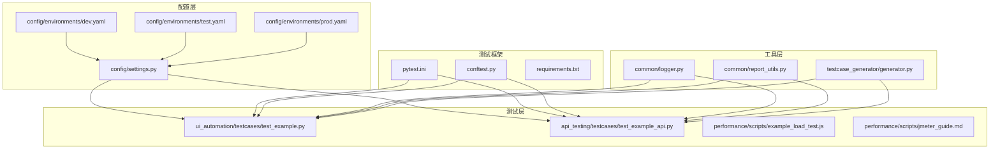
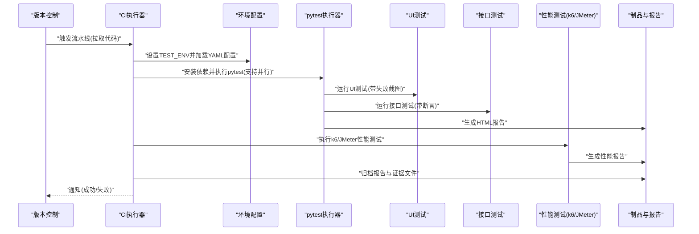
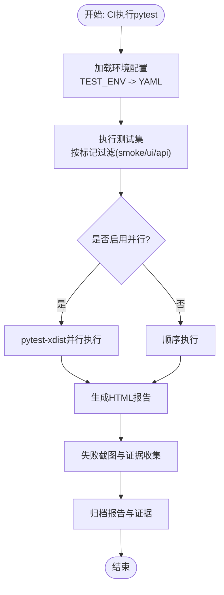
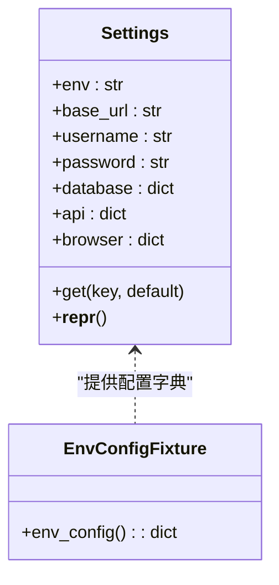
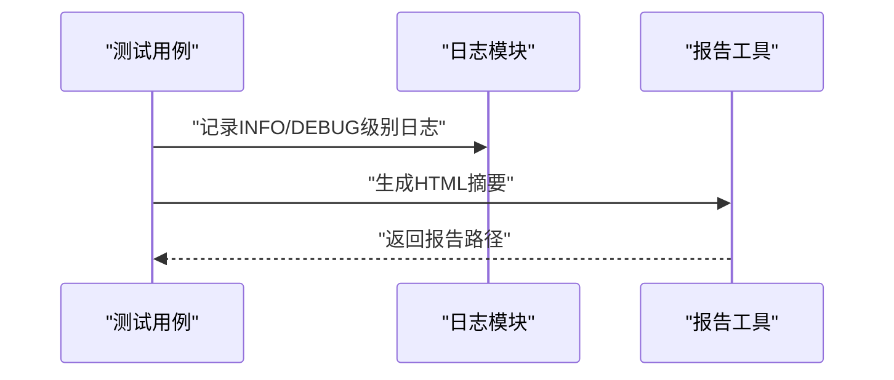
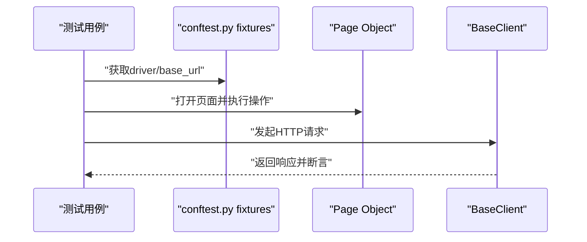
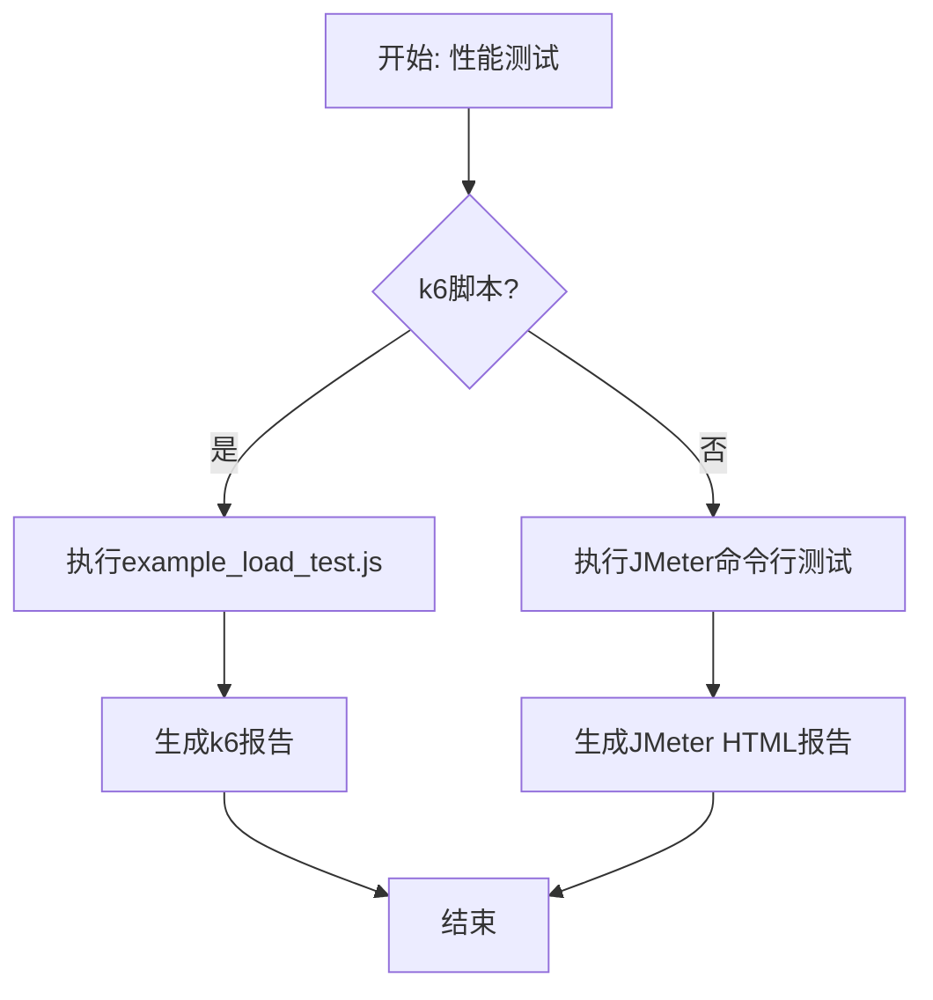
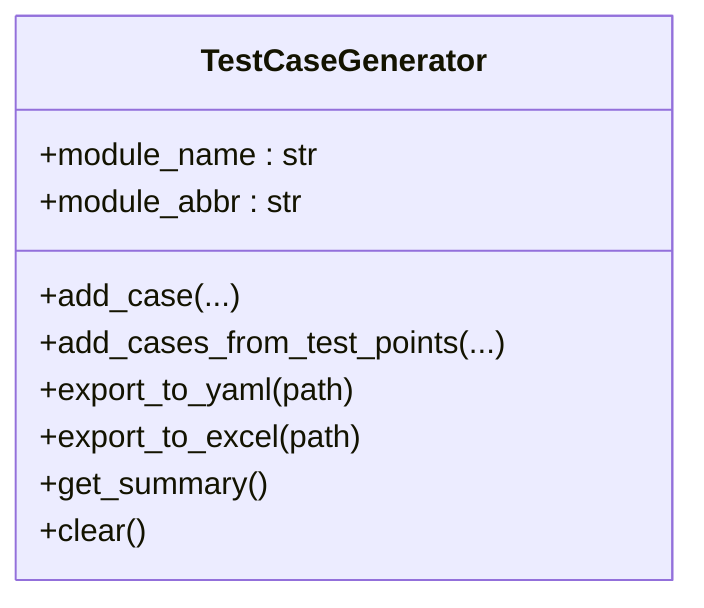
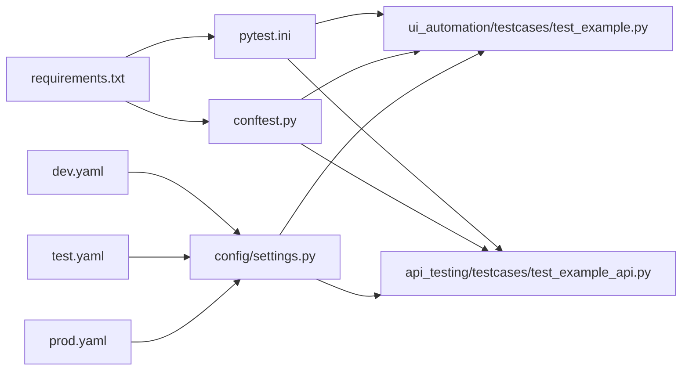

# CI/CD集成方案

<cite>
**本文档引用的文件**
- [README.md](file://README.md)
- [pytest.ini](file://pytest.ini)
- [conftest.py](file://conftest.py)
- [requirements.txt](file://requirements.txt)
- [config/settings.py](file://config/settings.py)
- [config/environments/dev.yaml](file://config/environments/dev.yaml)
- [config/environments/test.yaml](file://config/environments/test.yaml)
- [config/environments/prod.yaml](file://config/environments/prod.yaml)
- [common/report_utils.py](file://common/report_utils.py)
- [common/logger.py](file://common/logger.py)
- [api_testing/testcases/test_example_api.py](file://api_testing/testcases/test_example_api.py)
- [ui_automation/testcases/test_example.py](file://ui_automation/testcases/test_example.py)
- [performance/scripts/example_load_test.js](file://performance/scripts/example_load_test.js)
- [performance/scripts/jmeter_guide.md](file://performance/scripts/jmeter_guide.md)
- [testcase_generator/generator.py](file://testcase_generator/generator.py)
</cite>

## 目录
1. [引言](#引言)
2. [项目结构](#项目结构)
3. [核心组件](#核心组件)
4. [架构总览](#架构总览)
5. [详细组件分析](#详细组件分析)
6. [依赖关系分析](#依赖关系分析)
7. [性能考虑](#性能考虑)
8. [故障排查指南](#故障排查指南)
9. [结论](#结论)
10. [附录](#附录)

## 引言
本方案面向测试自动化工作区，提供一套完整的CI/CD集成实施指南，涵盖持续集成流水线设计、自动化测试执行与测试报告生成、pytest并行执行配置、测试结果聚合与质量门禁、Git工作流与分支策略、自动化部署触发机制，以及GitHub Actions与Jenkins等CI工具的配置思路。同时，文档化了覆盖率统计、性能回归检测与通知机制的落地要点。

## 项目结构
该项目采用按功能域划分的模块化组织方式，包含配置管理、UI自动化、接口测试、性能测试、用例生成器与公共工具等模块。整体结构清晰，便于在CI环境中进行分层构建与并行执行。

**图表来源**
- [config/settings.py:1-104](file://config/settings.py#L1-L104)
- [config/environments/dev.yaml:1-31](file://config/environments/dev.yaml#L1-L31)
- [config/environments/test.yaml:1-31](file://config/environments/test.yaml#L1-L31)
- [config/environments/prod.yaml:1-31](file://config/environments/prod.yaml#L1-L31)
- [ui_automation/testcases/test_example.py:1-161](file://ui_automation/testcases/test_example.py#L1-L161)
- [api_testing/testcases/test_example_api.py:1-167](file://api_testing/testcases/test_example_api.py#L1-L167)
- [performance/scripts/example_load_test.js:1-33](file://performance/scripts/example_load_test.js#L1-L33)
- [performance/scripts/jmeter_guide.md:1-98](file://performance/scripts/jmeter_guide.md#L1-L98)
- [common/logger.py:1-77](file://common/logger.py#L1-L77)
- [common/report_utils.py:1-143](file://common/report_utils.py#L1-L143)
- [testcase_generator/generator.py:1-263](file://testcase_generator/generator.py#L1-L263)
- [pytest.ini:1-12](file://pytest.ini#L1-L12)
- [conftest.py:1-148](file://conftest.py#L1-L148)
- [requirements.txt:1-21](file://requirements.txt#L1-L21)

**章节来源**
- [README.md:1-123](file://README.md#L1-L123)
- [pytest.ini:1-12](file://pytest.ini#L1-L12)
- [conftest.py:1-148](file://conftest.py#L1-L148)
- [requirements.txt:1-21](file://requirements.txt#L1-L21)
- [config/settings.py:1-104](file://config/settings.py#L1-L104)

## 核心组件
- 测试框架与配置
  - pytest.ini：定义测试路径、文件/类/函数命名规则、HTML报告输出选项与自定义标记（smoke、regression、api、ui等）。
  - conftest.py：全局fixture（浏览器驱动、基础URL、失败截图）、钩子函数（失败自动截图并附加到Allure）、marker注册、会话级环境配置注入。
  - requirements.txt：声明pytest、pytest-html、pytest-xdist、selenium、requests、PyYAML、openpyxl、loguru、allure-pytest等依赖。
- 配置管理
  - config/settings.py：基于环境变量TEST_ENV加载对应YAML配置，提供base_url、browser、api、database等属性访问；支持dev/test/prod三套环境。
  - environments/*.yaml：分别定义各环境的基础URL、账号、数据库、API与浏览器配置。
- 日志与报告
  - common/logger.py：统一日志配置（控制台INFO及以上、文件DEBUG及以上按天轮转、保留7天），提供get_logger便捷函数。
  - common/report_utils.py：时间戳生成、报告目录创建、HTML摘要生成与保存。
- 测试用例与数据
  - ui_automation/testcases/test_example.py：示例UI测试，使用Page Object模式与driver/base_url fixture，标注ui/smoke标记。
  - api_testing/testcases/test_example_api.py：示例接口测试，展示BaseClient调用与断言方法的使用方式。
- 性能测试
  - performance/scripts/example_load_test.js：k6脚本示例，包含阶梯式负载与阈值配置。
  - performance/scripts/jmeter_guide.md：JMeter命令行执行、报告生成与输出目录规范。
- 用例生成器
  - testcase_generator/generator.py：从测试点批量生成结构化测试用例，支持YAML与Excel导出。

**章节来源**
- [pytest.ini:1-12](file://pytest.ini#L1-L12)
- [conftest.py:1-148](file://conftest.py#L1-L148)
- [requirements.txt:1-21](file://requirements.txt#L1-L21)
- [config/settings.py:1-104](file://config/settings.py#L1-L104)
- [config/environments/dev.yaml:1-31](file://config/environments/dev.yaml#L1-L31)
- [config/environments/test.yaml:1-31](file://config/environments/test.yaml#L1-L31)
- [config/environments/prod.yaml:1-31](file://config/environments/prod.yaml#L1-L31)
- [common/logger.py:1-77](file://common/logger.py#L1-L77)
- [common/report_utils.py:1-143](file://common/report_utils.py#L1-L143)
- [ui_automation/testcases/test_example.py:1-161](file://ui_automation/testcases/test_example.py#L1-L161)
- [api_testing/testcases/test_example_api.py:1-167](file://api_testing/testcases/test_example_api.py#L1-L167)
- [performance/scripts/example_load_test.js:1-33](file://performance/scripts/example_load_test.js#L1-L33)
- [performance/scripts/jmeter_guide.md:1-98](file://performance/scripts/jmeter_guide.md#L1-L98)
- [testcase_generator/generator.py:1-263](file://testcase_generator/generator.py#L1-L263)

## 架构总览
下图展示了CI流水线中的关键交互：代码检出后，CI执行依赖安装、环境配置注入、测试执行（含并行与报告生成）、性能测试、结果聚合与质量门禁、产物归档与通知。

**图表来源**
- [conftest.py:84-125](file://conftest.py#L84-L125)
- [pytest.ini:1-12](file://pytest.ini#L1-L12)
- [config/settings.py:26-48](file://config/settings.py#L26-L48)
- [performance/scripts/example_load_test.js:1-33](file://performance/scripts/example_load_test.js#L1-L33)
- [performance/scripts/jmeter_guide.md:1-98](file://performance/scripts/jmeter_guide.md#L1-L98)

## 详细组件分析

### 测试框架与并行执行
- 测试路径与标记
  - testpaths仅包含ui_automation与api_testing两个目录，pytest.ini中定义了smoke、regression、api、ui等标记，便于按场景筛选执行。
- 并行执行
  - requirements.txt声明pytest-xdist，可在CI中通过-n auto开启CPU核数级别的并行，提升执行效率。
- 报告生成
  - pytest.ini通过--html与--self-contained-html生成自包含HTML报告，便于在CI中归档与查看。
- 失败截图与证据
  - conftest.py的钩子在测试失败时自动截图并保存至ui_automation/evidence，同时尝试附加到Allure报告，便于问题复现。

**图表来源**
- [pytest.ini:1-12](file://pytest.ini#L1-L12)
- [requirements.txt:1-21](file://requirements.txt#L1-L21)
- [conftest.py:84-125](file://conftest.py#L84-L125)

**章节来源**
- [pytest.ini:1-12](file://pytest.ini#L1-L12)
- [requirements.txt:1-21](file://requirements.txt#L1-L21)
- [conftest.py:1-148](file://conftest.py#L1-L148)

### 配置管理与多环境
- 环境选择
  - 通过环境变量TEST_ENV加载对应YAML配置，支持dev/test/prod三套环境，避免硬编码。
- 配置项
  - base_url、username/password、database、api、browser等，满足不同环境下的测试目标与浏览器行为差异。
- 会话级配置注入
  - conftest.py提供env_config fixture，使测试用例可直接获取当前环境的完整配置字典。

**图表来源**
- [config/settings.py:13-103](file://config/settings.py#L13-L103)
- [conftest.py:141-147](file://conftest.py#L141-L147)

**章节来源**
- [config/settings.py:1-104](file://config/settings.py#L1-L104)
- [config/environments/dev.yaml:1-31](file://config/environments/dev.yaml#L1-L31)
- [config/environments/test.yaml:1-31](file://config/environments/test.yaml#L1-L31)
- [config/environments/prod.yaml:1-31](file://config/environments/prod.yaml#L1-L31)
- [conftest.py:141-147](file://conftest.py#L141-L147)

### 日志与报告工具
- 日志
  - common/logger.py统一配置控制台与文件输出，按天轮转并保留7天，便于CI日志归档与问题定位。
- 报告
  - common/report_utils.py提供时间戳生成、报告目录创建、HTML摘要生成与保存，便于在CI中生成可读的测试摘要。

**图表来源**
- [common/logger.py:1-77](file://common/logger.py#L1-L77)
- [common/report_utils.py:1-143](file://common/report_utils.py#L1-L143)

**章节来源**
- [common/logger.py:1-77](file://common/logger.py#L1-L77)
- [common/report_utils.py:1-143](file://common/report_utils.py#L1-L143)

### UI与接口测试示例
- UI测试
  - ui_automation/testcases/test_example.py使用Page Object模式与driver/base_url fixture，标注ui/smoke标记，演示登录流程与元素可见性校验。
- 接口测试
  - api_testing/testcases/test_example_api.py展示BaseClient的GET/POST调用与断言方法，标注api标记，便于按模块执行。

**图表来源**
- [ui_automation/testcases/test_example.py:1-161](file://ui_automation/testcases/test_example.py#L1-L161)
- [api_testing/testcases/test_example_api.py:1-167](file://api_testing/testcases/test_example_api.py#L1-L167)
- [conftest.py:25-82](file://conftest.py#L25-L82)

**章节来源**
- [ui_automation/testcases/test_example.py:1-161](file://ui_automation/testcases/test_example.py#L1-L161)
- [api_testing/testcases/test_example_api.py:1-167](file://api_testing/testcases/test_example_api.py#L1-L167)
- [conftest.py:1-148](file://conftest.py#L1-L148)

### 性能测试与回归检测
- k6脚本
  - performance/scripts/example_load_test.js提供阶梯式负载与阈值配置（如p(95)响应时间、错误率），可直接在CI中执行并产出性能报告。
- JMeter指南
  - performance/scripts/jmeter_guide.md给出命令行执行、报告生成与输出目录规范，便于在CI中统一管理性能测试产物。

**图表来源**
- [performance/scripts/example_load_test.js:1-33](file://performance/scripts/example_load_test.js#L1-L33)
- [performance/scripts/jmeter_guide.md:1-98](file://performance/scripts/jmeter_guide.md#L1-L98)

**章节来源**
- [performance/scripts/example_load_test.js:1-33](file://performance/scripts/example_load_test.js#L1-L33)
- [performance/scripts/jmeter_guide.md:1-98](file://performance/scripts/jmeter_guide.md#L1-L98)

### 用例生成器与数据驱动
- 用例生成
  - testcase_generator/generator.py支持从测试点批量生成结构化测试用例，并导出为YAML与Excel，便于团队协作与需求到用例的追溯。
- 数据驱动
  - UI测试示例中通过YAML加载测试数据，便于在CI中按环境注入不同数据集。

**图表来源**
- [testcase_generator/generator.py:17-187](file://testcase_generator/generator.py#L17-L187)

**章节来源**
- [testcase_generator/generator.py:1-263](file://testcase_generator/generator.py#L1-L263)
- [ui_automation/testcases/test_example.py:20-29](file://ui_automation/testcases/test_example.py#L20-L29)

## 依赖关系分析
- 组件耦合
  - 测试用例依赖conftest.py提供的fixtures（driver、base_url、env_config），并通过pytest.ini的标记进行分组执行。
  - 配置模块config/settings.py被测试用例与UI/Page Object共同依赖，形成稳定的配置入口。
- 外部依赖
  - requirements.txt声明pytest生态（pytest-html、pytest-xdist）、UI自动化（selenium）、接口测试（requests）、日志（loguru）、报告（allure-pytest）等，支撑CI执行链路。

**图表来源**
- [pytest.ini:1-12](file://pytest.ini#L1-L12)
- [conftest.py:1-148](file://conftest.py#L1-L148)
- [config/settings.py:1-104](file://config/settings.py#L1-L104)
- [config/environments/dev.yaml:1-31](file://config/environments/dev.yaml#L1-L31)
- [config/environments/test.yaml:1-31](file://config/environments/test.yaml#L1-L31)
- [config/environments/prod.yaml:1-31](file://config/environments/prod.yaml#L1-L31)
- [requirements.txt:1-21](file://requirements.txt#L1-L21)

**章节来源**
- [pytest.ini:1-12](file://pytest.ini#L1-L12)
- [conftest.py:1-148](file://conftest.py#L1-L148)
- [config/settings.py:1-104](file://config/settings.py#L1-L104)
- [requirements.txt:1-21](file://requirements.txt#L1-L21)

## 性能考虑
- 并行执行
  - 在CI中使用pytest-xdist并行执行，结合-n auto可充分利用多核CPU，缩短流水线时长。
- 报告与证据
  - pytest-html生成自包含报告，配合失败截图与Allure附件，便于快速定位问题，减少回溯成本。
- 日志轮转
  - 日志按天轮转并保留7天，避免CI作业日志无限增长影响存储与检索。
- 性能测试
  - k6与JMeter均支持命令行执行与报告生成，建议在CI中固定阈值（如p(95)响应时间、错误率），作为质量门禁的一部分。

[本节为通用指导，无需具体文件分析]

## 故障排查指南
- 浏览器驱动与窗口大小
  - 若UI测试失败，检查浏览器类型、headless模式、隐式等待与页面加载超时配置，确认与环境一致。
- 失败截图与证据
  - conftest.py在测试失败时自动截图并保存至ui_automation/evidence，若未生成，请检查驱动初始化与异常捕获逻辑。
- 环境配置
  - 确认TEST_ENV变量正确，且对应YAML文件存在；若缺失配置文件，将抛出文件不存在异常。
- 日志定位
  - 查看logs/目录下按天生成的日志文件，结合测试报告定位问题根因。
- 性能测试
  - k6/JMeter命令行参数与报告输出目录需与脚本约定一致，避免报告生成失败或覆盖历史数据。

**章节来源**
- [conftest.py:25-82](file://conftest.py#L25-L82)
- [conftest.py:84-125](file://conftest.py#L84-L125)
- [config/settings.py:37-48](file://config/settings.py#L37-L48)
- [common/logger.py:30-56](file://common/logger.py#L30-L56)
- [performance/scripts/jmeter_guide.md:73-97](file://performance/scripts/jmeter_guide.md#L73-L97)

## 结论
本方案基于现有代码库提供了从测试执行、报告生成到性能测试与质量门禁的完整CI/CD实践路径。通过pytest并行执行、多环境配置与统一日志/报告工具，能够高效稳定地支撑自动化测试流水线。建议在CI中固化质量门禁（如测试通过率、性能阈值、覆盖率门槛），并完善通知机制，以保障交付质量与效率。

[本节为总结性内容，无需具体文件分析]

## 附录

### CI工具配置要点（概念性说明）
- GitHub Actions
  - 使用actions/checkout检出代码，设置TEST_ENV，安装Python与依赖，执行pytest并上传报告与证据。
  - 可在工作流中并行矩阵（不同环境/浏览器）与性能测试任务。
- Jenkins
  - 使用Pipeline或自由风格项目，配置环境变量TEST_ENV，执行shell脚本安装依赖与pytest，归档测试报告与证据。
  - 可集成Allure或pytest-html插件生成报告。

[本节为概念性说明，无需具体文件分析]

### 质量门禁与覆盖率统计
- 覆盖率
  - 建议在CI中集成覆盖率工具（如pytest-cov），设定最小覆盖率阈值，作为质量门禁。
- 回归检测
  - 使用pytest标记（smoke/regression）区分冒烟与回归测试集，确保每次提交至少运行冒烟测试。
- 通知机制
  - 在CI中配置邮件、IM或Slack通知，失败时自动推送报告链接与关键日志摘要。

[本节为通用指导，无需具体文件分析]