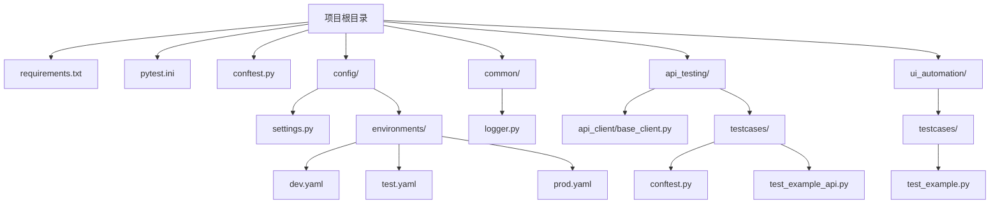
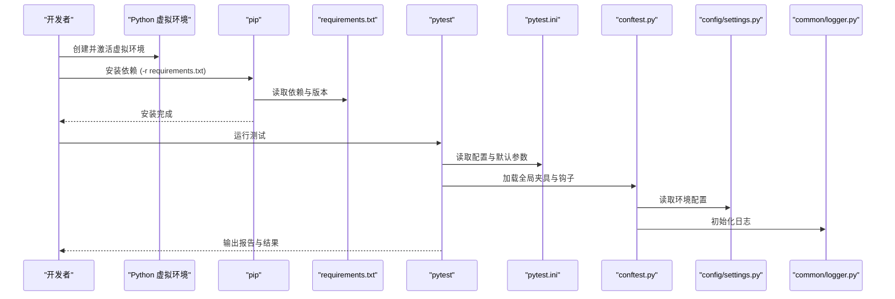
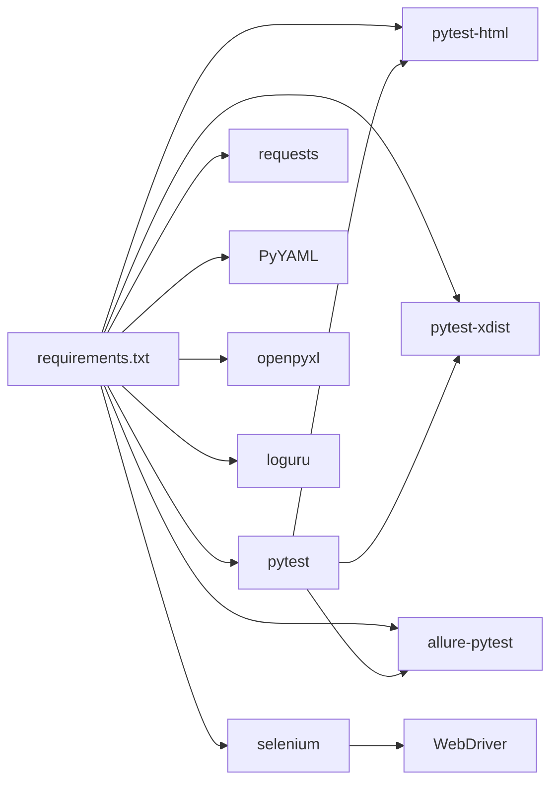

# 依赖安装与管理

<cite>
**本文引用的文件**
- [requirements.txt](file://requirements.txt)
- [pytest.ini](file://pytest.ini)
- [conftest.py](file://conftest.py)
- [api_testing/testcases/conftest.py](file://api_testing/testcases/conftest.py)
- [config/settings.py](file://config/settings.py)
- [config/environments/dev.yaml](file://config/environments/dev.yaml)
- [config/environments/test.yaml](file://config/environments/test.yaml)
- [config/environments/prod.yaml](file://config/environments/prod.yaml)
- [common/logger.py](file://common/logger.py)
- [api_testing/api_client/base_client.py](file://api_testing/api_client/base_client.py)
- [api_testing/testcases/test_example_api.py](file://api_testing/testcases/test_example_api.py)
- [ui_automation/testcases/test_example.py](file://ui_automation/testcases/test_example.py)
- [README.md](file://README.md)
</cite>

## 目录
1. [引言](#引言)
2. [项目结构](#项目结构)
3. [核心组件](#核心组件)
4. [架构总览](#架构总览)
5. [详细组件分析](#详细组件分析)
6. [依赖分析](#依赖分析)
7. [性能考虑](#性能考虑)
8. [故障排除指南](#故障排除指南)
9. [结论](#结论)
10. [附录](#附录)

## 引言
本指南围绕本项目的依赖安装与管理展开，重点包括：
- Python 虚拟环境的创建与激活
- pip 依赖安装流程与版本管理策略
- requirements.txt 文件结构、依赖分类与版本约束规则
- pytest 配置、插件安装与测试框架初始化过程
- 依赖冲突解决、版本兼容性检查与更新策略
- 依赖安装故障排除与替代安装方案

本指南旨在帮助开发者快速、稳定地搭建测试环境，并在多模块（UI 自动化、接口测试、日志与报告等）协同场景下高效开展测试工作。

## 项目结构
该项目采用模块化组织，核心依赖集中在顶层 requirements.txt，测试框架与配置位于 pytest.ini 与 conftest.py，配置与日志分别由 config 与 common 子模块提供。整体结构如下所示：

图表来源
- [requirements.txt](file://requirements.txt)
- [pytest.ini](file://pytest.ini)
- [conftest.py](file://conftest.py)
- [config/settings.py](file://config/settings.py)
- [config/environments/dev.yaml](file://config/environments/dev.yaml)
- [config/environments/test.yaml](file://config/environments/test.yaml)
- [config/environments/prod.yaml](file://config/environments/prod.yaml)
- [common/logger.py](file://common/logger.py)
- [api_testing/api_client/base_client.py](file://api_testing/api_client/base_client.py)
- [api_testing/testcases/conftest.py](file://api_testing/testcases/conftest.py)
- [api_testing/testcases/test_example_api.py](file://api_testing/testcases/test_example_api.py)
- [ui_automation/testcases/test_example.py](file://ui_automation/testcases/test_example.py)

章节来源
- [README.md](file://README.md)
- [requirements.txt](file://requirements.txt)
- [pytest.ini](file://pytest.ini)
- [conftest.py](file://conftest.py)

## 核心组件
- 依赖清单与版本约束：顶层 requirements.txt 明确列出各模块所需依赖及其版本，便于一次性安装与锁定版本。
- 测试框架与插件：pytest.ini 定义测试发现路径、命名规范、默认参数与标记；pytest 插件包括 HTML 报告、并行执行与 Allure 报告等。
- 全局配置与环境：config/settings.py 通过 YAML 环境文件加载不同环境配置，支持多环境切换。
- 日志系统：common/logger.py 基于 loguru 提供统一日志输出与文件轮转。
- API 客户端：api_testing/api_client/base_client.py 封装 HTTP 请求、断言与日志记录，贯穿接口测试。
- UI 自动化与测试夹具：ui_automation/testcases/test_example.py 与 conftest.py 提供浏览器驱动、失败截图与基础 URL 等夹具。

章节来源
- [requirements.txt](file://requirements.txt)
- [pytest.ini](file://pytest.ini)
- [config/settings.py](file://config/settings.py)
- [common/logger.py](file://common/logger.py)
- [api_testing/api_client/base_client.py](file://api_testing/api_client/base_client.py)
- [conftest.py](file://conftest.py)
- [api_testing/testcases/conftest.py](file://api_testing/testcases/conftest.py)
- [ui_automation/testcases/test_example.py](file://ui_automation/testcases/test_example.py)

## 架构总览
下图展示了依赖安装与测试执行的关键交互路径，从虚拟环境创建到依赖安装、再到 pytest 初始化与执行。

图表来源
- [requirements.txt](file://requirements.txt)
- [pytest.ini](file://pytest.ini)
- [conftest.py](file://conftest.py)
- [config/settings.py](file://config/settings.py)
- [common/logger.py](file://common/logger.py)

## 详细组件分析

### 依赖清单与版本管理
- 分类与用途
  - 测试框架：pytest、pytest-html、pytest-xdist
  - Web UI 自动化：selenium
  - 接口测试：requests
  - 数据处理：PyYAML、openpyxl
  - 日志：loguru
  - 报告（可选）：allure-pytest
- 版本约束规则
  - 使用精确版本号（如 pytest==7.4.4），确保可复现性与稳定性
  - 通过注释分组依赖类别，便于维护与审计
- 版本兼容性检查
  - pytest 与 pytest-html、pytest-xdist 的版本组合需满足兼容要求
  - selenium 与浏览器驱动版本需匹配，避免自动化失败
  - requests 与底层网络栈版本需保持稳定
- 更新策略
  - 建议先在隔离分支进行小范围升级，结合 pytest 并行与 HTML 报告验证回归
  - 升级后在 dev/test 环境先行验证，再推广至 prod

章节来源
- [requirements.txt](file://requirements.txt)

### pytest 配置与插件初始化
- 配置要点
  - 测试路径与命名规范：testpaths、python_files、python_classes、python_functions
  - 默认参数：addopts 包含详细输出与 HTML 报告生成
  - 自定义标记：smoke、regression、api、ui，便于分层执行
- 插件安装与作用
  - pytest-html：生成自包含 HTML 报告
  - pytest-xdist：并行执行测试，提升效率
  - allure-pytest（可选）：生成 Allure 报告
- 初始化流程
  - pytest 读取 pytest.ini，加载默认参数与标记
  - conftest.py 注册全局夹具与钩子，注入 driver、base_url 等
  - 测试执行过程中自动应用标记与钩子逻辑

章节来源
- [pytest.ini](file://pytest.ini)
- [conftest.py](file://conftest.py)
- [api_testing/testcases/conftest.py](file://api_testing/testcases/conftest.py)

### 全局配置与环境切换
- 配置加载机制
  - Settings 类根据 TEST_ENV 选择对应 YAML 文件（dev/test/prod）
  - 通过 settings.get 或属性访问获取 base_url、browser、api 等配置
- 环境文件内容
  - dev/test/prod 均包含 base_url、账号信息、数据库配置、API 配置与浏览器配置
  - 浏览器配置支持 headless、隐式等待与页面加载超时等参数
- 在测试中的使用
  - UI 自动化：driver fixture 读取 browser 配置并初始化 WebDriver
  - 接口测试：BaseClient 读取 api.base_url 与 timeout，拼接完整 URL 并设置超时

章节来源
- [config/settings.py](file://config/settings.py)
- [config/environments/dev.yaml](file://config/environments/dev.yaml)
- [config/environments/test.yaml](file://config/environments/test.yaml)
- [config/environments/prod.yaml](file://config/environments/prod.yaml)
- [conftest.py](file://conftest.py)
- [api_testing/api_client/base_client.py](file://api_testing/api_client/base_client.py)

### 日志系统与统一输出
- 日志特性
  - 控制台输出 INFO 级别及以上，文件输出 DEBUG 级别及以上，按天轮转，保留 7 天
  - 通过 get_logger(name) 绑定模块名，便于定位来源
- 在测试中的应用
  - conftest.py 与 API 客户端均使用 get_logger 记录关键事件与异常
  - 失败截图钩子在异常时记录错误日志，便于问题排查

章节来源
- [common/logger.py](file://common/logger.py)
- [conftest.py](file://conftest.py)
- [api_testing/api_client/base_client.py](file://api_testing/api_client/base_client.py)

### API 客户端与断言工具
- 功能概览
  - 支持 GET/POST/PUT/DELETE/PATCH/上传文件等 HTTP 方法
  - 统一日志记录请求与响应，包含 URL、参数、头信息与耗时
  - 提供断言工具：状态码、JSON 键、响应时间、列表非空、键值包含等
  - Session 管理与资源释放，支持 with 语法
- 在测试中的使用
  - 测试用例通过 api_client 或 auth_client 获取客户端实例
  - 结合 pytest 标记与夹具，实现冒烟、回归、接口与 UI 测试的分层执行

章节来源
- [api_testing/api_client/base_client.py](file://api_testing/api_client/base_client.py)
- [api_testing/testcases/conftest.py](file://api_testing/testcases/conftest.py)
- [api_testing/testcases/test_example_api.py](file://api_testing/testcases/test_example_api.py)

### UI 自动化与失败截图
- 失败截图钩子
  - 在测试失败时自动保存截图到 ui_automation/evidence/ 目录
  - 截图文件名包含测试用例名与时间戳，便于定位问题
- 浏览器驱动初始化
  - 根据配置文件选择浏览器类型、是否 headless、隐式等待与页面加载超时
  - 支持 Chrome 与 Firefox，提供常见参数优化（无沙箱、窗口大小等）

章节来源
- [conftest.py](file://conftest.py)
- [ui_automation/testcases/test_example.py](file://ui_automation/testcases/test_example.py)

## 依赖分析
- 直接依赖
  - pytest 依赖 pytest-html、pytest-xdist、allure-pytest（可选）
  - selenium 依赖浏览器驱动（需与浏览器版本匹配）
  - requests 依赖底层网络栈
  - loguru 依赖日志系统
  - PyYAML/openpyxl 依赖 YAML/Excel 解析
- 间接依赖
  - pytest-html 依赖 pytest
  - pytest-xdist 依赖 pytest
  - allure-pytest 依赖 pytest
  - selenium 依赖 WebDriver（ChromeDriver/FirefoxDriver）
- 潜在循环依赖
  - 本项目模块间为单向依赖（测试用例依赖夹具与配置），未见循环依赖
- 外部集成点
  - 浏览器驱动与操作系统版本的匹配
  - 网络环境对 requests 的影响（超时、代理等）

图表来源
- [requirements.txt](file://requirements.txt)

章节来源
- [requirements.txt](file://requirements.txt)

## 性能考虑
- 并行执行
  - 使用 pytest-xdist 的 -n auto 参数提升执行效率，但需注意共享资源与并发安全
- 报告生成
  - pytest-html 生成自包含报告，便于分享；Allure 报告更丰富，适合持续集成场景
- 超时与重试
  - BaseClient 与浏览器配置均支持超时设置，建议在复杂网络环境下适当放宽
- 日志级别
  - 生产环境建议使用 INFO 级别，避免过多调试日志影响性能

## 故障排除指南
- 虚拟环境与依赖安装
  - 确认已创建并激活虚拟环境后再安装依赖
  - 若安装失败，尝试更换镜像源或离线安装包
  - 清理缓存后重试：删除 ~/.cache/pip 或使用 --no-cache-dir
- 浏览器驱动问题
  - selenium 与浏览器版本不匹配会导致 WebDriver 启动失败
  - 建议使用 webdriver-manager 自动下载匹配驱动
- 权限与路径
  - 确保项目目录权限正确，日志与证据目录可写
- 网络与超时
  - 接口测试超时可调整 BaseClient 的 timeout 或 pytest.ini 的默认参数
- 并行执行冲突
  - 并行执行时避免共享资源竞争，必要时禁用并行或加锁
- 报告生成失败
  - 检查 pytest-html 插件版本与 pytest 兼容性
  - 确保输出目录存在且可写

章节来源
- [requirements.txt](file://requirements.txt)
- [pytest.ini](file://pytest.ini)
- [conftest.py](file://conftest.py)
- [api_testing/api_client/base_client.py](file://api_testing/api_client/base_client.py)

## 结论
本项目通过明确的依赖清单、完善的 pytest 配置与插件体系、可切换的环境配置以及统一的日志系统，构建了稳定高效的测试环境。遵循本文提供的安装流程、版本管理策略与故障排除方案，可在多模块协同场景下快速落地并持续演进测试能力。

## 附录

### 依赖安装与版本管理操作步骤
- 创建并激活虚拟环境
  - 使用 python -m venv 创建虚拟环境
  - 激活脚本：macOS/Linux 使用 source venv/bin/activate；Windows 使用 venv\Scripts\activate
- 安装依赖
  - 在项目根目录执行 pip install -r requirements.txt
- 验证安装
  - 运行 pytest 查看默认参数与标记是否生效
  - 生成 HTML 报告以确认 pytest-html 插件可用

章节来源
- [README.md](file://README.md)
- [requirements.txt](file://requirements.txt)
- [pytest.ini](file://pytest.ini)