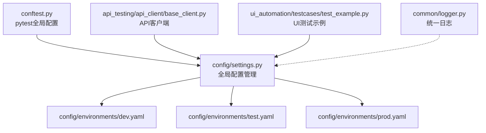
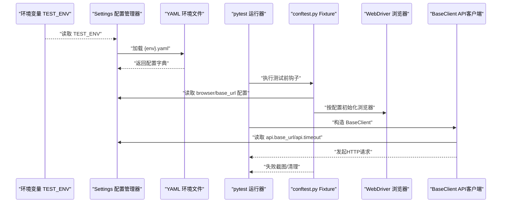
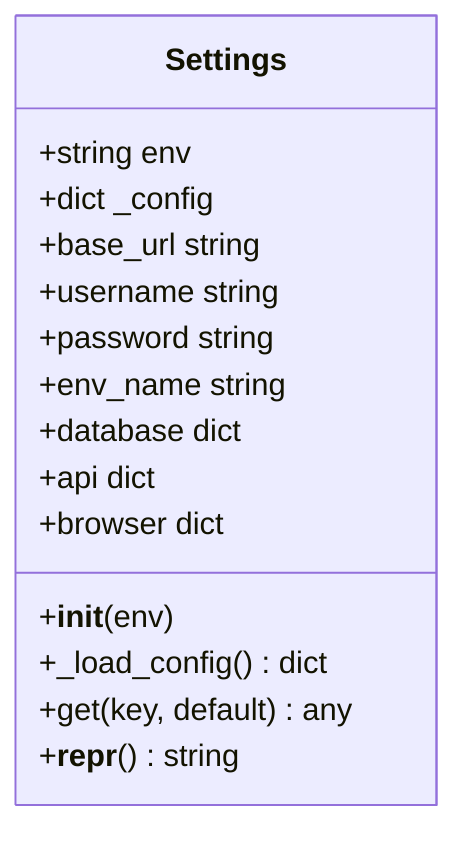
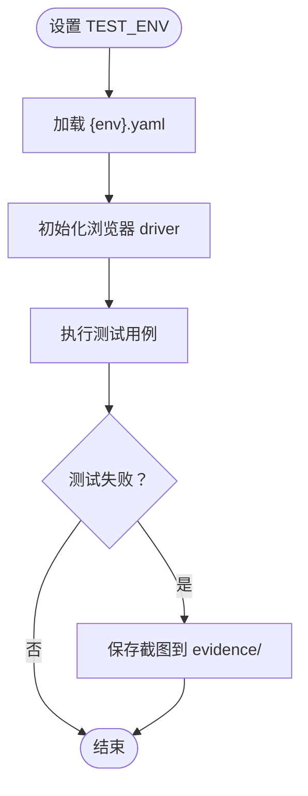
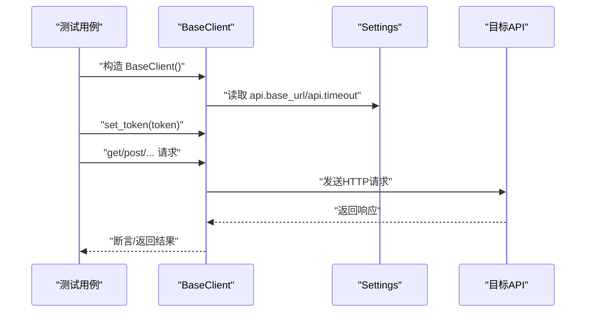
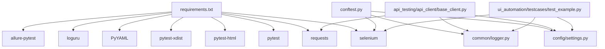

# 环境准备与配置

<cite>
**本文引用的文件**
- [config/settings.py](file://config/settings.py)
- [config/environments/dev.yaml](file://config/environments/dev.yaml)
- [config/environments/test.yaml](file://config/environments/test.yaml)
- [config/environments/prod.yaml](file://config/environments/prod.yaml)
- [conftest.py](file://conftest.py)
- [api_testing/api_client/base_client.py](file://api_testing/api_client/base_client.py)
- [api_testing/testcases/test_example_api.py](file://api_testing/testcases/test_example_api.py)
- [ui_automation/testcases/test_example.py](file://ui_automation/testcases/test_example.py)
- [common/logger.py](file://common/logger.py)
- [requirements.txt](file://requirements.txt)
- [pytest.ini](file://pytest.ini)
- [README.md](file://README.md)
- [docs/getting_started.md](file://docs/getting_started.md)
- [api_testing/testdata/example_api_data.yaml](file://api_testing/testdata/example_api_data.yaml)
- [ui_automation/testdata/login_data.yaml](file://ui_automation/testdata/login_data.yaml)
</cite>

## 目录
1. [引言](#引言)
2. [项目结构](#项目结构)
3. [核心组件](#核心组件)
4. [架构总览](#架构总览)
5. [详细组件分析](#详细组件分析)
6. [依赖分析](#依赖分析)
7. [性能考虑](#性能考虑)
8. [故障排查指南](#故障排查指南)
9. [结论](#结论)
10. [附录](#附录)

## 引言
本指南聚焦“环境准备与配置”，系统阐述多环境配置管理策略与实践，覆盖开发(dev)、测试(test)、生产(prod)三类环境的配置差异与切换机制；详解YAML配置文件格式、环境变量设置与配置验证流程；给出环境初始化步骤、配置文件结构与参数说明，并结合数据库连接、API端点与认证配置的实际示例，帮助读者快速完成从零到一的环境搭建与验证。

## 项目结构
本项目采用“按功能域分层 + 配置集中化”的组织方式：
- config/settings.py：全局配置管理入口，负责按环境变量加载对应YAML配置文件，并提供统一访问接口。
- config/environments/：存放各环境的YAML配置文件（dev/test/prod），包含基础URL、账号、数据库、API、浏览器等配置。
- conftest.py：pytest全局配置，注入WebDriver、基础URL、失败截图等能力，并读取配置驱动UI自动化。
- api_testing/api_client/base_client.py：API客户端封装，基于配置读取API基础地址与超时等参数。
- ui_automation/testcases/test_example.py：UI自动化示例，演示如何使用配置中的base_url与浏览器配置。
- common/logger.py：统一日志配置，便于在不同环境下输出一致的日志。
- requirements.txt、pytest.ini、README.md、docs/getting_started.md：环境依赖、测试运行配置与快速上手指引。

图表来源
- [config/settings.py:1-104](file://config/settings.py#L1-L104)
- [config/environments/dev.yaml:1-31](file://config/environments/dev.yaml#L1-L31)
- [config/environments/test.yaml:1-31](file://config/environments/test.yaml#L1-L31)
- [config/environments/prod.yaml:1-31](file://config/environments/prod.yaml#L1-L31)
- [conftest.py:1-122](file://conftest.py#L1-L122)
- [api_testing/api_client/base_client.py:1-308](file://api_testing/api_client/base_client.py#L1-L308)
- [ui_automation/testcases/test_example.py:1-161](file://ui_automation/testcases/test_example.py#L1-L161)
- [common/logger.py:1-77](file://common/logger.py#L1-L77)

章节来源
- [README.md:1-123](file://README.md#L1-L123)
- [docs/getting_started.md:1-91](file://docs/getting_started.md#L1-L91)

## 核心组件
- 配置管理器（Settings）：根据环境变量TEST_ENV加载对应YAML配置，提供属性与get方法访问配置项，支持base_url、username、password、database、api、browser等。
- 环境配置文件（YAML）：dev/test/prod三套配置，分别定义env_name、base_url、账号、数据库、API、浏览器等键值。
- pytest集成（conftest.py）：注入driver、base_url等fixture，读取browser配置初始化浏览器，失败自动截图。
- API客户端（BaseClient）：读取api配置中的base_url与timeout，封装HTTP请求与断言。
- 日志系统（logger）：统一输出格式与落盘策略，便于问题定位。

章节来源
- [config/settings.py:13-104](file://config/settings.py#L13-L104)
- [config/environments/dev.yaml:1-31](file://config/environments/dev.yaml#L1-L31)
- [config/environments/test.yaml:1-31](file://config/environments/test.yaml#L1-L31)
- [config/environments/prod.yaml:1-31](file://config/environments/prod.yaml#L1-L31)
- [conftest.py:25-70](file://conftest.py#L25-L70)
- [api_testing/api_client/base_client.py:18-45](file://api_testing/api_client/base_client.py#L18-L45)
- [common/logger.py:59-77](file://common/logger.py#L59-L77)

## 架构总览
下图展示了“环境变量 → 配置加载 → 测试执行”的整体流程，以及关键组件之间的交互关系。

图表来源
- [config/settings.py:26-48](file://config/settings.py#L26-L48)
- [conftest.py:25-70](file://conftest.py#L25-L70)
- [api_testing/api_client/base_client.py:21-45](file://api_testing/api_client/base_client.py#L21-L45)

## 详细组件分析

### 配置管理器（Settings）
- 功能要点
  - 通过环境变量TEST_ENV确定加载的YAML文件（默认test）。
  - 读取YAML并缓存为字典，提供属性访问与get(key, default)通用方法。
  - 暴露常用配置键：base_url、username、password、env_name、database、api、browser。
- 关键行为
  - 配置文件不存在时抛出异常，便于早期发现配置缺失。
  - 通过settings.get("api", {})安全读取嵌套配置，避免KeyError。
- 使用建议
  - 在新增配置键时保持一致性命名，避免跨模块命名差异。
  - 对敏感信息（如数据库密码）建议通过环境变量注入或密钥管理服务，不在YAML中明文存储。

图表来源
- [config/settings.py:13-104](file://config/settings.py#L13-L104)

章节来源
- [config/settings.py:26-96](file://config/settings.py#L26-L96)

### 环境配置文件（YAML）
- 结构与键位
  - env_name：环境显示名称（开发/测试/生产）。
  - base_url：基础URL，供UI与API模块使用。
  - username/password：账号信息（示例配置，实际使用中建议通过安全渠道注入）。
  - database：数据库连接参数（host/port/name/user/password）。
  - api：API基础地址、超时、token占位等。
  - browser：浏览器类型、是否headless、隐式等待、页面加载超时等。
- 环境差异
  - dev：本地或沙箱环境，headless=false，适合本地调试。
  - test：通用测试环境，base_url指向测试域名。
  - prod：生产环境，headless=true，强调稳定性与性能。
- 配置验证流程
  - 启动时由Settings加载对应YAML，若文件不存在立即报错。
  - 读取配置后，各模块按需使用（如BaseClient读取api，conftest读取browser）。
  - 建议在CI中增加“配置完整性校验”步骤：确保关键键位存在且非空。

章节来源
- [config/environments/dev.yaml:1-31](file://config/environments/dev.yaml#L1-L31)
- [config/environments/test.yaml:1-31](file://config/environments/test.yaml#L1-L31)
- [config/environments/prod.yaml:1-31](file://config/environments/prod.yaml#L1-L31)

### pytest集成与环境切换
- 环境变量TEST_ENV
  - 通过导出TEST_ENV=dev/test/prod切换环境。
  - 未设置时默认test。
- conftest.py的作用
  - 注入driver fixture：读取browser配置初始化Chrome/Firefox，设置headless、隐式等待、页面加载超时。
  - 注入base_url fixture：直接提供当前环境的基础URL。
  - 失败自动截图：在call阶段失败时保存截图至ui_automation/evidence/。
- 运行标记
  - pytest.ini中定义了ui、api、smoke、regression等marker，便于按场景筛选测试。

图表来源
- [conftest.py:25-70](file://conftest.py#L25-L70)
- [conftest.py:80-111](file://conftest.py#L80-L111)
- [pytest.ini:1-12](file://pytest.ini#L1-L12)

章节来源
- [conftest.py:112-122](file://conftest.py#L112-L122)
- [pytest.ini:1-12](file://pytest.ini#L1-L12)

### API客户端与配置联动
- BaseClient读取配置
  - 从settings.get("api", {})中读取base_url与timeout，作为默认请求参数。
  - 支持动态设置Authorization头（token），便于鉴权接口测试。
- 请求与断言
  - 封装GET/POST/PUT/DELETE/PATCH与文件上传方法。
  - 提供断言工具：状态码、JSON键存在性、JSON键值、响应时间、列表非空等。
- 使用建议
  - 对需要鉴权的接口，先登录获取token，再set_token后发起后续请求。
  - 对外部接口，建议在本地/dev环境先行验证，避免频繁调用不稳定上游。

图表来源
- [api_testing/api_client/base_client.py:21-45](file://api_testing/api_client/base_client.py#L21-L45)
- [api_testing/api_client/base_client.py:135-187](file://api_testing/api_client/base_client.py#L135-L187)
- [api_testing/api_client/base_client.py:233-295](file://api_testing/api_client/base_client.py#L233-L295)

章节来源
- [api_testing/api_client/base_client.py:18-45](file://api_testing/api_client/base_client.py#L18-L45)
- [api_testing/testcases/test_example_api.py:18-167](file://api_testing/testcases/test_example_api.py#L18-L167)

### UI自动化与浏览器配置
- 浏览器初始化
  - 从settings.browser读取type/headless/implicit_wait/page_load_timeout。
  - 支持chrome/firefox，headless模式在生产环境更常见。
- 失败截图
  - 在pytest_runtest_makereport钩子中，call阶段失败时自动截图并保存到evidence/目录。
- 基础URL
  - base_url fixture直接提供当前环境的base_url，避免硬编码。

章节来源
- [conftest.py:25-70](file://conftest.py#L25-L70)
- [conftest.py:80-111](file://conftest.py#L80-L111)
- [ui_automation/testcases/test_example.py:31-161](file://ui_automation/testcases/test_example.py#L31-L161)

## 依赖分析
- 运行时依赖
  - pytest、pytest-html、pytest-xdist：测试框架与报告。
  - selenium：UI自动化。
  - requests：接口测试。
  - PyYAML：解析YAML配置。
  - loguru：统一日志。
  - allure-pytest：可选报告。
- 项目内依赖
  - conftest.py依赖config.settings与common.logger。
  - BaseClient依赖config.settings与common.logger。
  - 各模块通过settings统一读取配置，降低耦合度。

图表来源
- [requirements.txt:1-21](file://requirements.txt#L1-L21)
- [conftest.py:19-22](file://conftest.py#L19-L22)
- [api_testing/api_client/base_client.py:12-15](file://api_testing/api_client/base_client.py#L12-L15)
- [ui_automation/testcases/test_example.py:14-18](file://ui_automation/testcases/test_example.py#L14-L18)

章节来源
- [requirements.txt:1-21](file://requirements.txt#L1-L21)

## 性能考虑
- 浏览器配置
  - 生产环境建议headless=true，减少资源占用。
  - 合理设置implicit_wait与page_load_timeout，避免过长等待影响吞吐。
- API请求
  - 根据接口特性调整timeout，避免长时间阻塞。
  - 对高频接口可考虑复用Session，减少连接开销。
- 日志级别
  - 控制台INFO级别，文件DEBUG级别，兼顾可观测性与性能。

## 故障排查指南
- 症状：配置文件不存在或路径错误
  - 现象：启动即报“配置文件不存在”异常。
  - 处理：确认TEST_ENV与config/environments/下的文件名一致；检查文件是否存在且可读。
  - 参考
    - [config/settings.py:42-48](file://config/settings.py#L42-L48)
- 症状：浏览器初始化失败或无法打开页面
  - 现象：driver报错或页面加载超时。
  - 处理：检查browser配置（type/headless/implicit_wait/page_load_timeout）；确认对应浏览器驱动版本与Selenium兼容；在dev环境先本地验证。
  - 参考
    - [conftest.py:41-61](file://conftest.py#L41-L61)
- 症状：接口请求超时或连接错误
  - 现象：请求超时/连接错误日志。
  - 处理：检查api.base_url与网络连通性；适当增大timeout；确认目标服务可用。
  - 参考
    - [api_testing/api_client/base_client.py:122-133](file://api_testing/api_client/base_client.py#L122-L133)
- 症状：测试失败但无截图
  - 现象：失败未生成截图。
  - 处理：确认pytest_runtest_makereport钩子生效；检查evidence/目录权限；确保driver可用。
  - 参考
    - [conftest.py:80-111](file://conftest.py#L80-L111)
- 症状：日志输出不符合预期
  - 现象：缺少文件日志或控制台日志过多。
  - 处理：检查common/logger.py的level与format配置；确认logs/目录存在且可写。
  - 参考
    - [common/logger.py:40-56](file://common/logger.py#L40-L56)

## 结论
本项目通过“环境变量+YAML配置”的组合，实现了清晰、可维护的多环境配置体系。配合pytest与Selenium/Requests生态，能够在不同环境中稳定运行UI与接口测试。建议在团队内统一配置规范与校验流程，确保配置变更可追溯、可回滚，并持续优化浏览器与API的性能参数。

## 附录

### 环境初始化步骤
- 克隆仓库与创建虚拟环境
  - 参考
    - [README.md:47-62](file://README.md#L47-L62)
- 安装依赖
  - 参考
    - [requirements.txt:1-21](file://requirements.txt#L1-L21)
- 配置环境
  - 修改config/environments/下对应环境的YAML文件。
  - 设置环境变量TEST_ENV=dev/test/prod。
  - 参考
    - [docs/getting_started.md:23-30](file://docs/getting_started.md#L23-L30)

### 配置文件结构与参数说明
- 通用键位
  - env_name：环境显示名称。
  - base_url：基础URL。
  - username/password：账号信息（示例）。
- 数据库配置（database）
  - host：主机。
  - port：端口。
  - name：数据库名。
  - user：用户名。
  - password：密码。
- API配置（api）
  - base_url：API基础地址。
  - timeout：请求超时（秒）。
  - token：认证令牌占位。
- 浏览器配置（browser）
  - type：浏览器类型（chrome/firefox）。
  - headless：是否无头模式。
  - implicit_wait：隐式等待（秒）。
  - page_load_timeout：页面加载超时（秒）。

章节来源
- [config/environments/dev.yaml:11-31](file://config/environments/dev.yaml#L11-L31)
- [config/environments/test.yaml:11-31](file://config/environments/test.yaml#L11-L31)
- [config/environments/prod.yaml:11-31](file://config/environments/prod.yaml#L11-L31)

### 数据文件示例
- 接口测试数据（example_api_data.yaml）
  - 包含登录、用户查询、创建用户等接口的请求与期望结果模板。
  - 参考
    - [api_testing/testdata/example_api_data.yaml:1-116](file://api_testing/testdata/example_api_data.yaml#L1-L116)
- UI登录测试数据（login_data.yaml）
  - 包含有效/无效登录场景的用户名、密码与期望提示。
  - 参考
    - [ui_automation/testdata/login_data.yaml:1-19](file://ui_automation/testdata/login_data.yaml#L1-L19)

### 运行与报告
- 运行测试
  - 参考
    - [README.md:64-81](file://README.md#L64-L81)
    - [docs/getting_started.md:31-51](file://docs/getting_started.md#L31-L51)
- 生成HTML报告
  - 参考
    - [pytest.ini:6](file://pytest.ini#L6)