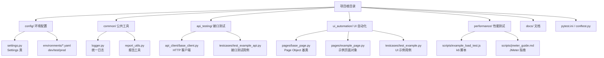
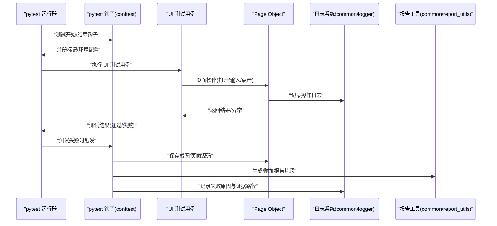
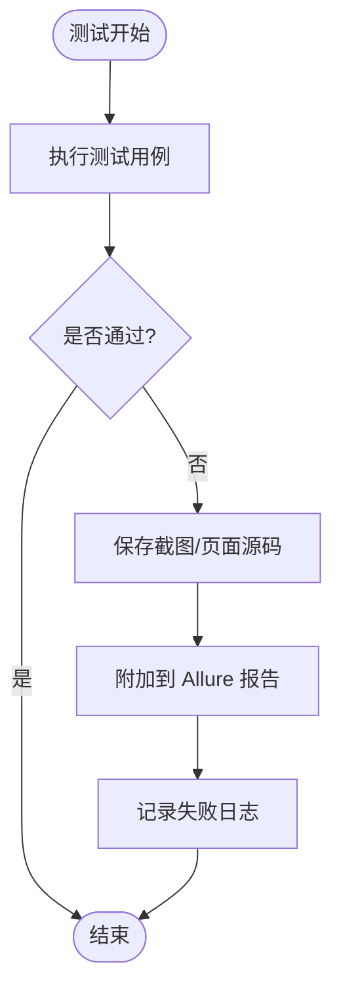
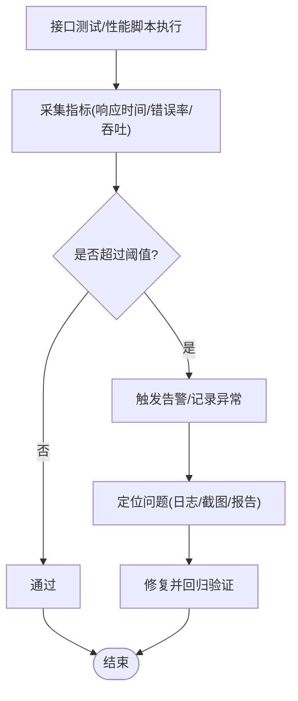
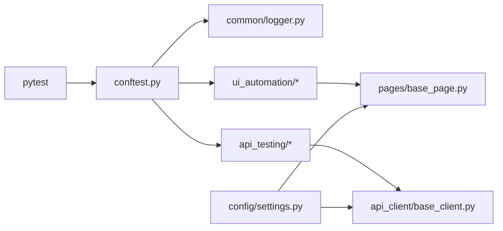

# 监控与告警配置

<cite>
**本文引用的文件**
- [README.md](file://README.md)
- [requirements.txt](file://requirements.txt)
- [pytest.ini](file://pytest.ini)
- [conftest.py](file://conftest.py)
- [config/settings.py](file://config/settings.py)
- [config/environments/dev.yaml](file://config/environments/dev.yaml)
- [config/environments/test.yaml](file://config/environments/test.yaml)
- [config/environments/prod.yaml](file://config/environments/prod.yaml)
- [common/logger.py](file://common/logger.py)
- [common/report_utils.py](file://common/report_utils.py)
- [api_testing/api_client/base_client.py](file://api_testing/api_client/base_client.py)
- [api_testing/testcases/test_example_api.py](file://api_testing/testcases/test_example_api.py)
- [ui_automation/testcases/test_example.py](file://ui_automation/testcases/test_example.py)
- [ui_automation/pages/base_page.py](file://ui_automation/pages/base_page.py)
- [ui_automation/pages/example_page.py](file://ui_automation/pages/example_page.py)
- [performance/scripts/example_load_test.js](file://performance/scripts/example_load_test.js)
- [performance/scripts/jmeter_guide.md](file://performance/scripts/jmeter_guide.md)
</cite>

## 目录
1. [简介](#简介)
2. [项目结构](#项目结构)
3. [核心组件](#核心组件)
4. [架构总览](#架构总览)
5. [详细组件分析](#详细组件分析)
6. [依赖关系分析](#依赖关系分析)
7. [性能考量](#性能考量)
8. [故障排查指南](#故障排查指南)
9. [结论](#结论)
10. [附录](#附录)

## 简介
本指南面向测试与质量保障团队，围绕“监控与告警配置”提供一套可落地的操作手册。内容覆盖测试执行监控、性能指标采集、异常检测、日志系统配置、关键指标与阈值策略、告警规则与通知渠道、故障响应流程，以及测试失败监控、资源使用监控与系统健康检查的实现要点。同时给出监控仪表板配置、历史数据分析与趋势预测方法的实践建议。

## 项目结构
该项目采用模块化组织，测试框架基于 pytest，结合 UI 自动化（Selenium）、接口测试（Requests）、性能测试（k6/JMeter）与统一日志（Loguru）。配置管理通过多环境 YAML 文件与 Settings 类实现，日志与报告工具集中在 common 子模块。

图表来源
- [README.md:1-123](file://README.md#L1-L123)
- [config/settings.py:1-104](file://config/settings.py#L1-L104)
- [common/logger.py:1-77](file://common/logger.py#L1-L77)
- [common/report_utils.py:1-143](file://common/report_utils.py#L1-L143)
- [api_testing/api_client/base_client.py:1-308](file://api_testing/api_client/base_client.py#L1-L308)
- [ui_automation/pages/base_page.py:1-515](file://ui_automation/pages/base_page.py#L1-L515)
- [performance/scripts/example_load_test.js:1-33](file://performance/scripts/example_load_test.js#L1-L33)
- [performance/scripts/jmeter_guide.md:1-98](file://performance/scripts/jmeter_guide.md#L1-L98)

章节来源
- [README.md:1-123](file://README.md#L1-L123)
- [pytest.ini:1-16](file://pytest.ini#L1-L16)

## 核心组件
- 配置管理：通过 Settings 类按环境读取 YAML 配置，提供 base_url、api、browser 等配置项，支持多环境切换。
- 日志系统：基于 Loguru，统一控制台与文件输出，按天轮转并保留 7 天，支持模块级日志绑定。
- 测试执行监控：pytest 钩子在测试失败时自动截图并附加到 Allure 报告；全局 driver fixture 管理浏览器生命周期。
- 接口测试客户端：封装 HTTP 请求、断言与日志，内置响应时间断言，便于性能与稳定性监控。
- UI Page Object：封装页面元素与交互，统一截图与页面源码保存，便于问题复现与证据留存。
- 性能测试：提供 k6 与 JMeter 的脚本与执行指南，支持阈值配置与报告生成。

章节来源
- [config/settings.py:13-104](file://config/settings.py#L13-L104)
- [common/logger.py:1-77](file://common/logger.py#L1-L77)
- [conftest.py:84-126](file://conftest.py#L84-L126)
- [api_testing/api_client/base_client.py:18-308](file://api_testing/api_client/base_client.py#L18-L308)
- [ui_automation/pages/base_page.py:36-515](file://ui_automation/pages/base_page.py#L36-L515)
- [performance/scripts/example_load_test.js:1-33](file://performance/scripts/example_load_test.js#L1-L33)
- [performance/scripts/jmeter_guide.md:1-98](file://performance/scripts/jmeter_guide.md#L1-L98)

## 架构总览
下图展示了测试执行、日志与性能监控的关键交互路径，以及异常检测与证据留存的流程。

图表来源
- [conftest.py:84-126](file://conftest.py#L84-L126)
- [ui_automation/pages/base_page.py:370-421](file://ui_automation/pages/base_page.py#L370-L421)
- [common/logger.py:1-77](file://common/logger.py#L1-L77)
- [common/report_utils.py:68-143](file://common/report_utils.py#L68-L143)

## 详细组件分析

### 测试执行监控与异常检测
- 测试失败自动截图与证据留存：在测试失败时，钩子自动保存 PNG 截图与页面源码，并尝试附加到 Allure 报告，便于后续分析。
- 失败重试与报告增强：依赖 pytest-rerunfailures，可在 CI 中提升稳定性；pytest-html 与 Allure 用于生成可视化报告。
- 浏览器生命周期管理：全局 driver fixture 统一初始化与销毁，减少资源泄漏风险。

图表来源
- [conftest.py:84-126](file://conftest.py#L84-L126)
- [ui_automation/pages/base_page.py:370-421](file://ui_automation/pages/base_page.py#L370-L421)

章节来源
- [conftest.py:84-126](file://conftest.py#L84-L126)
- [requirements.txt:21-21](file://requirements.txt#L21-L21)
- [pytest.ini:1-16](file://pytest.ini#L1-L16)

### 性能指标收集与阈值策略
- 接口响应时间断言：BaseClient 提供响应时间断言方法，便于在接口测试中设定最大响应时间阈值。
- k6 负载测试：示例脚本包含 p95 响应时间与错误率阈值配置，可直接作为性能基线参考。
- JMeter 执行与报告：提供命令行执行、HTML 报告生成与参数覆盖方法，便于在不同场景下调整并发与循环次数。

图表来源
- [api_testing/api_client/base_client.py:258-265](file://api_testing/api_client/base_client.py#L258-L265)
- [performance/scripts/example_load_test.js:14-18](file://performance/scripts/example_load_test.js#L14-L18)
- [performance/scripts/jmeter_guide.md:23-49](file://performance/scripts/jmeter_guide.md#L23-L49)

章节来源
- [api_testing/api_client/base_client.py:233-295](file://api_testing/api_client/base_client.py#L233-L295)
- [performance/scripts/example_load_test.js:1-33](file://performance/scripts/example_load_test.js#L1-L33)
- [performance/scripts/jmeter_guide.md:1-98](file://performance/scripts/jmeter_guide.md#L1-L98)

### 日志系统配置与关键指标
- 日志格式与级别：控制台输出 INFO 及以上，文件输出 DEBUG 及以上，按天轮转并保留 7 天。
- 模块绑定：通过 bind(module=...) 为每个模块注入上下文，便于跨模块关联分析。
- 关键指标建议：
  - 测试执行：用例总数、通过数、失败数、跳过数、通过率。
  - 接口测试：状态码分布、响应时间分布、错误率、超时次数。
  - UI 自动化：页面打开耗时、元素查找耗时、交互失败次数、截图数量。
  - 性能测试：并发用户数、RPS、P95/P99 响应时间、错误率、资源占用。

章节来源
- [common/logger.py:14-56](file://common/logger.py#L14-L56)
- [common/report_utils.py:68-122](file://common/report_utils.py#L68-L122)

### 告警规则配置与通知渠道
- 告警规则建议：
  - 接口测试：错误率 > 1%、P95 响应时间 > 阈值、超时占比 > 阈值。
  - UI 自动化：页面打开失败率 > 阈值、元素查找超时 > 阈值、截图异常 > 阈值。
  - 性能测试：RPS 显著下降、P95 响应时间上升、错误率上升。
- 通知渠道：结合 CI/CD 平台（如 GitHub Actions/Jenkins）与企业 IM（如钉钉/飞书/Webhook），在阈值触发时发送告警消息。
- 响应流程：
  - 触发告警 → 自动抓取日志与证据 → 生成临时报告 → 指派责任人 → 回归验证 → 关闭工单。

章节来源
- [performance/scripts/example_load_test.js:14-18](file://performance/scripts/example_load_test.js#L14-L18)
- [api_testing/api_client/base_client.py:258-265](file://api_testing/api_client/base_client.py#L258-L265)
- [conftest.py:113-125](file://conftest.py#L113-L125)

### 故障响应流程
- 自动化证据：失败截图、页面源码、日志文件、Allure 报告附件。
- 快速定位：结合日志关键字搜索、页面元素定位器与响应时间断言结果。
- 回归验证：使用 rerunfailures 重试失败用例，确认修复有效性。

章节来源
- [ui_automation/pages/base_page.py:370-421](file://ui_automation/pages/base_page.py#L370-L421)
- [conftest.py:113-125](file://conftest.py#L113-L125)
- [requirements.txt:21-21](file://requirements.txt#L21-L21)

### 监控仪表板配置与历史分析
- 仪表板建议指标：
  - 测试通过率趋势、失败用例 TopN、平均响应时间趋势、错误率趋势。
  - UI 自动化页面打开耗时分布、元素查找耗时分布。
  - 性能测试 RPS、P95/P99 响应时间、错误率。
- 历史数据分析：按日/周/月聚合指标，识别异常波动与回归。
- 趋势预测：基于历史数据进行简单移动平均或指数平滑，设定预警阈值。

章节来源
- [common/report_utils.py:68-122](file://common/report_utils.py#L68-L122)
- [performance/scripts/jmeter_guide.md:71-91](file://performance/scripts/jmeter_guide.md#L71-L91)

## 依赖关系分析
- 测试框架与工具：pytest、pytest-html、Allure、pytest-rerunfailures、Selenium、Requests、Loguru。
- 配置与日志：config/settings.py 依赖 YAML 环境配置；common/logger.py 提供统一日志；conftest.py 注入日志与失败截图。
- 接口与 UI：api_client/base_client.py 依赖 requests 与 config/settings；ui_automation/pages/base_page.py 依赖 Selenium 与 common/logger。

图表来源
- [requirements.txt:1-25](file://requirements.txt#L1-L25)
- [conftest.py:19-22](file://conftest.py#L19-L22)
- [config/settings.py:13-104](file://config/settings.py#L13-L104)
- [api_testing/api_client/base_client.py:18-44](file://api_testing/api_client/base_client.py#L18-L44)
- [ui_automation/pages/base_page.py:36-56](file://ui_automation/pages/base_page.py#L36-L56)

章节来源
- [requirements.txt:1-25](file://requirements.txt#L1-L25)
- [conftest.py:19-22](file://conftest.py#L19-L22)
- [config/settings.py:13-104](file://config/settings.py#L13-L104)

## 性能考量
- 并发与稳定性：pytest-xdist 支持并行执行；JMeter 与 k6 提供不同粒度的并发模型。
- 资源监控：建议在 CI 环境中采集 CPU/内存/网络等资源指标，结合性能测试报告进行综合评估。
- 报告与缓存：统一报告输出目录与命名规范，避免历史数据覆盖；按需生成 HTML 报告与 JTL 结果。

章节来源
- [requirements.txt:4-4](file://requirements.txt#L4-L4)
- [performance/scripts/jmeter_guide.md:71-91](file://performance/scripts/jmeter_guide.md#L71-L91)

## 故障排查指南
- 日志定位：使用模块绑定的日志，按“模块名+关键词”检索；关注请求/响应日志与异常堆栈。
- 截图与证据：失败时自动保存的截图与页面源码是定位 UI 问题的关键；必要时手动补充关键步骤截图。
- 配置核对：确认 TEST_ENV 与对应 YAML 配置一致；核对 base_url、超时、浏览器参数等。
- 依赖版本：确保 pytest、Selenium、Requests、Loguru 版本与 requirements 一致。

章节来源
- [common/logger.py:59-77](file://common/logger.py#L59-L77)
- [conftest.py:113-125](file://conftest.py#L113-L125)
- [config/environments/dev.yaml:1-31](file://config/environments/dev.yaml#L1-L31)
- [config/environments/test.yaml:1-31](file://config/environments/test.yaml#L1-L31)
- [config/environments/prod.yaml:1-31](file://config/environments/prod.yaml#L1-L31)
- [requirements.txt:1-25](file://requirements.txt#L1-L25)

## 结论
通过统一的配置管理、标准化的日志与报告、完善的测试执行监控与异常检测机制，以及明确的告警规则与故障响应流程，本项目形成了可扩展、可观测、可追溯的测试监控体系。建议在现有基础上进一步引入资源监控与趋势预测能力，持续优化阈值策略与通知渠道，以提升整体质量保障效率。

## 附录
- 环境配置文件示例：dev/test/prod YAML 文件分别定义了基础 URL、账号、数据库、API 与浏览器配置。
- 多环境切换：通过环境变量 TEST_ENV 指定当前环境，Settings 类自动加载对应配置。
- 测试标记：pytest.ini 中定义了 ui、api、smoke、regression、functional 等标记，便于分类执行与统计。

章节来源
- [config/environments/dev.yaml:1-31](file://config/environments/dev.yaml#L1-L31)
- [config/environments/test.yaml:1-31](file://config/environments/test.yaml#L1-L31)
- [config/environments/prod.yaml:1-31](file://config/environments/prod.yaml#L1-L31)
- [config/settings.py:26-35](file://config/settings.py#L26-L35)
- [pytest.ini:7-15](file://pytest.ini#L7-L15)