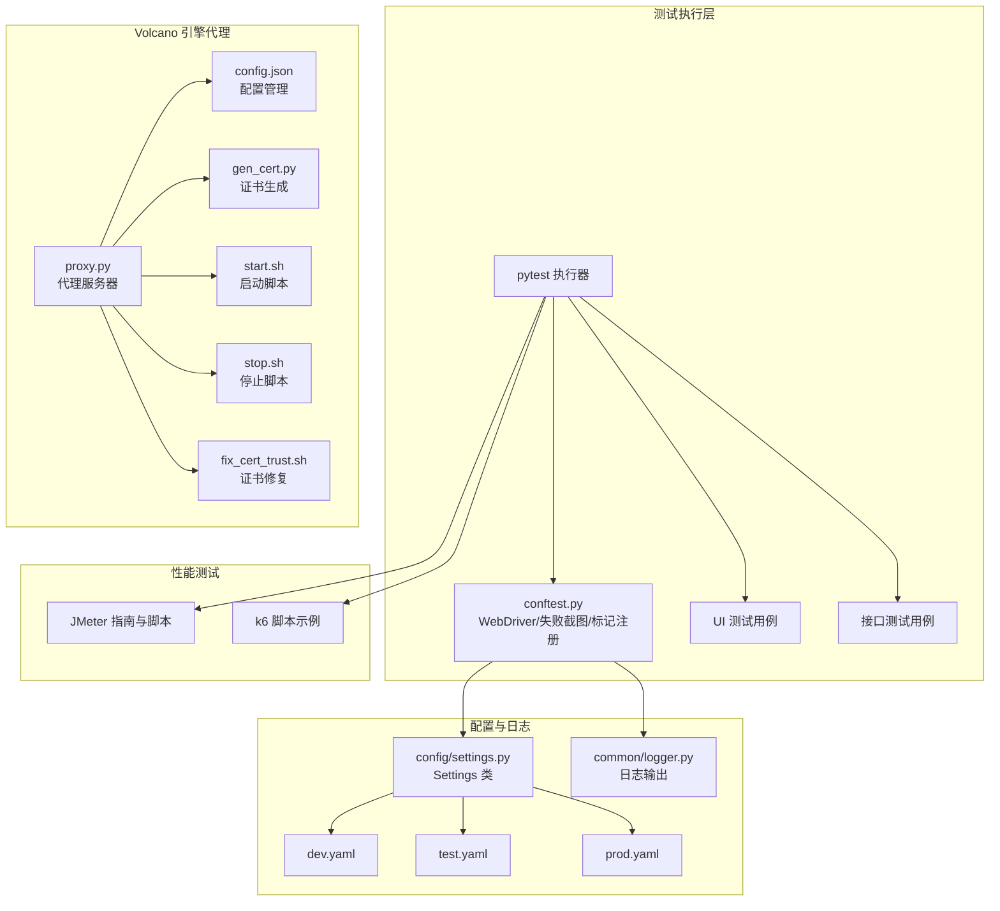
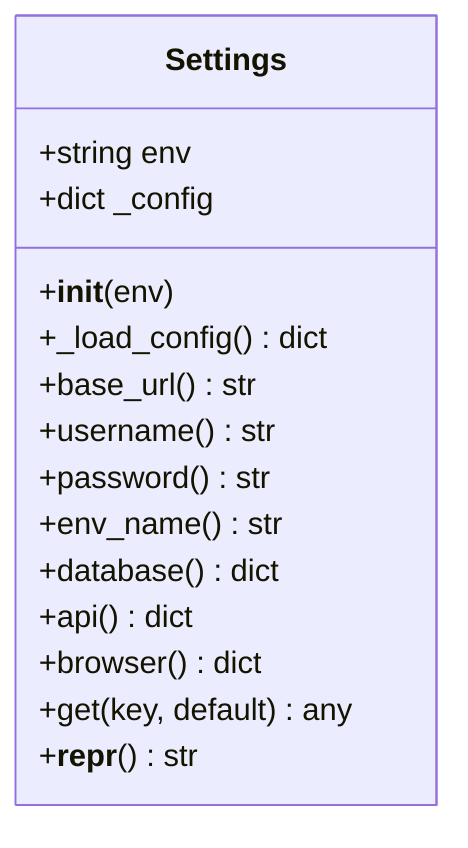
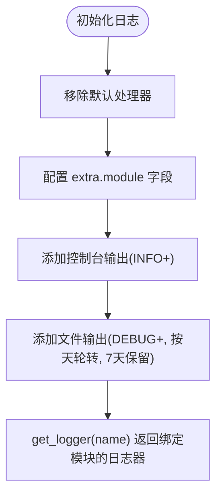
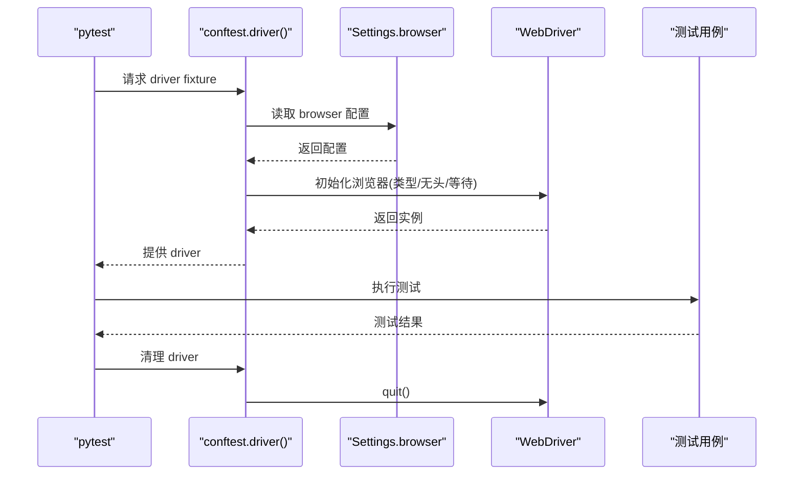
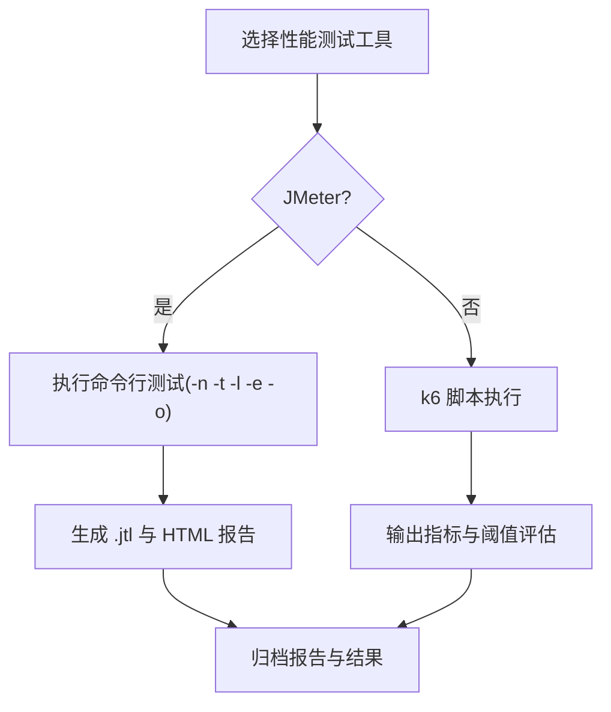
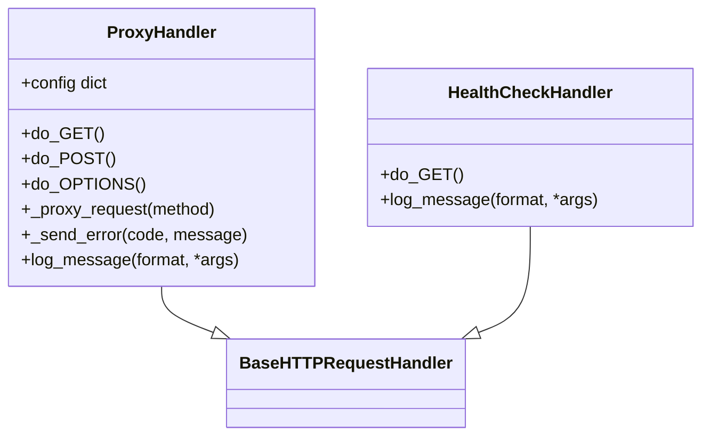
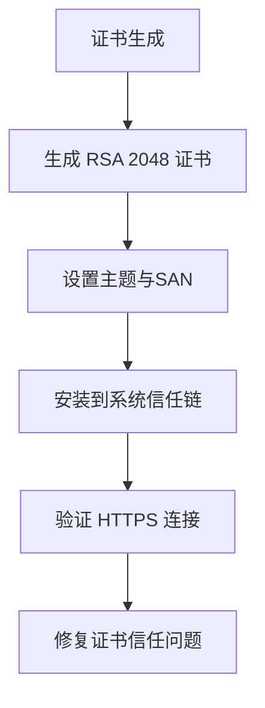
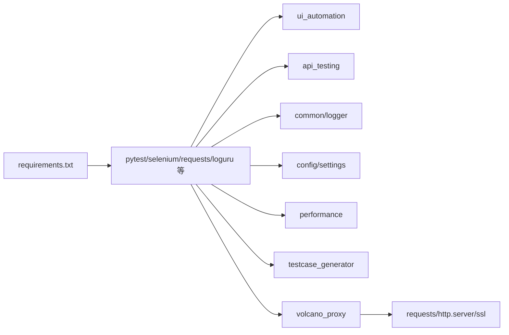

# 部署与运维

<cite>
**本文引用的文件**
- [README.md](file://README.md)
- [requirements.txt](file://requirements.txt)
- [pytest.ini](file://pytest.ini)
- [conftest.py](file://conftest.py)
- [config/settings.py](file://config/settings.py)
- [config/environments/dev.yaml](file://config/environments/dev.yaml)
- [config/environments/test.yaml](file://config/environments/test.yaml)
- [config/environments/prod.yaml](file://config/environments/prod.yaml)
- [common/logger.py](file://common/logger.py)
- [performance/scripts/jmeter_guide.md](file://performance/scripts/jmeter_guide.md)
- [performance/scripts/example_load_test.js](file://performance/scripts/example_load_test.js)
- [docs/getting_started.md](file://docs/getting_started.md)
- [ui_automation/testcases/test_example.py](file://ui_automation/testcases/test_example.py)
- [api_testing/testcases/test_example_api.py](file://api_testing/testcases/test_example_api.py)
- [.gitignore](file://.gitignore)
- [volcano_proxy/config.json](file://volcano_proxy/config.json)
- [volcano_proxy/proxy.py](file://volcano_proxy/proxy.py)
- [volcano_proxy/gen_cert.py](file://volcano_proxy/gen_cert.py)
- [volcano_proxy/start.sh](file://volcano_proxy/start.sh)
- [volcano_proxy/stop.sh](file://volcano_proxy/stop.sh)
- [volcano_proxy/fix_cert_trust.sh](file://volcano_proxy/fix_cert_trust.sh)
</cite>

## 目录
1. [引言](#引言)
2. [项目结构](#项目结构)
3. [核心组件](#核心组件)
4. [架构总览](#架构总览)
5. [详细组件分析](#详细组件分析)
6. [依赖分析](#依赖分析)
7. [性能考虑](#性能考虑)
8. [故障排查指南](#故障排查指南)
9. [结论](#结论)
10. [附录](#附录)

## 引言
本指南面向部署与运维团队，围绕该测试自动化工作区提供从环境准备、依赖安装、配置管理、多环境部署策略、CI/CD 集成、监控与告警、性能优化、故障恢复到容器化与云平台集成的完整操作说明。文档同时给出运维工具使用、日志分析与问题诊断方法，并结合现有代码库中的配置与脚本进行落地。**新增**：包含 Volcano 引擎代理基础设施的部署与运维指南。

## 项目结构
该项目采用模块化组织，包含配置管理、UI 自动化、接口测试、性能测试、测试用例生成器、公共工具与文档等模块。**新增**：Volcano 引擎代理基础设施模块。关键特性包括：
- 多环境配置（dev/test/prod）通过 YAML 文件集中管理
- pytest 驱动的测试执行与报告生成
- 统一日志模块与失败截图机制
- 性能测试支持 JMeter 与 k6
- Git 协同与本地虚拟环境隔离
- **新增**：Volcano 引擎代理服务器，支持模型映射与证书管理

```mermaid
graph TB
A["项目根目录"] --> B["config/ 配置模块"]
A --> C["common/ 公共工具"]
A --> D["ui_automation/ UI 自动化"]
A --> E["api_testing/ 接口测试"]
A --> F["performance/ 性能测试"]
A --> G["testcase_generator/ 用例生成器"]
A --> H["docs/ 文档"]
A --> I["requirements.txt 依赖清单"]
A --> J[".gitignore 忽略规则"]
A --> VP["volcano_proxy/ Volcano代理"]
VP --> VP1["proxy.py 代理服务器"]
VP --> VP2["config.json 配置文件"]
VP --> VP3["gen_cert.py 证书生成"]
VP --> VP4["start.sh 启动脚本"]
VP --> VP5["stop.sh 停止脚本"]
VP --> VP6["fix_cert_trust.sh 证书修复"]
B --> B1["settings.py 配置管理"]
B --> B2["environments/*.yaml 环境配置"]
C --> C1["logger.py 日志"]
D --> D1["testcases/ 测试用例"]
D --> D2["pages/ 页面对象"]
E --> E1["testcases/ 测试用例"]
E --> E2["api_client/ 客户端封装"]
F --> F1["scripts/ 脚本与指南"]
F --> F2["reports/ 报告"]
G --> G1["generator.py 生成器"]
H --> H1["getting_started.md 快速上手"]
```



**图表来源**
- [README.md:7-43](file://README.md#L7-L43)
- [config/settings.py:13-104](file://config/settings.py#L13-L104)
- [common/logger.py:1-77](file://common/logger.py#L1-L77)
- [performance/scripts/jmeter_guide.md:1-98](file://performance/scripts/jmeter_guide.md#L1-L98)
- [docs/getting_started.md:1-91](file://docs/getting_started.md#L1-L91)
- [volcano_proxy/proxy.py:1-371](file://volcano_proxy/proxy.py#L1-371)

**章节来源**
- [README.md:7-43](file://README.md#L7-L43)
- [docs/getting_started.md:1-91](file://docs/getting_started.md#L1-L91)

## 核心组件
- 配置管理：通过 Settings 类按环境变量加载对应 YAML 配置，提供属性与 get 方法访问；全局实例 settings 供各模块使用。
- 日志系统：基于 loguru 的统一日志配置，控制台 INFO+ 输出与文件 DEBUG+ 按天轮转、保留 7 天。
- 测试执行：pytest.ini 定义测试路径、HTML 报告与标记；conftest.py 提供 WebDriver fixture、失败截图钩子与 marker 注册。
- 性能测试：JMeter 指南与脚本示例；k6 脚本示例展示阈值与阶梯式负载。
- 用例生成：测试用例生成器支持 YAML/Excel 导出，便于团队协作与版本化管理。
- **新增**：Volcano 引擎代理：支持 HTTPS 代理、模型映射、证书管理、健康检查与进程管理。

**章节来源**
- [config/settings.py:13-104](file://config/settings.py#L13-L104)
- [common/logger.py:1-77](file://common/logger.py#L1-L77)
- [pytest.ini:1-12](file://pytest.ini#L1-L12)
- [conftest.py:1-122](file://conftest.py#L1-L122)
- [performance/scripts/jmeter_guide.md:1-98](file://performance/scripts/jmeter_guide.md#L1-L98)
- [performance/scripts/example_load_test.js:1-33](file://performance/scripts/example_load_test.js#L1-L33)
- [testcase_generator/generator.py:17-263](file://testcase_generator/generator.py#L17-L263)
- [volcano_proxy/proxy.py:1-371](file://volcano_proxy/proxy.py#L1-371)

## 架构总览
下图展示了测试执行链路与配置、日志、性能测试之间的关系，以及多环境配置的加载路径。**新增**：Volcano 引擎代理作为中间层，拦截并转发 API 请求。



**图表来源**
- [conftest.py:19-78](file://conftest.py#L19-L78)
- [config/settings.py:26-48](file://config/settings.py#L26-L48)
- [config/environments/dev.yaml:1-31](file://config/environments/dev.yaml#L1-L31)
- [config/environments/test.yaml:1-31](file://config/environments/test.yaml#L1-L31)
- [config/environments/prod.yaml:1-31](file://config/environments/prod.yaml#L1-L31)
- [common/logger.py:34-56](file://common/logger.py#L34-L56)
- [performance/scripts/jmeter_guide.md:19-98](file://performance/scripts/jmeter_guide.md#L19-L98)
- [performance/scripts/example_load_test.js:5-19](file://performance/scripts/example_load_test.js#L5-L19)
- [volcano_proxy/proxy.py:28-371](file://volcano_proxy/proxy.py#L28-371)
- [volcano_proxy/config.json:1-26](file://volcano_proxy/config.json#L1-26)

## 详细组件分析

### 配置管理组件
- 功能要点
  - 通过环境变量 TEST_ENV 选择 dev/test/prod，自动加载对应 YAML
  - 提供 base_url、username、password、database、api、browser 等属性访问
  - 支持通用 get(key, default) 获取任意配置项
- 部署建议
  - 在 CI/CD 环境中设置 TEST_ENV，避免硬编码
  - 将敏感配置（如数据库密码、token）纳入密钥管理，不要提交到仓库
  - 为不同环境维护独立的 YAML 文件，确保一致性与可审计性



**图表来源**
- [config/settings.py:13-104](file://config/settings.py#L13-L104)

**章节来源**
- [config/settings.py:13-104](file://config/settings.py#L13-L104)
- [config/environments/dev.yaml:1-31](file://config/environments/dev.yaml#L1-L31)
- [config/environments/test.yaml:1-31](file://config/environments/test.yaml#L1-L31)
- [config/environments/prod.yaml:1-31](file://config/environments/prod.yaml#L1-L31)

### 日志组件
- 功能要点
  - 控制台 INFO 级别及以上输出，彩色日志
  - 文件 DEBUG 级别及以上，按天轮转，保留 7 天
  - 通过 get_logger(name) 绑定模块名，便于定位来源
- 运维建议
  - 在容器或云平台中挂载日志卷，避免日志丢失
  - 结合日志收集系统（如 Fluent Bit/Fluentd、Filebeat）统一采集
  - 对敏感字段进行脱敏处理，避免日志泄露



**图表来源**
- [common/logger.py:34-76](file://common/logger.py#L34-L76)

**章节来源**
- [common/logger.py:1-77](file://common/logger.py#L1-L77)

### 测试执行与失败截图
- 功能要点
  - WebDriver fixture 根据 browser 配置初始化 Chrome/Firefox，支持 headless、隐式等待、页面加载超时
  - 失败自动截图钩子：在 call 阶段失败时保存截图至 ui_automation/evidence/
  - pytest.ini 定义测试路径、HTML 报告与标记（smoke/regression/api/ui）
- 运维建议
  - 在 CI/CD 中上传失败截图与报告作为工件
  - 使用并行执行（xdist）提升吞吐，但需关注资源限制
  - 为 UI 测试设置稳定的等待策略与重试机制



**图表来源**
- [conftest.py:25-69](file://conftest.py#L25-L69)
- [config/settings.py:80-83](file://config/settings.py#L80-L83)

**章节来源**
- [pytest.ini:1-12](file://pytest.ini#L1-L12)
- [conftest.py:1-122](file://conftest.py#L1-L122)
- [ui_automation/testcases/test_example.py:31-161](file://ui_automation/testcases/test_example.py#L31-L161)

### 性能测试组件
- JMeter
  - 支持命令行非 GUI 执行，生成 .jtl 结果与 HTML 报告
  - 建议按模块命名脚本，输出到 performance/reports/ 并按日期命名
- k6
  - 示例脚本展示阶梯式负载与阈值配置，适合快速评估接口性能
- 运维建议
  - 在独立性能测试机或容器中执行，避免与业务流量互相影响
  - 将 .jtl 与 HTML 报告作为工件归档，便于对比分析



**图表来源**
- [performance/scripts/jmeter_guide.md:19-98](file://performance/scripts/jmeter_guide.md#L19-L98)
- [performance/scripts/example_load_test.js:5-19](file://performance/scripts/example_load_test.js#L5-L19)

**章节来源**
- [performance/scripts/jmeter_guide.md:1-98](file://performance/scripts/jmeter_guide.md#L1-L98)
- [performance/scripts/example_load_test.js:1-33](file://performance/scripts/example_load_test.js#L1-L33)

### 用例生成器组件
- 功能要点
  - 从测试点批量生成结构化用例，支持导出 YAML/Excel
  - 自动生成用例编号与摘要信息，便于版本化管理
- 运维建议
  - 将生成的用例纳入版本控制，配合评审流程
  - 用例模板标准化，减少沟通成本

**章节来源**
- [testcase_generator/generator.py:17-263](file://testcase_generator/generator.py#L17-L263)

### Volcano 引擎代理基础设施
**新增**：Volcano 引擎代理作为中间层，拦截并转发 API 请求，支持模型映射与证书管理。

#### 代理服务器组件
- 功能要点
  - 支持 HTTPS 代理，监听 443 端口
  - 拦截 api.minimax.chat 域名的请求并转发到火山引擎
  - 实现模型名称映射与推理程度设置
  - 支持流式响应（SSE）处理
  - 提供健康检查端点
- 部署建议
  - 需要 root 权限监听 443 端口
  - 配置正确的火山引擎 API Key
  - 确保系统信任自签名证书
  - 在防火墙中开放 443 端口



**图表来源**
- [volcano_proxy/proxy.py:58-238](file://volcano_proxy/proxy.py#L58-238)
- [volcano_proxy/proxy.py:244-263](file://volcano_proxy/proxy.py#L244-263)

#### 配置管理组件
- 功能要点
  - 通过 config.json 集中管理代理配置
  - 包含火山引擎 API 配置、代理服务器设置、模型映射表
  - 支持默认回退模型与推理程度设置
- 部署建议
  - 在生产环境中使用环境变量或密钥管理服务
  - 定期备份配置文件
  - 为不同环境维护独立的配置文件

**章节来源**
- [volcano_proxy/config.json:1-26](file://volcano_proxy/config.json#L1-26)
- [volcano_proxy/proxy.py:34-371](file://volcano_proxy/proxy.py#L34-371)

#### 证书管理组件
- 功能要点
  - 自动生成自签名 SSL 证书（RSA 2048位）
  - 支持 macOS 系统信任链安装与卸载
  - 生成证书时包含 SAN（Subject Alternative Name）
  - 提供证书修复脚本解决信任问题
- 部署建议
  - 在生产环境中使用受信 CA 签发的证书
  - 定期更新证书有效期
  - 确保私钥安全存储



**图表来源**
- [volcano_proxy/gen_cert.py:17-61](file://volcano_proxy/gen_cert.py#L17-61)
- [volcano_proxy/fix_cert_trust.sh:31-40](file://volcano_proxy/fix_cert_trust.sh#L31-40)

#### 启动与停止组件
- 功能要点
  - start.sh：一键启动代理，自动检查证书、配置与进程状态
  - stop.sh：优雅停止代理，支持清理模式移除所有配置
  - 自动修改 /etc/hosts 实现域名劫持
  - 提供 PID 文件管理与进程监控
- 部署建议
  - 在 systemd 或 docker 中配置自动启动
  - 设置合理的超时与重试机制
  - 配置日志轮转与磁盘空间管理

**章节来源**
- [volcano_proxy/start.sh:1-125](file://volcano_proxy/start.sh#L1-125)
- [volcano_proxy/stop.sh:1-84](file://volcano_proxy/stop.sh#L1-84)

## 依赖分析
- Python 依赖通过 requirements.txt 管理，包含 pytest、pytest-html、pytest-xdist、selenium、requests、PyYAML、openpyxl、loguru、allure-pytest 等
- 项目通过 conftest.py 注入全局路径与配置，确保模块间解耦与复用
- 日志与配置模块被广泛使用，耦合度低、内聚性强
- **新增**：Volcano 代理依赖 requests 库进行上游请求转发



**图表来源**
- [requirements.txt:1-21](file://requirements.txt#L1-L21)
- [conftest.py:14-22](file://conftest.py#L14-L22)
- [common/logger.py:9-12](file://common/logger.py#L9-L12)
- [config/settings.py:9-10](file://config/settings.py#L9-L10)
- [volcano_proxy/proxy.py:22](file://volcano_proxy/proxy.py#L22)

**章节来源**
- [requirements.txt:1-21](file://requirements.txt#L1-L21)
- [conftest.py:1-122](file://conftest.py#L1-L122)

## 性能考虑
- 测试执行
  - 使用 pytest-xdist 并行执行，合理设置 CPU/内存上限
  - UI 自动化建议 headless 模式，减少资源消耗
- 日志
  - 控制台 INFO 级别输出，文件 DEBUG 级别按天轮转，避免磁盘膨胀
- 性能测试
  - JMeter/k6 分离执行，避免相互干扰
  - 阈值与负载阶梯需结合业务场景动态调整
- **新增**：Volcano 代理性能
  - 代理服务器支持流式响应处理，适用于 SSE 场景
  - 超时设置为 300 秒，适合长连接场景
  - 建议在高并发场景下使用连接池与缓存策略

## 故障排查指南
- 环境配置问题
  - 确认 TEST_ENV 与对应 YAML 文件是否存在
  - 检查 YAML 语法与键名拼写
- 浏览器驱动问题
  - 确认浏览器类型与驱动版本匹配
  - 在 CI 环境中启用无头模式与固定窗口尺寸
- 失败截图与证据
  - 检查 ui_automation/evidence/ 目录权限与空间
  - 确认失败钩子已注册且生效
- 日志定位
  - 查看 logs/ 下按日期分割的日志文件
  - 关注模块名绑定与级别过滤
- 性能测试
  - JMeter 结果文件与报告目录需为空或不存在
  - k6 脚本中的接口地址与阈值需与目标环境一致
- **新增**：Volcano 代理故障排查
  - 检查 443 端口占用情况与防火墙配置
  - 验证证书文件存在且系统信任链正确
  - 确认火山引擎 API Key 有效且有余额
  - 查看代理日志文件定位具体错误
  - 使用健康检查端点验证代理状态

**章节来源**
- [config/settings.py:37-48](file://config/settings.py#L37-L48)
- [conftest.py:80-110](file://conftest.py#L80-L110)
- [common/logger.py:30-56](file://common/logger.py#L30-L56)
- [performance/scripts/jmeter_guide.md:84-98](file://performance/scripts/jmeter_guide.md#L84-L98)
- [performance/scripts/example_load_test.js:22-32](file://performance/scripts/example_load_test.js#L22-L32)
- [volcano_proxy/proxy.py:288-371](file://volcano_proxy/proxy.py#L288-371)

## 结论
本指南基于现有代码库提供了从环境准备、配置管理、测试执行、性能测试到日志与故障排查的完整运维实践。**新增**：Volcano 引擎代理基础设施为 API 请求提供了中间层拦截与转发能力，支持模型映射与证书管理。建议在 CI/CD 中固化上述流程，结合密钥管理与工件归档，形成可追溯、可复现的自动化流水线。

## 附录

### 环境准备与依赖安装
- 创建虚拟环境并安装依赖
- 设置 TEST_ENV 切换环境
- 运行测试与生成报告
- **新增**：安装 Volcano 代理依赖（requests）

**章节来源**
- [docs/getting_started.md:11-51](file://docs/getting_started.md#L11-L51)
- [README.md:54-81](file://README.md#L54-L81)
- [requirements.txt:1-21](file://requirements.txt#L1-L21)

### 多环境部署策略与配置管理
- 通过环境变量 TEST_ENV 选择 dev/test/prod
- YAML 配置集中管理，敏感信息纳入密钥管理
- 版本控制策略：将配置文件纳入版本管理，但排除密钥与临时文件
- **新增**：Volcano 代理配置管理策略
  - 使用 separate 配置文件管理代理设置
  - 在不同环境中维护独立的模型映射表
  - 通过环境变量管理 API Key

**章节来源**
- [config/settings.py:26-34](file://config/settings.py#L26-L34)
- [config/environments/dev.yaml:1-31](file://config/environments/dev.yaml#L1-L31)
- [config/environments/test.yaml:1-31](file://config/environments/test.yaml#L1-L31)
- [config/environments/prod.yaml:1-31](file://config/environments/prod.yaml#L1-L31)
- [.gitignore](file://.gitignore)
- [volcano_proxy/config.json:1-26](file://volcano_proxy/config.json#L1-26)

### CI/CD 集成方案
- 触发条件：push 到 main 或合并 PR
- 步骤建议：
  - 拉取代码、创建虚拟环境、安装依赖
  - 设置 TEST_ENV 与环境变量
  - 执行 pytest（可并行），生成 HTML 报告与 Allure 报告（可选）
  - 上传失败截图与报告为工件
  - 运行性能测试（JMeter/k6），归档结果
  - **新增**：部署 Volcano 代理服务
    - 在部署阶段安装代理依赖
    - 配置代理证书与 API Key
    - 启动代理服务并验证健康状态
- 安全建议：密钥与令牌通过 CI 密钥管理注入，不写入仓库

**章节来源**
- [pytest.ini:6-11](file://pytest.ini#L6-L11)
- [conftest.py:112-122](file://conftest.py#L112-L122)
- [requirements.txt:2-21](file://requirements.txt#L2-L21)

### 监控与告警配置
- 日志监控：采集 logs/ 目录，设置 ERROR/WARN 告警
- 测试报告：将报告作为工件，建立基线与回归阈值
- 性能监控：JMeter/k6 报告中的 p95、错误率阈值触发告警
- **新增**：Volcano 代理监控
  - 监控代理进程状态与健康检查端点
  - 设置证书过期预警与重新生成提醒
  - 监控火山引擎 API 调用配额与错误率
  - 跟踪模型映射命中率与性能指标

**章节来源**
- [common/logger.py:34-56](file://common/logger.py#L34-L56)
- [performance/scripts/jmeter_guide.md:28-37](file://performance/scripts/jmeter_guide.md#L28-L37)
- [performance/scripts/example_load_test.js:14-19](file://performance/scripts/example_load_test.js#L14-L19)
- [volcano_proxy/proxy.py:244-263](file://volcano_proxy/proxy.py#L244-263)

### Docker 容器化部署（最佳实践）
- 基础镜像：官方 Python 基础镜像
- 依赖安装：COPY requirements.txt && pip install -r
- 环境变量：设置 TEST_ENV 与浏览器驱动路径
- 挂载卷：logs/、ui_automation/evidence/、performance/reports/ 用于持久化
- 运行命令：pytest + 并行参数；JMeter/k6 单独容器执行
- **新增**：Volcano 代理容器化
  - 使用非 root 用户运行代理服务
  - 挂载证书目录与配置文件
  - 暴露 443 端口并配置网络模式
  - 使用健康检查探针监控代理状态

**章节来源**
- [requirements.txt:1-21](file://requirements.txt#L1-21)
- [conftest.py:41-55](file://conftest.py#L41-L55)
- [common/logger.py:30-32](file://common/logger.py#L30-L32)

### 云平台集成与自动化运维
- 云构建：在云 CI/CD 平台配置任务，使用容器化执行
- 存储：将日志与报告上传到对象存储，设置生命周期策略
- 安全：密钥与证书通过平台密钥管理服务注入
- **新增**：云平台部署 Volcano 代理
  - 使用托管服务管理证书与密钥
  - 配置负载均衡与自动扩缩容
  - 设置监控告警与日志聚合
  - 使用蓝绿部署或滚动更新策略

**章节来源**
- [docs/getting_started.md:68-90](file://docs/getting_started.md#L68-L90)

### 运维工具使用与日志分析
- 日志分析：按日期筛选，结合模块名定位问题
- 失败截图：在 CI/CD 中下载 evidence/ 截图进行人工复核
- 报告分析：对比历史报告，识别回归与性能退化
- **新增**：Volcano 代理运维工具
  - 使用 start.sh/stop.sh 管理代理生命周期
  - 通过健康检查端点监控代理状态
  - 使用 fix_cert_trust.sh 修复证书信任问题
  - 分析代理日志定位请求转发问题

**章节来源**
- [common/logger.py:30-56](file://common/logger.py#L30-L56)
- [conftest.py:92-110](file://conftest.py#L92-L110)
- [pytest.ini:6](file://pytest.ini#L6)
- [volcano_proxy/start.sh:1-125](file://volcano_proxy/start.sh#L1-125)
- [volcano_proxy/stop.sh:1-84](file://volcano_proxy/stop.sh#L1-84)
- [volcano_proxy/fix_cert_trust.sh:1-62](file://volcano_proxy/fix_cert_trust.sh#L1-62)

### Volcano 代理部署操作指南
**新增**：详细的 Volcano 代理部署与运维操作指南。

#### 部署前准备
1. **系统要求**
   - Linux/macOS 系统（推荐 Ubuntu 18.04+）
   - Python 3.6+ 环境
   - OpenSSL 工具链
   - 管理员权限（sudo）

2. **硬件要求**
   - CPU：至少 2 核心
   - 内存：至少 2GB RAM
   - 磁盘：至少 500MB 可用空间

3. **网络要求**
   - 开放 443 端口（HTTPS）
   - 出站访问火山引擎 API（ark.cn-beijing.volces.com）
   - DNS 解析 api.minimax.chat

#### 安装步骤
1. **克隆项目**
```bash
git clone <repository-url>
cd volcano_proxy
```

2. **生成自签名证书**
```bash
python3 gen_cert.py
# 按提示安装到系统信任链
```

3. **配置 API Key**
编辑 `config.json` 文件，填入有效的火山引擎 API Key：
```json
{
  "volcano_engine": {
    "api_key": "YOUR_ACTUAL_API_KEY",
    "base_url": "https://ark.cn-beijing.volces.com/api/coding/v3"
  }
}
```

4. **启动代理服务**
```bash
sudo bash start.sh
```

#### 验证部署
1. **健康检查**
```bash
curl http://127.0.0.1:8443/health
```

2. **测试 HTTPS 连接**
```bash
curl -k https://api.minimax.chat/
```

3. **查看代理日志**
```bash
tail -f proxy.log
```

#### 常用运维命令
1. **启动代理**
```bash
sudo bash start.sh
```

2. **停止代理**
```bash
sudo bash stop.sh
```

3. **清理配置**
```bash
sudo bash stop.sh --clean
```

4. **修复证书信任**
```bash
sudo bash fix_cert_trust.sh
```

#### 配置文件详解
**config.json 结构**：
```json
{
  "volcano_engine": {
    "api_key": "火山引擎 API Key",
    "base_url": "火山引擎 API 基础 URL"
  },
  "proxy": {
    "listen_host": "监听主机地址",
    "listen_port": "监听端口号",
    "target_domain": "目标域名",
    "cert_file": "证书文件路径",
    "key_file": "私钥文件路径"
  },
  "model_mapping": {
    "源模型名": "目标模型名",
    "glm-5.1": "glm-5.1"
  },
  "default_fallback_model": "默认回退模型",
  "reasoning_effort": "推理程度"
}
```

#### 故障排查
1. **证书相关问题**
```bash
# 重新生成证书
python3 gen_cert.py gen

# 重新安装证书
python3 gen_cert.py install

# 修复证书信任
sudo bash fix_cert_trust.sh
```

2. **进程管理问题**
```bash
# 查看代理进程
ps aux | grep proxy.py

# 查看 PID 文件
cat proxy.pid

# 强制停止
sudo kill -9 $(cat proxy.pid)
```

3. **网络连接问题**
```bash
# 测试火山引擎连通性
curl -I https://ark.cn-beijing.volces.com/

# 检查 DNS 解析
nslookup api.minimax.chat

# 检查防火墙规则
sudo iptables -L
```

#### 性能优化建议
1. **代理性能调优**
   - 调整超时时间：根据业务需求修改 `timeout` 参数
   - 启用连接复用：在上游请求中使用连接池
   - 监控内存使用：定期检查代理进程内存占用

2. **模型映射优化**
   - 定期分析模型使用统计
   - 优化常用模型的映射配置
   - 设置合理的默认回退模型

3. **日志管理**
   - 配置日志轮转策略
   - 设置合适的日志级别
   - 定期清理过期日志文件

#### 安全加固
1. **证书安全管理**
   - 定期更新证书有效期
   - 使用强加密算法（RSA 2048+）
   - 限制证书访问权限

2. **API Key 管理**
   - 使用环境变量或密钥管理服务
   - 定期轮换 API Key
   - 设置访问频率限制

3. **网络安全**
   - 配置防火墙规则
   - 启用 HTTPS 强制跳转
   - 监控异常访问行为

#### 监控与告警
1. **健康监控**
   - 健康检查端点：`http://127.0.0.1:8443/health`
   - 进程存活监控
   - 证书有效期监控

2. **性能监控**
   - 代理响应时间
   - 上游 API 调用成功率
   - 错误率与超时率

3. **日志监控**
   - 错误日志告警
   - 访问量统计
   - 异常请求检测

**章节来源**
- [volcano_proxy/config.json:1-26](file://volcano_proxy/config.json#L1-26)
- [volcano_proxy/proxy.py:34-371](file://volcano_proxy/proxy.py#L34-371)
- [volcano_proxy/gen_cert.py:1-134](file://volcano_proxy/gen_cert.py#L1-134)
- [volcano_proxy/start.sh:1-125](file://volcano_proxy/start.sh#L1-125)
- [volcano_proxy/stop.sh:1-84](file://volcano_proxy/stop.sh#L1-84)
- [volcano_proxy/fix_cert_trust.sh:1-62](file://volcano_proxy/fix_cert_trust.sh#L1-62)