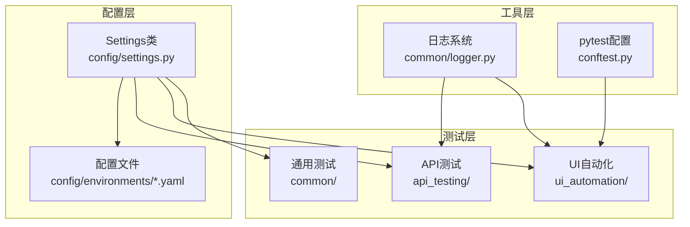
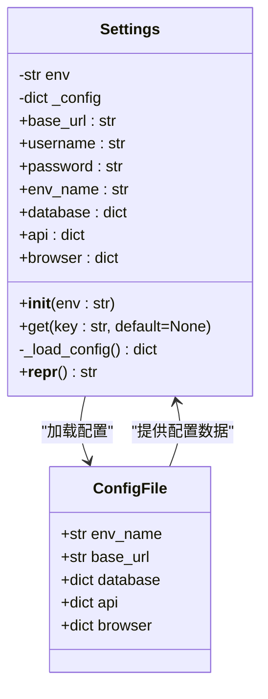
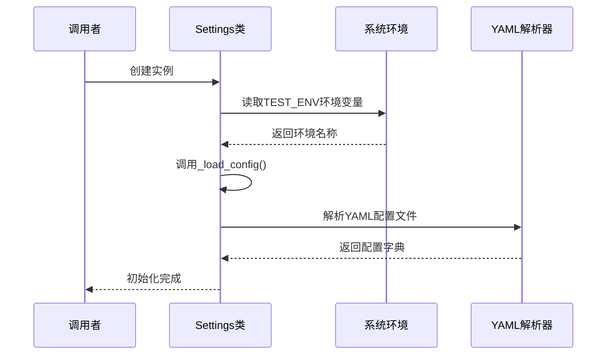
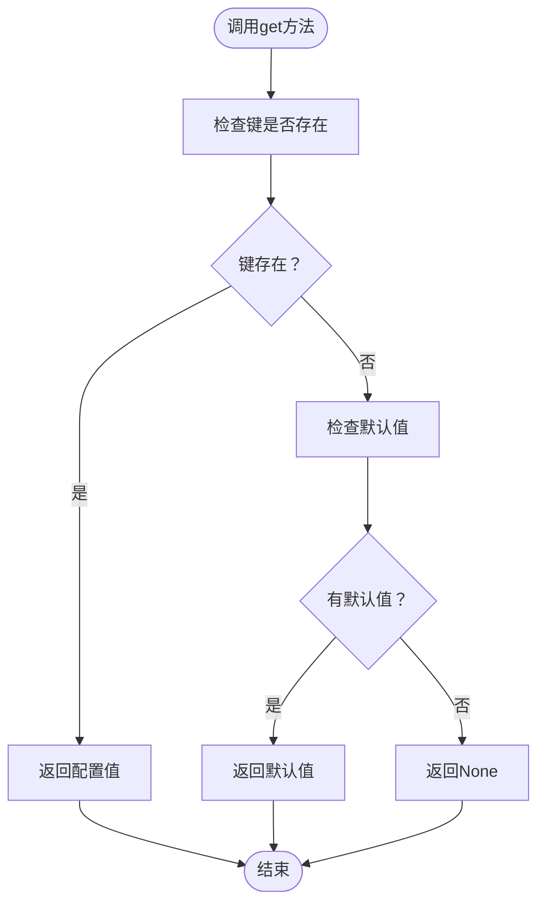
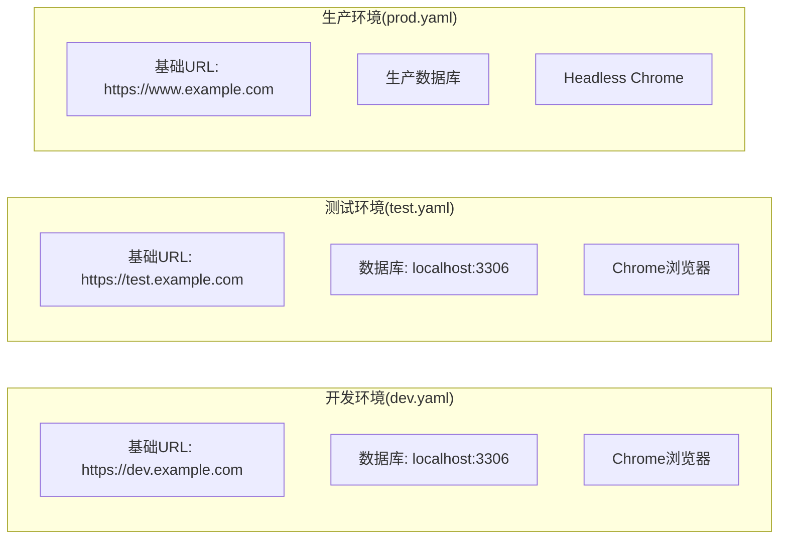
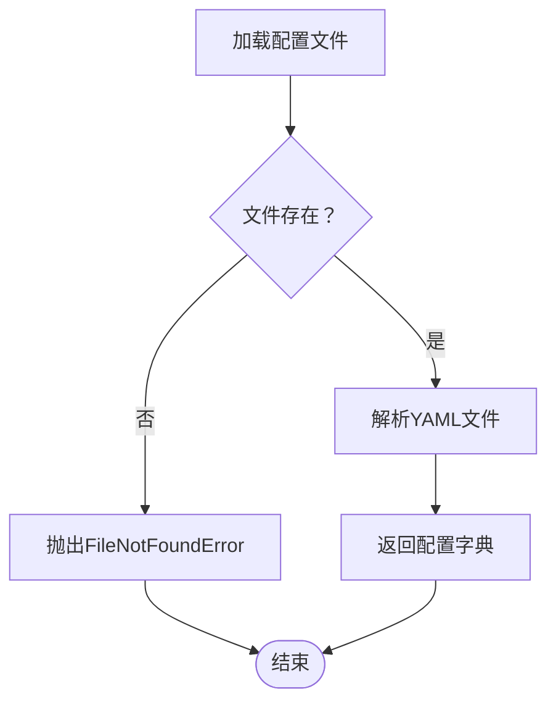
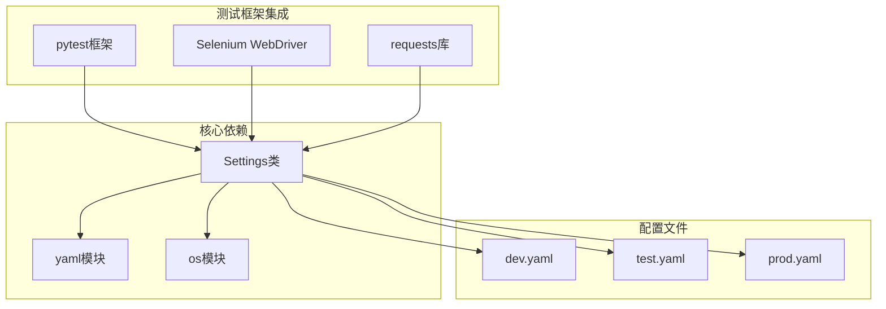

# Settings类设计

<cite>
**本文档引用的文件**
- [config/settings.py](file://config/settings.py)
- [config/environments/dev.yaml](file://config/environments/dev.yaml)
- [config/environments/test.yaml](file://config/environments/test.yaml)
- [config/environments/prod.yaml](file://config/environments/prod.yaml)
- [conftest.py](file://conftest.py)
- [api_testing/testcases/conftest.py](file://api_testing/testcases/conftest.py)
- [api_testing/api_client/base_client.py](file://api_testing/api_client/base_client.py)
- [common/logger.py](file://common/logger.py)
</cite>

## 目录
1. [简介](#简介)
2. [项目结构](#项目结构)
3. [核心组件](#核心组件)
4. [架构概览](#架构概览)
5. [详细组件分析](#详细组件分析)
6. [依赖分析](#依赖分析)
7. [性能考虑](#性能考虑)
8. [故障排除指南](#故障排除指南)
9. [结论](#结论)
10. [附录](#附录)

## 简介
Settings类是一个集中化的配置管理组件，负责根据环境变量加载对应的YAML配置文件，并提供统一的配置访问接口。该类采用单例模式设计，通过全局settings实例供整个测试框架使用，支持多种测试场景（API测试、UI自动化等）的配置需求。

## 项目结构
测试框架采用分层架构设计，Settings类位于config模块中，通过YAML文件管理不同环境的配置信息。



**图表来源**
- [config/settings.py:13-103](file://config/settings.py#L13-L103)
- [config/environments/dev.yaml:1-31](file://config/environments/dev.yaml#L1-L31)

**章节来源**
- [config/settings.py:1-104](file://config/settings.py#L1-L104)

## 核心组件
Settings类是整个配置系统的核心，提供了以下关键功能：

### 主要特性
- **环境感知**：根据TEST_ENV环境变量自动选择配置文件
- **YAML配置**：支持复杂的嵌套配置结构
- **属性访问**：提供便捷的属性访问方式
- **通用查询**：支持字典风格的get方法
- **错误处理**：完善的异常处理机制

### 配置文件结构
每个环境都有对应的YAML配置文件，包含以下标准配置项：
- `base_url`：基础URL地址
- `username/password`：认证凭据
- `env_name`：环境显示名称
- `database`：数据库连接配置
- `api`：API服务配置
- `browser`：浏览器自动化配置

**章节来源**
- [config/settings.py:50-96](file://config/settings.py#L50-L96)
- [config/environments/dev.yaml:1-31](file://config/environments/dev.yaml#L1-L31)

## 架构概览
Settings类采用简洁而高效的架构设计，实现了配置的延迟加载和统一管理。



**图表来源**
- [config/settings.py:13-103](file://config/settings.py#L13-L103)

### 初始化流程
Settings类的初始化过程遵循以下步骤：

1. **环境检测**：优先使用构造函数传入的env参数，否则读取TEST_ENV环境变量
2. **配置加载**：调用_load_config()方法加载对应的YAML文件
3. **配置解析**：使用yaml.safe_load()解析配置文件内容
4. **默认值处理**：如果配置文件为空，返回空字典

**章节来源**
- [config/settings.py:26-48](file://config/settings.py#L26-L48)

## 详细组件分析

### Settings类核心方法

#### __init__方法
构造函数负责设置环境变量和加载配置文件。



**图表来源**
- [config/settings.py:26-35](file://config/settings.py#L26-L35)

#### 属性方法实现
Settings类提供了多个便捷的属性方法：

| 属性名 | 类型 | 默认值 | 使用场景 |
|--------|------|--------|----------|
| base_url | str | "" | API基础URL |
| username | str | "" | 用户名认证 |
| password | str | "" | 密码认证 |
| env_name | str | "" | 环境显示名称 |
| database | dict | {} | 数据库配置 |
| api | dict | {} | API服务配置 |
| browser | dict | {} | 浏览器配置 |

**章节来源**
- [config/settings.py:50-83](file://config/settings.py#L50-L83)

#### get方法实现
通用配置获取方法支持默认值处理。



**图表来源**
- [config/settings.py:85-96](file://config/settings.py#L85-L96)

### 配置文件加载机制

#### 环境配置文件
系统预置了三种标准环境配置：



**图表来源**
- [config/environments/dev.yaml:1-31](file://config/environments/dev.yaml#L1-L31)
- [config/environments/test.yaml:1-31](file://config/environments/test.yaml#L1-L31)
- [config/environments/prod.yaml:1-31](file://config/environments/prod.yaml#L1-L31)

**章节来源**
- [config/environments/dev.yaml:1-31](file://config/environments/dev.yaml#L1-L31)
- [config/environments/test.yaml:1-31](file://config/environments/test.yaml#L1-L31)
- [config/environments/prod.yaml:1-31](file://config/environments/prod.yaml#L1-L31)

### 错误处理策略

#### 配置文件缺失处理
当指定的配置文件不存在时，Settings类会抛出FileNotFoundError异常。



**图表来源**
- [config/settings.py:37-48](file://config/settings.py#L37-L48)

**章节来源**
- [config/settings.py:42-45](file://config/settings.py#L42-L45)

## 依赖分析

### 模块间依赖关系
Settings类与测试框架其他组件的集成关系如下：



**图表来源**
- [config/settings.py:9-10](file://config/settings.py#L9-L10)
- [conftest.py:19](file://conftest.py#L19)
- [api_testing/testcases/conftest.py:13](file://api_testing/testcases/conftest.py#L13)

### 使用场景分析

#### API测试集成
在API测试中，Settings类主要用于获取认证信息和基础URL：

**章节来源**
- [api_testing/testcases/conftest.py:47-79](file://api_testing/testcases/conftest.py#L47-L79)
- [api_testing/api_client/base_client.py:21-44](file://api_testing/api_client/base_client.py#L21-L44)

#### UI自动化集成
在UI自动化测试中，Settings类提供浏览器配置信息：

**章节来源**
- [conftest.py:36-69](file://conftest.py#L36-L69)

## 性能考虑
Settings类的设计充分考虑了性能和内存使用：

### 缓存机制
- **一次性加载**：配置文件只在初始化时加载一次
- **内存缓存**：配置数据存储在实例属性中，避免重复解析
- **延迟初始化**：只有在首次访问时才触发配置加载

### 内存优化
- **轻量级设计**：仅存储必要的配置数据
- **字典结构**：使用Python内置字典，内存效率高
- **属性访问**：通过@property装饰器实现快速访问

## 故障排除指南

### 常见问题及解决方案

#### 配置文件加载失败
**问题描述**：运行时抛出FileNotFoundError异常
**可能原因**：
- TEST_ENV环境变量设置错误
- 配置文件路径不正确
- 配置文件权限不足

**解决方法**：
1. 检查TEST_ENV环境变量值
2. 验证配置文件是否存在
3. 确认文件权限设置

#### 配置项访问返回空值
**问题描述**：访问配置项返回空字符串或空字典
**可能原因**：
- 配置文件中缺少对应键
- 配置文件格式错误

**解决方法**：
1. 检查配置文件语法
2. 验证键名拼写
3. 使用get方法提供默认值

#### 环境切换问题
**问题描述**：无法正确切换到目标环境
**解决方法**：
1. 确认环境变量设置
2. 验证对应配置文件存在
3. 检查文件命名规范

**章节来源**
- [config/settings.py:42-45](file://config/settings.py#L42-L45)

## 结论
Settings类作为测试框架的核心配置管理组件，通过简洁的设计实现了强大的配置管理功能。其基于环境变量的配置文件加载机制、统一的配置访问接口以及完善的错误处理策略，为整个测试框架提供了稳定可靠的配置支持。该设计既满足了多环境配置的需求，又保持了良好的可维护性和扩展性。

## 附录

### 使用示例

#### 基本使用
```python
from config.settings import settings

# 访问基础配置
base_url = settings.base_url
username = settings.username
password = settings.password

# 使用通用方法
database_config = settings.get("database", {})
api_config = settings.get("api", {})
```

#### 在测试中的应用
```python
# API测试
@pytest.fixture
def auth_client():
    client = BaseClient()
    token = settings.get("api", {}).get("token", "")
    if token:
        client.set_token(token)
    return client

# UI自动化
@pytest.fixture
def driver():
    browser_config = settings.get("browser", {})
    browser_type = browser_config.get("type", "chrome")
    # ... 初始化WebDriver
```

### 最佳实践

#### 配置文件组织
1. **标准化命名**：使用dev/test/prod作为环境前缀
2. **层次化结构**：按照功能模块组织配置项
3. **文档化说明**：为每个配置项添加注释说明

#### 错误处理
1. **提供默认值**：使用get方法时提供合理的默认值
2. **环境变量检查**：确保TEST_ENV环境变量正确设置
3. **配置验证**：在应用启动时验证关键配置项

#### 扩展指南
1. **新增配置项**：在相应环境的YAML文件中添加新配置
2. **自定义属性**：在Settings类中添加新的@property方法
3. **配置验证**：添加配置验证逻辑确保数据完整性

### 配置项参考表

| 配置项 | 类型 | 必需 | 描述 |
|--------|------|------|------|
| base_url | str | 是 | 基础URL地址 |
| username | str | 否 | 用户名 |
| password | str | 否 | 密码 |
| env_name | str | 否 | 环境显示名称 |
| database.host | str | 否 | 数据库主机 |
| database.port | int | 否 | 数据库端口 |
| database.name | str | 否 | 数据库名称 |
| database.user | str | 否 | 数据库用户 |
| database.password | str | 否 | 数据库密码 |
| api.base_url | str | 否 | API基础URL |
| api.timeout | int | 否 | API超时时间 |
| api.token | str | 否 | API认证令牌 |
| browser.type | str | 否 | 浏览器类型 |
| browser.headless | bool | 否 | 是否无头模式 |
| browser.implicit_wait | int | 否 | 隐式等待时间 |
| browser.page_load_timeout | int | 否 | 页面加载超时时间 |