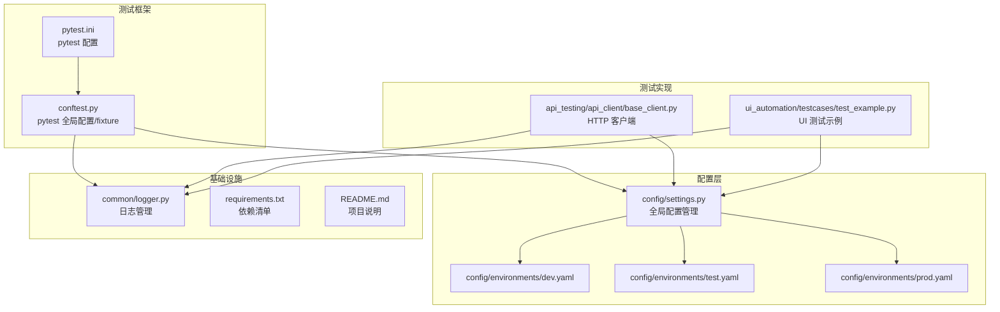
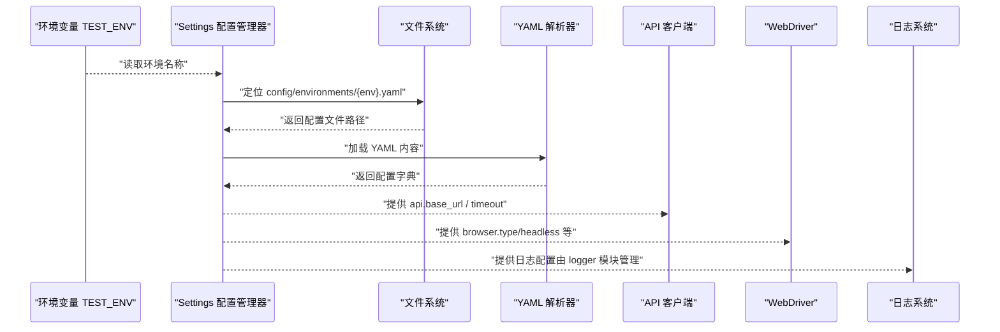
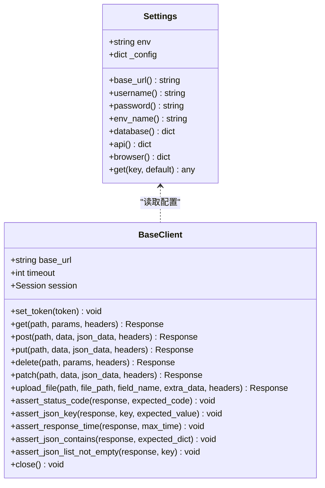
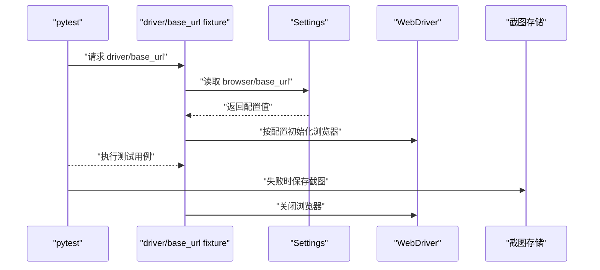
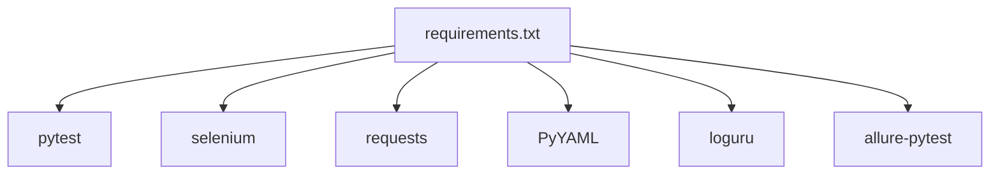

# 多环境配置管理

<cite>
**本文引用的文件**
- [config/settings.py](file://config/settings.py)
- [config/environments/dev.yaml](file://config/environments/dev.yaml)
- [config/environments/test.yaml](file://config/environments/test.yaml)
- [config/environments/prod.yaml](file://config/environments/prod.yaml)
- [conftest.py](file://conftest.py)
- [pytest.ini](file://pytest.ini)
- [common/logger.py](file://common/logger.py)
- [api_testing/api_client/base_client.py](file://api_testing/api_client/base_client.py)
- [ui_automation/testcases/test_example.py](file://ui_automation/testcases/test_example.py)
- [requirements.txt](file://requirements.txt)
- [README.md](file://README.md)
</cite>

## 目录
1. [引言](#引言)
2. [项目结构](#项目结构)
3. [核心组件](#核心组件)
4. [架构总览](#架构总览)
5. [详细组件分析](#详细组件分析)
6. [依赖分析](#依赖分析)
7. [性能考虑](#性能考虑)
8. [故障排查指南](#故障排查指南)
9. [结论](#结论)
10. [附录](#附录)

## 引言
本文件系统性阐述该测试自动化工作区的多环境配置管理方案，重点覆盖 dev/test/prod 三类环境的配置差异、适用场景与最佳实践。文档基于实际代码实现，详细解析配置文件结构、字段定义、环境切换机制（TEST_ENV 环境变量）以及优先级处理策略，并提供配置创建指南、命名规范与验证规则，帮助团队在不同环境下稳定、安全地开展测试工作。

## 项目结构
该项目采用“按功能域分层 + 配置集中化”的组织方式，核心配置位于 config/ 下，按环境拆分为 environments/ 子目录中的 YAML 文件；测试框架通过 pytest 驱动，UI 自动化与接口测试分别位于 ui_automation/ 与 api_testing/ 目录。

图表来源
- [config/settings.py:1-104](file://config/settings.py#L1-L104)
- [config/environments/dev.yaml:1-31](file://config/environments/dev.yaml#L1-L31)
- [config/environments/test.yaml:1-31](file://config/environments/test.yaml#L1-L31)
- [config/environments/prod.yaml:1-31](file://config/environments/prod.yaml#L1-L31)
- [conftest.py:1-122](file://conftest.py#L1-L122)
- [pytest.ini:1-12](file://pytest.ini#L1-L12)
- [common/logger.py:1-77](file://common/logger.py#L1-L77)
- [api_testing/api_client/base_client.py:1-308](file://api_testing/api_client/base_client.py#L1-L308)
- [ui_automation/testcases/test_example.py:1-161](file://ui_automation/testcases/test_example.py#L1-L161)

章节来源
- [README.md:1-123](file://README.md#L1-L123)

## 核心组件
- 全局配置管理器 Settings：负责根据 TEST_ENV 选择对应 YAML 配置文件，提供属性访问与通用 get 方法，支持扩展新配置项。
- 环境配置文件：dev/test/prod 三套 YAML，分别定义基础 URL、账号信息、数据库、API、浏览器等配置。
- pytest 集成：通过 conftest.py 注入 driver、base_url 等 fixture，并在失败时自动截图。
- 日志系统：统一日志格式与落盘策略，便于跨模块问题定位。
- API 客户端：基于 Requests 的封装，自动读取配置中的 API 基础地址与超时等参数。
- UI 测试：基于 Selenium，使用 Settings 中的 browser 配置动态初始化浏览器。

章节来源
- [config/settings.py:13-104](file://config/settings.py#L13-L104)
- [conftest.py:25-78](file://conftest.py#L25-L78)
- [common/logger.py:1-77](file://common/logger.py#L1-L77)
- [api_testing/api_client/base_client.py:18-45](file://api_testing/api_client/base_client.py#L18-L45)
- [ui_automation/testcases/test_example.py:31-66](file://ui_automation/testcases/test_example.py#L31-L66)

## 架构总览
下图展示了环境切换机制与关键模块之间的交互关系，突出 TEST_ENV 的作用与配置加载流程。

图表来源
- [config/settings.py:26-48](file://config/settings.py#L26-L48)
- [api_testing/api_client/base_client.py:21-29](file://api_testing/api_client/base_client.py#L21-L29)
- [conftest.py:36-61](file://conftest.py#L36-L61)
- [common/logger.py:14-56](file://common/logger.py#L14-L56)

## 详细组件分析

### 环境配置文件结构与字段定义
- 通用字段
  - env_name：环境显示名称（字符串）
  - base_url：基础 URL（字符串）
  - username/password：账户凭据（字符串）
  - database：数据库配置（字典）
    - host：主机地址（字符串）
    - port：端口（整数）
    - name：数据库名（字符串）
    - user：用户名（字符串）
    - password：密码（字符串）
  - api：API 配置（字典）
    - base_url：API 基础地址（字符串）
    - timeout：请求超时（秒，整数）
    - token：认证令牌（字符串，初始为空）
  - browser：浏览器配置（字典，UI 自动化使用）
    - type：浏览器类型（字符串，如 chrome/firefox）
    - headless：是否无头模式（布尔）
    - implicit_wait：隐式等待（秒，整数）
    - page_load_timeout：页面加载超时（秒，整数）

- 环境差异
  - 开发环境（dev）：base_url 指向开发域名，数据库与 API 基础地址指向开发服务，浏览器默认非无头模式，便于本地调试。
  - 测试环境（test）：base_url 指向测试域名，数据库与 API 基础地址指向测试服务，浏览器默认非无头模式，适合持续集成与回归测试。
  - 生产环境（prod）：base_url 指向生产域名，数据库与 API 基础地址指向生产服务，浏览器默认无头模式，减少资源占用并提升稳定性。

章节来源
- [config/environments/dev.yaml:1-31](file://config/environments/dev.yaml#L1-L31)
- [config/environments/test.yaml:1-31](file://config/environments/test.yaml#L1-L31)
- [config/environments/prod.yaml:1-31](file://config/environments/prod.yaml#L1-L31)

### 环境切换机制与优先级
- 切换方式
  - 通过环境变量 TEST_ENV 指定环境名称（dev/test/prod）。若未设置，将回退到默认值 test。
  - Settings 在初始化时读取 TEST_ENV，并据此加载 config/environments/{env}.yaml。
- 优先级
  - 环境变量 TEST_ENV 优先于硬编码默认值。
  - 若指定的配置文件不存在，将抛出文件不存在异常，阻止错误配置生效。
- 与其他模块的耦合
  - API 客户端与 UI 测试均通过 Settings 的属性或 get 方法读取配置，确保统一入口。
  - pytest 的 driver fixture 读取 browser 配置，base_url fixture 直接暴露 settings.base_url。

章节来源
- [config/settings.py:26-48](file://config/settings.py#L26-L48)
- [config/settings.py:50-96](file://config/settings.py#L50-L96)
- [conftest.py:36-77](file://conftest.py#L36-L77)
- [api_testing/api_client/base_client.py:21-29](file://api_testing/api_client/base_client.py#L21-L29)

### API 客户端与配置联动
- 初始化行为
  - 从配置读取 api.base_url 作为默认基础地址，timeout 作为默认超时。
  - 设置默认 Content-Type 与 Accept 头部。
  - 可选设置 Authorization 头（Bearer Token）。
- 请求流程
  - 构建完整 URL（自动处理 base_url 与路径拼接）。
  - 合并自定义 headers 与会话默认 headers。
  - 记录请求与响应日志，包含耗时与关键上下文。
  - 捕获超时与连接异常并记录错误。
- 断言工具
  - 提供状态码、JSON 键、响应时间、列表非空等断言方法，便于接口测试用例编写。

图表来源
- [config/settings.py:13-104](file://config/settings.py#L13-L104)
- [api_testing/api_client/base_client.py:18-308](file://api_testing/api_client/base_client.py#L18-L308)

章节来源
- [api_testing/api_client/base_client.py:18-187](file://api_testing/api_client/base_client.py#L18-L187)
- [api_testing/api_client/base_client.py:231-299](file://api_testing/api_client/base_client.py#L231-L299)

### UI 自动化与浏览器配置
- driver fixture
  - 从配置读取 browser.type 与 headless，按类型初始化 Chrome/Firefox。
  - 设置窗口大小、沙盒参数、隐式等待与页面加载超时。
  - 测试结束后自动关闭浏览器。
- base_url fixture
  - 直接暴露 settings.base_url，简化测试用例编写。
- 失败截图钩子
  - 在测试失败时自动保存截图至 ui_automation/evidence/ 目录，文件名包含用例名与时间戳。

图表来源
- [conftest.py:25-78](file://conftest.py#L25-L78)
- [conftest.py:80-111](file://conftest.py#L80-L111)
- [config/settings.py:50-96](file://config/settings.py#L50-L96)

章节来源
- [conftest.py:25-78](file://conftest.py#L25-L78)
- [conftest.py:80-111](file://conftest.py#L80-L111)

### 日志系统与配置一致性
- 日志格式与级别
  - 控制台输出 INFO 及以上级别，文件输出 DEBUG 及以上级别，按天轮转，保留 7 天。
- 模块绑定
  - 通过 get_logger(name) 绑定模块名，便于区分不同模块的日志来源。
- 与配置的关系
  - 日志系统独立于配置文件，但 API 客户端与 UI 测试通过统一 logger 输出请求/响应与页面操作日志，确保配置变更后的行为一致可追溯。

章节来源
- [common/logger.py:14-56](file://common/logger.py#L14-L56)
- [common/logger.py:59-77](file://common/logger.py#L59-L77)

## 依赖分析
- 运行时依赖
  - 测试框架：pytest、pytest-html、pytest-xdist
  - UI 自动化：selenium
  - 接口测试：requests
  - 数据处理：PyYAML、openpyxl
  - 日志：loguru
  - 报告（可选）：allure-pytest
- 模块间依赖
  - Settings 是配置中心，被 API 客户端与 UI 测试共同依赖。
  - conftest.py 依赖 Settings 与 logger，提供 pytest 钩子与 fixture。
  - API 客户端与 UI 测试各自读取配置，形成松耦合设计。

图表来源
- [requirements.txt:1-21](file://requirements.txt#L1-L21)

章节来源
- [requirements.txt:1-21](file://requirements.txt#L1-L21)

## 性能考虑
- 浏览器初始化
  - 无头模式（prod）可降低资源消耗，提升并发稳定性。
  - 合理设置 implicit_wait 与 page_load_timeout，避免过长等待影响整体吞吐。
- HTTP 请求
  - 适度调整 api.timeout，平衡响应速度与网络波动。
  - 使用 Session 复用连接，减少握手开销。
- 日志级别
  - 生产环境建议保持 INFO 级别，避免过多 DEBUG 日志影响性能。

## 故障排查指南
- 环境文件缺失
  - 现象：初始化 Settings 时抛出文件不存在异常。
  - 处理：确认 TEST_ENV 值与 config/environments/ 下的 YAML 文件名一致。
- 浏览器初始化失败
  - 现象：driver fixture 抛出不支持的浏览器类型或启动异常。
  - 处理：检查 browser.type 与 headless 配置，确保对应驱动已安装且版本匹配。
- 请求超时/连接错误
  - 现象：API 客户端记录超时或连接错误日志。
  - 处理：检查 api.base_url 与网络连通性，适当增大 timeout 或重试。
- 失败截图未生成
  - 现象：测试失败但未生成截图。
  - 处理：确认 evidence 目录存在权限，检查钩子是否被禁用或 driver 是否可用。

章节来源
- [config/settings.py:42-48](file://config/settings.py#L42-L48)
- [conftest.py:54-55](file://conftest.py#L54-L55)
- [api_testing/api_client/base_client.py:122-133](file://api_testing/api_client/base_client.py#L122-L133)
- [conftest.py:92-110](file://conftest.py#L92-L110)

## 结论
本项目通过集中化的 YAML 配置与 Settings 管理器实现了清晰的多环境支持，结合 pytest fixture 与日志系统，形成了可维护、可扩展的测试配置体系。遵循本文提供的最佳实践与验证规则，可在 dev/test/prod 三类环境中稳定运行各类测试任务。

## 附录

### 各环境适用场景与配置要点
- 开发环境（dev）
  - 适用场景：本地开发与调试，快速迭代。
  - 配置要点：base_url 指向开发服务，browser.headless=false，便于观察页面变化。
- 测试环境（test）
  - 适用场景：持续集成与回归测试，数据相对隔离。
  - 配置要点：base_url 指向测试服务，browser.headless=false，便于问题复现。
- 生产环境（prod）
  - 适用场景：线上稳定性验证与性能测试。
  - 配置要点：base_url 指向生产服务，browser.headless=true，减少资源占用。

章节来源
- [config/environments/dev.yaml:1-31](file://config/environments/dev.yaml#L1-L31)
- [config/environments/test.yaml:1-31](file://config/environments/test.yaml#L1-L31)
- [config/environments/prod.yaml:1-31](file://config/environments/prod.yaml#L1-L31)

### 环境切换与运行示例
- 设置环境变量
  - Linux/macOS: export TEST_ENV=dev
  - Windows: set TEST_ENV=dev
- 运行测试
  - 运行全部测试：pytest
  - 运行冒烟测试：pytest -m smoke
  - 运行接口测试：pytest -m api
  - 运行 UI 自动化测试：pytest -m ui
  - 并行运行：pytest -n auto

章节来源
- [pytest.ini:1-12](file://pytest.ini#L1-L12)
- [README.md:64-81](file://README.md#L64-L81)

### 配置文件创建指南与命名规范
- 文件命名
  - 使用小写英文，后缀 .yaml，文件名为环境名（dev/test/prod）。
- 字段命名
  - 使用驼峰或下划线风格保持一致，建议使用下划线风格以提高可读性。
- 字段层级
  - 保持扁平或最多两层嵌套，避免过深结构导致维护困难。
- 默认值与必填项
  - 明确哪些字段为必填，哪些有默认值；在代码中提供合理的默认值与校验。
- 安全性
  - 敏感信息（如密码、token）建议通过环境变量注入，不在 YAML 中硬编码明文。
- 验证规则
  - 类型校验：确保数值型字段为整数，布尔型为布尔值。
  - 范围校验：端口范围、超时上限等。
  - 可达性：base_url 可访问性可通过简单探测验证。
  - 一致性：同一环境内字段命名与层级保持一致。

### 配置项含义对照表
- env_name：环境显示名称，用于日志与报告标识。
- base_url：测试访问的基础 URL。
- username/password：登录凭据，建议使用专用测试账号。
- database.host/port/name/user/password：数据库连接参数。
- api.base_url/timeout/token：API 基础地址、请求超时与认证令牌。
- browser.type/headless/implicit_wait/page_load_timeout：浏览器类型、无头模式、隐式等待与页面加载超时。

章节来源
- [config/environments/dev.yaml:1-31](file://config/environments/dev.yaml#L1-L31)
- [config/environments/test.yaml:1-31](file://config/environments/test.yaml#L1-L31)
- [config/environments/prod.yaml:1-31](file://config/environments/prod.yaml#L1-L31)