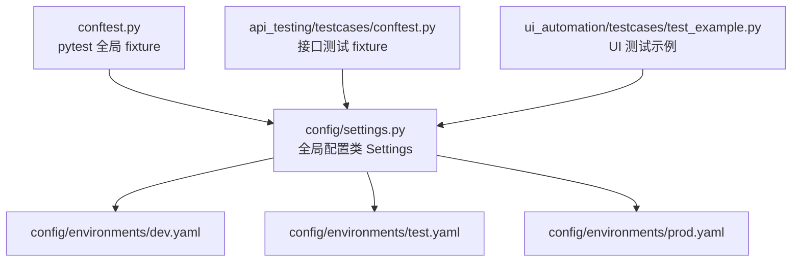
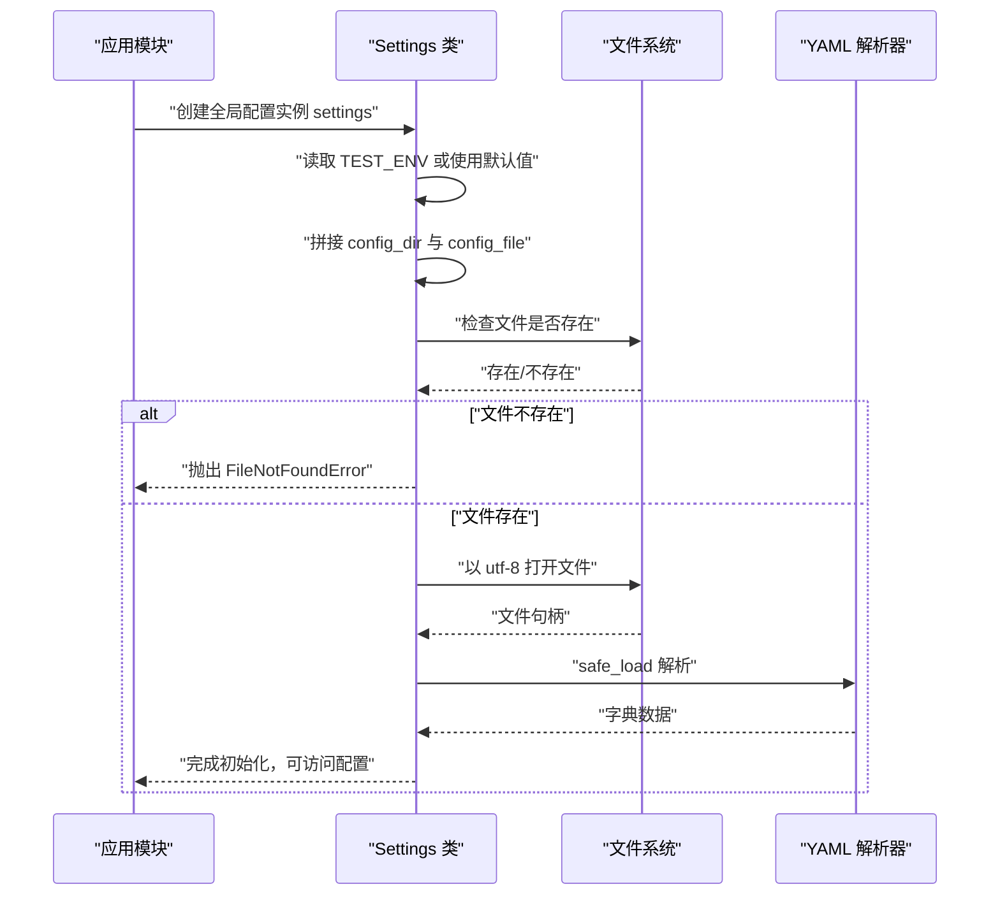
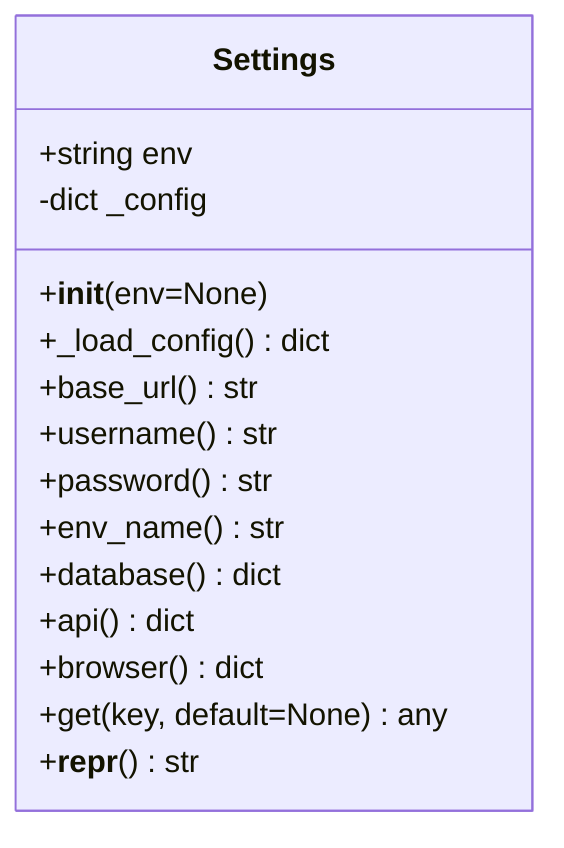
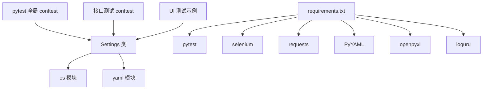
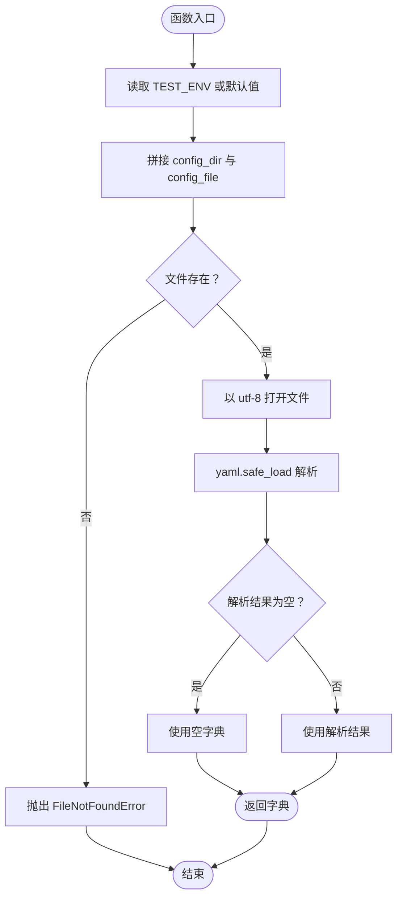

# 配置加载机制

<cite>
**本文引用的文件**
- [config/settings.py](file://config/settings.py)
- [config/environments/dev.yaml](file://config/environments/dev.yaml)
- [config/environments/test.yaml](file://config/environments/test.yaml)
- [config/environments/prod.yaml](file://config/environments/prod.yaml)
- [common/file_handler.py](file://common/file_handler.py)
- [conftest.py](file://conftest.py)
- [api_testing/testcases/conftest.py](file://api_testing/testcases/conftest.py)
- [ui_automation/testcases/test_example.py](file://ui_automation/testcases/test_example.py)
- [requirements.txt](file://requirements.txt)
- [pytest.ini](file://pytest.ini)
</cite>

## 目录
1. [引言](#引言)
2. [项目结构](#项目结构)
3. [核心组件](#核心组件)
4. [架构总览](#架构总览)
5. [详细组件分析](#详细组件分析)
6. [依赖分析](#依赖分析)
7. [性能考虑](#性能考虑)
8. [故障排除指南](#故障排除指南)
9. [结论](#结论)
10. [附录](#附录)

## 引言
本文件聚焦于配置加载机制，系统性解析 config/settings.py 中的配置加载实现，包括文件查找算法、YAML 解析流程、异常处理策略、路径解析规则、文件存在性检查与编码处理，并给出缓存策略、性能优化与内存管理建议。同时提供配置加载失败的故障排除指南，以及单元测试与集成测试策略，帮助读者快速定位问题并确保配置加载的稳定性与可维护性。

## 项目结构
配置模块位于 config/ 目录，包含全局配置类 Settings 与多环境配置文件 environments/。环境配置文件遵循约定式命名，例如 dev.yaml、test.yaml、prod.yaml。其他模块通过导入全局配置实例 settings 使用配置。

图表来源
- [config/settings.py:1-104](file://config/settings.py#L1-L104)
- [config/environments/dev.yaml:1-31](file://config/environments/dev.yaml#L1-L31)
- [config/environments/test.yaml:1-31](file://config/environments/test.yaml#L1-L31)
- [config/environments/prod.yaml:1-31](file://config/environments/prod.yaml#L1-L31)
- [conftest.py:19](file://conftest.py#L19)
- [api_testing/testcases/conftest.py:13](file://api_testing/testcases/conftest.py#L13)
- [ui_automation/testcases/test_example.py:15](file://ui_automation/testcases/test_example.py#L15)

章节来源
- [config/settings.py:1-104](file://config/settings.py#L1-L104)
- [config/environments/dev.yaml:1-31](file://config/environments/dev.yaml#L1-L31)
- [config/environments/test.yaml:1-31](file://config/environments/test.yaml#L1-L31)
- [config/environments/prod.yaml:1-31](file://config/environments/prod.yaml#L1-L31)
- [conftest.py:19](file://conftest.py#L19)
- [api_testing/testcases/conftest.py:13](file://api_testing/testcases/conftest.py#L13)
- [ui_automation/testcases/test_example.py:15](file://ui_automation/testcases/test_example.py#L15)

## 核心组件
- Settings 类：负责根据环境变量加载对应 YAML 配置文件，提供属性访问与通用 get 方法。
- 环境配置文件：dev.yaml、test.yaml、prod.yaml，分别定义不同环境的基础 URL、账号信息、数据库、API、浏览器等配置。
- 全局配置实例 settings：供其他模块直接导入使用。

章节来源
- [config/settings.py:13-104](file://config/settings.py#L13-L104)
- [config/environments/dev.yaml:1-31](file://config/environments/dev.yaml#L1-L31)
- [config/environments/test.yaml:1-31](file://config/environments/test.yaml#L1-L31)
- [config/environments/prod.yaml:1-31](file://config/environments/prod.yaml#L1-L31)

## 架构总览
配置加载的整体流程如下：初始化时读取环境变量 TEST_ENV（默认 test），拼接 config/environments/<env>.yaml 的绝对路径，进行文件存在性检查，使用 UTF-8 编码打开文件并用 YAML 安全解析器解析，最终将解析结果存储在实例内部字典中，供属性与 get 方法访问。

图表来源
- [config/settings.py:26-48](file://config/settings.py#L26-L48)

## 详细组件分析

### Settings 类与配置加载
- 初始化与环境变量：优先使用传入 env，否则读取 TEST_ENV 环境变量，默认值为 test。
- 文件查找算法：基于 __file__ 的目录计算 config_dir，再拼接 environments 与 <env>.yaml 组成 config_file。
- 文件存在性检查：使用 os.path.exists 对 config_file 进行检查，不存在则抛出 FileNotFoundError。
- 编码与解析：以 UTF-8 打开文件，使用 yaml.safe_load 进行安全解析，若解析结果为假值则回退为空字典。
- 配置访问：提供 base_url、username、password、env_name、database、api、browser 等属性，以及通用 get(key, default) 方法。

图表来源
- [config/settings.py:13-104](file://config/settings.py#L13-L104)

章节来源
- [config/settings.py:26-48](file://config/settings.py#L26-L48)
- [config/settings.py:50-96](file://config/settings.py#L50-L96)

### 环境配置文件结构
- dev.yaml、test.yaml、prod.yaml 结构一致，均包含 env_name、base_url、username、password、database、api、browser 等键，用于支撑不同环境的测试需求。
- 该结构为 Settings 类的属性与 get 方法提供了稳定的键名来源。

章节来源
- [config/environments/dev.yaml:1-31](file://config/environments/dev.yaml#L1-L31)
- [config/environments/test.yaml:1-31](file://config/environments/test.yaml#L1-L31)
- [config/environments/prod.yaml:1-31](file://config/environments/prod.yaml#L1-L31)

### 在测试中的使用
- pytest 全局 conftest：通过 settings.get("browser", {}) 与 settings.base_url 获取浏览器配置与基础 URL。
- 接口测试 conftest：通过 settings.get("api", {}).get("token", "") 与 settings.username/password 获取认证信息。
- UI 测试示例：通过 from config.settings import settings 导入配置，结合 Page Object 模式使用 base_url。

章节来源
- [conftest.py:40-81](file://conftest.py#L40-L81)
- [api_testing/testcases/conftest.py:48-79](file://api_testing/testcases/conftest.py#L48-L79)
- [ui_automation/testcases/test_example.py:15](file://ui_automation/testcases/test_example.py#L15)

### YAML 文件处理工具对比
- common/file_handler.YAMLHandler：提供 read、write、read_all 等方法，具备更完善的日志记录与异常捕获，适合通用数据文件处理。
- Settings._load_config：针对 config/environments 下的固定命名与结构进行轻量级加载，强调简单与确定性。

章节来源
- [common/file_handler.py:13-78](file://common/file_handler.py#L13-L78)
- [config/settings.py:37-48](file://config/settings.py#L37-L48)

## 依赖分析
- Settings 依赖：
  - os：用于路径拼接与文件存在性检查。
  - yaml：用于安全解析 YAML。
- 测试层依赖：
  - conftest.py 与各模块 conftest：导入 settings 并使用其配置。
  - requirements.txt：声明 pytest、selenium、requests、PyYAML、openpyxl、loguru 等依赖，确保配置加载与测试执行所需的运行时环境。

图表来源
- [config/settings.py:9-10](file://config/settings.py#L9-L10)
- [conftest.py:19](file://conftest.py#L19)
- [api_testing/testcases/conftest.py:13](file://api_testing/testcases/conftest.py#L13)
- [ui_automation/testcases/test_example.py:15](file://ui_automation/testcases/test_example.py#L15)
- [requirements.txt:1-21](file://requirements.txt#L1-L21)

章节来源
- [config/settings.py:9-10](file://config/settings.py#L9-L10)
- [requirements.txt:1-21](file://requirements.txt#L1-L21)

## 性能考虑
- 单次初始化：Settings 在首次导入时完成配置加载，后续访问为内存字典读取，复杂度 O(1)，开销极低。
- 文件 I/O：仅在初始化阶段进行一次磁盘读取与 YAML 解析，避免重复 IO。
- 编码与解析：UTF-8 编码与 safe_load 解析均为标准实现，性能稳定。
- 内存管理：配置字典在进程生命周期内持有，无需显式释放；若需热更新，可在上层模块重新创建实例或引入缓存刷新策略。

[本节为通用性能讨论，不直接分析具体文件，故无章节来源]

## 故障排除指南
- 常见错误类型与原因
  - 配置文件不存在：环境变量 TEST_ENV 指定的环境名与实际文件不一致，或文件路径拼接错误。
  - YAML 解析失败：文件格式不合法、缩进错误、特殊字符未正确转义。
  - 编码问题：文件非 UTF-8 编码导致读取异常。
- 错误信息解读与定位
  - FileNotFoundError：由 Settings._load_config 抛出，提示具体文件路径与环境名，检查 TEST_ENV 与文件命名。
  - YAML 解析异常：若使用通用 YAMLHandler，会记录 yaml.YAMLError；此处 Settings 使用 safe_load，异常由上层捕获或传播。
- 解决方案
  - 确认 TEST_ENV 值与 config/environments 下的文件名一致（dev/test/prod）。
  - 使用文本编辑器保存为 UTF-8 编码，检查缩进与键名。
  - 在测试入口处打印 settings.env 与 settings.base_url，确认加载成功。
- 相关日志与工具
  - 通用 YAMLHandler 提供 read/write/read_all 的日志记录，便于排查文件读写问题。
  - pytest 配置与标记可用于隔离与调试配置相关的测试。

章节来源
- [config/settings.py:42-48](file://config/settings.py#L42-L48)
- [common/file_handler.py:23-36](file://common/file_handler.py#L23-L36)
- [pytest.ini:1-12](file://pytest.ini#L1-L12)

## 结论
配置加载机制以 Settings 类为核心，通过约定式文件命名与环境变量驱动，实现了简洁可靠的多环境配置管理。其初始化阶段完成文件查找、存在性检查、编码与解析，后续访问为常数时间复杂度。配合 pytest 与测试工具链，配置加载在测试环境中得到广泛使用。建议在生产或复杂场景下引入缓存刷新与热更新策略，并保持配置文件的版本控制与一致性校验。

[本节为总结性内容，不直接分析具体文件，故无章节来源]

## 附录

### 配置加载流程图（算法实现映射）

图表来源
- [config/settings.py:37-48](file://config/settings.py#L37-L48)

### 单元测试与集成测试策略
- 单元测试
  - 针对 Settings._load_config：构造不存在的环境名触发 FileNotFoundError；构造非法 YAML 文件验证解析异常；构造空文件验证回退为空字典。
  - 针对属性与 get 方法：验证不同环境配置键的读取与默认值行为。
- 集成测试
  - 在 conftest 中注入 settings，验证 base_url、browser、api 等配置在 UI 与接口测试中可用。
  - 使用 pytest.ini 的标记（如 ui、api）隔离配置相关的测试套件。
- 测试数据与配置
  - 使用 common/file_handler 或 DataLoader 读取测试数据，确保与配置加载解耦。

章节来源
- [conftest.py:40-81](file://conftest.py#L40-L81)
- [api_testing/testcases/conftest.py:48-79](file://api_testing/testcases/conftest.py#L48-L79)
- [pytest.ini:7-12](file://pytest.ini#L7-L12)
- [common/file_handler.py:13-78](file://common/file_handler.py#L13-L78)