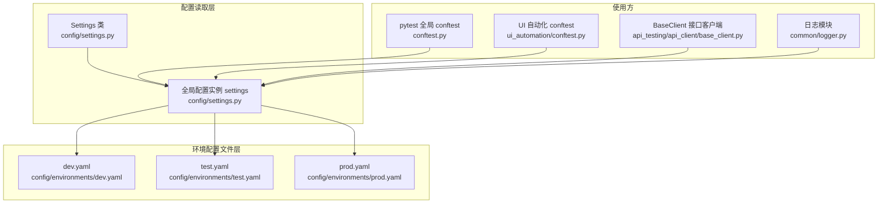
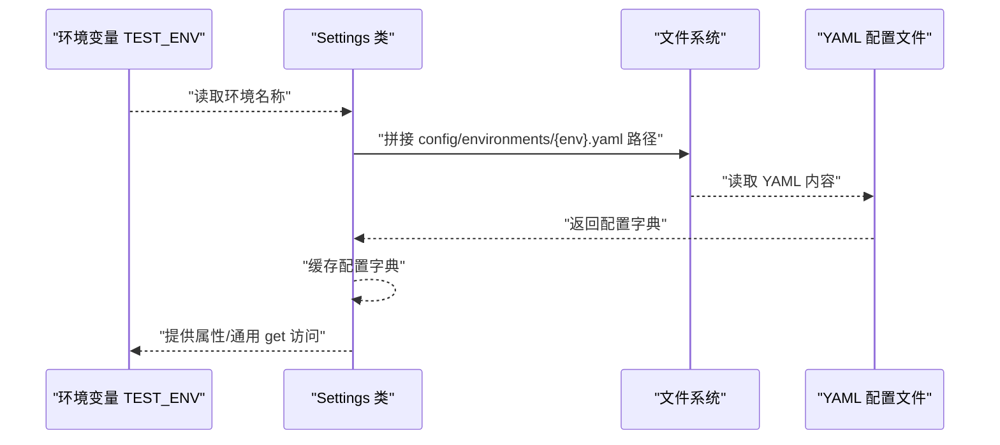
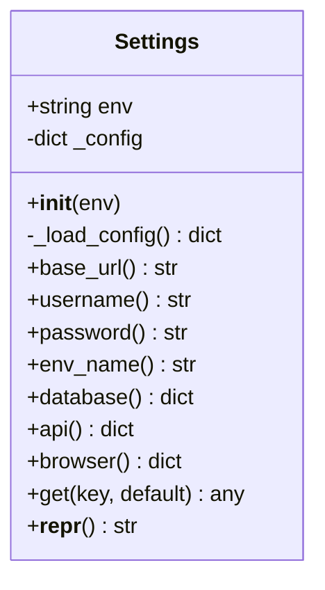
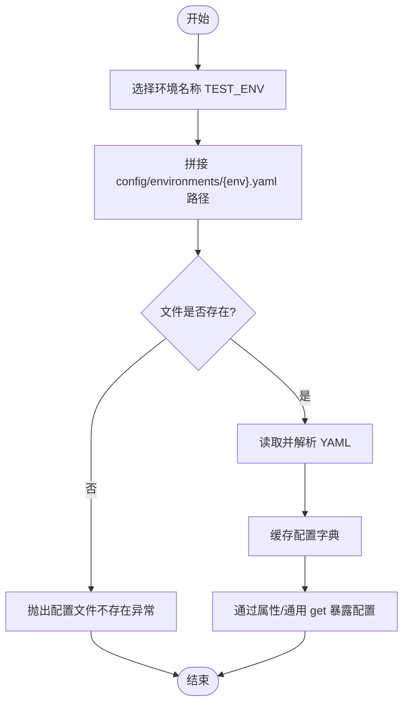
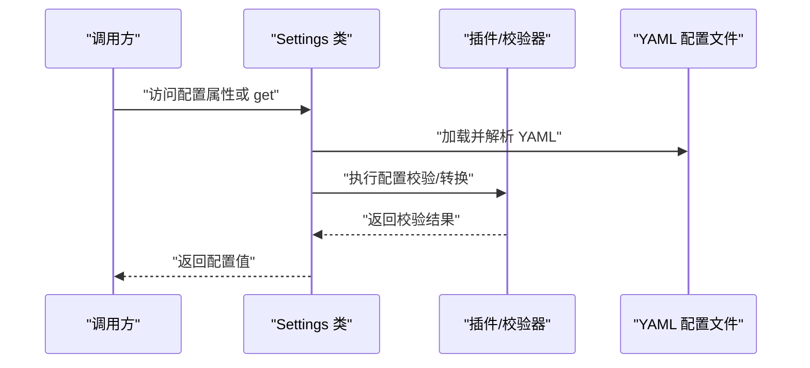
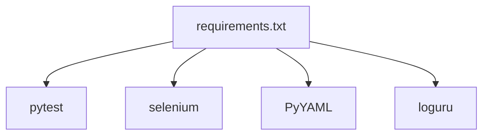

# 配置扩展指南

<cite>
**本文档引用的文件**
- [config/settings.py](file://config/settings.py)
- [config/environments/dev.yaml](file://config/environments/dev.yaml)
- [config/environments/test.yaml](file://config/environments/test.yaml)
- [config/environments/prod.yaml](file://config/environments/prod.yaml)
- [conftest.py](file://conftest.py)
- [api_testing/api_client/base_client.py](file://api_testing/api_client/base_client.py)
- [ui_automation/conftest.py](file://ui_automation/conftest.py)
- [common/logger.py](file://common/logger.py)
- [requirements.txt](file://requirements.txt)
- [pytest.ini](file://pytest.ini)
</cite>

## 目录
1. [简介](#简介)
2. [项目结构](#项目结构)
3. [核心组件](#核心组件)
4. [架构总览](#架构总览)
5. [详细组件分析](#详细组件分析)
6. [依赖分析](#依赖分析)
7. [性能考虑](#性能考虑)
8. [故障排查指南](#故障排查指南)
9. [结论](#结论)
10. [附录](#附录)

## 简介
本指南面向希望在现有配置系统基础上扩展新配置项与新环境的开发者。内容涵盖：
- 在 Settings 类中添加自定义配置属性（属性定义、getter 实现、默认值处理）
- 新环境配置文件的创建流程（命名规范、结构与最佳实践）
- 配置系统的扩展点与插件机制（动态配置加载、配置验证扩展思路）
- 配置迁移、向后兼容与版本管理策略
- 配置扩展的测试方法与部署注意事项

## 项目结构
配置系统由“配置读取层”和“环境配置文件层”组成，读取层负责加载与暴露配置，环境层提供不同环境的配置文件。

**图表来源**
- [config/settings.py:13-104](file://config/settings.py#L13-L104)
- [config/environments/dev.yaml:1-31](file://config/environments/dev.yaml#L1-L31)
- [config/environments/test.yaml:1-31](file://config/environments/test.yaml#L1-L31)
- [config/environments/prod.yaml:1-31](file://config/environments/prod.yaml#L1-L31)
- [conftest.py:19](file://conftest.py#L19)
- [ui_automation/conftest.py:14](file://ui_automation/conftest.py#L14)
- [api_testing/api_client/base_client.py:21-30](file://api_testing/api_client/base_client.py#L21-L30)
- [common/logger.py:12-77](file://common/logger.py#L12-L77)

**章节来源**
- [config/settings.py:13-104](file://config/settings.py#L13-L104)
- [config/environments/dev.yaml:1-31](file://config/environments/dev.yaml#L1-L31)
- [config/environments/test.yaml:1-31](file://config/environments/test.yaml#L1-L31)
- [config/environments/prod.yaml:1-31](file://config/environments/prod.yaml#L1-L31)
- [conftest.py:19](file://conftest.py#L19)
- [ui_automation/conftest.py:14](file://ui_automation/conftest.py#L14)
- [api_testing/api_client/base_client.py:21-30](file://api_testing/api_client/base_client.py#L21-L30)
- [common/logger.py:12-77](file://common/logger.py#L12-L77)

## 核心组件
- Settings 类：负责根据环境变量加载对应 YAML 配置文件，并提供属性访问与通用 get 方法。
- 环境配置文件：位于 config/environments/ 目录，按环境命名（如 dev.yaml、test.yaml、prod.yaml）。
- 使用方：pytest fixture、UI 自动化、接口客户端等模块通过 settings 获取配置。

关键特性与行为：
- 环境切换：通过环境变量 TEST_ENV 指定（默认 test）。
- 配置加载：读取 config/environments/{env}.yaml，不存在时抛出异常。
- 配置暴露：提供 base_url、username、password、env_name、database、api、browser 等属性；以及通用 get(key, default) 方法。
- 默认值：所有属性均通过字典 get(key, default) 提供默认值（如空字符串或空字典）。

**章节来源**
- [config/settings.py:26-96](file://config/settings.py#L26-L96)

## 架构总览
配置系统采用“集中式读取 + 多环境文件”的架构，读取层与使用方解耦，便于扩展与维护。

**图表来源**
- [config/settings.py:26-48](file://config/settings.py#L26-L48)

## 详细组件分析

### Settings 类与配置属性扩展
- 扩展步骤
  1) 在 config/environments/{env}.yaml 中新增配置项（如新增 top_level_key 或嵌套结构）。
  2) 在 Settings 类中添加属性 getter（返回 self._config.get(...)，并设置合理默认值）。
  3) 在使用方（fixture、客户端、页面对象等）通过 settings.{new_property} 或 settings.get(...) 访问。
- 默认值处理
  - 字符串/数值：使用空字符串或 0 等安全默认值。
  - 嵌套结构：使用 {} 作为默认字典，避免 None 导致的访问异常。
- 注意事项
  - 保持与现有属性一致的命名风格与层级结构。
  - 如需强类型校验，可在 Settings 类中增加校验逻辑并在初始化时抛出清晰错误。

**图表来源**
- [config/settings.py:13-104](file://config/settings.py#L13-L104)

**章节来源**
- [config/settings.py:50-96](file://config/settings.py#L50-L96)

### 新环境配置文件创建流程
- 命名规范
  - 文件名：{env}.yaml，放置于 config/environments/ 目录。
  - 环境变量：TEST_ENV 指定环境名称（如 dev/test/prod）。
- 配置项结构
  - 建议沿用现有结构：顶层键包括 env_name、base_url、username、password、database、api、browser 等。
  - 新增键建议与现有键保持一致的层级与类型，便于统一访问。
- 最佳实践
  - 为每个环境提供完整的配置集合，避免在运行时动态拼接。
  - 对敏感信息（如密码）建议通过环境变量注入或外部密钥管理，不在 YAML 中硬编码。
  - 为浏览器配置提供 headless、implicit_wait、page_load_timeout 等关键参数，确保自动化稳定性。

**图表来源**
- [config/settings.py:37-48](file://config/settings.py#L37-L48)

**章节来源**
- [config/settings.py:37-48](file://config/settings.py#L37-L48)
- [config/environments/dev.yaml:1-31](file://config/environments/dev.yaml#L1-L31)
- [config/environments/test.yaml:1-31](file://config/environments/test.yaml#L1-L31)
- [config/environments/prod.yaml:1-31](file://config/environments/prod.yaml#L1-L31)

### 配置系统的扩展点与插件机制
- 扩展点
  - Settings 类：可新增属性 getter、增强 get 方法、增加配置校验与转换。
  - 环境文件：新增环境、新增配置键、调整默认值。
  - 使用方：pytest fixture、UI 自动化、接口客户端等模块均可通过 settings 访问配置。
- 插件机制（建议实现）
  - 动态配置加载：在 Settings.__init__ 中增加插件钩子，允许第三方模块注册配置加载器。
  - 配置验证扩展：在 _load_config 后增加校验器链，对关键配置进行类型与范围校验，失败时抛出明确异常。
  - 环境覆盖：支持通过环境变量或外部配置源（如远程配置中心）覆盖本地 YAML。

**图表来源**
- [config/settings.py:26-96](file://config/settings.py#L26-L96)

**章节来源**
- [config/settings.py:26-96](file://config/settings.py#L26-L96)

### 配置迁移、向后兼容与版本管理
- 向后兼容
  - 新增配置项时提供默认值，避免破坏既有使用方。
  - 旧键名变更时保留兼容 getter，内部映射到新键名，并在下个版本移除。
- 版本管理
  - 建议在 YAML 文件顶部添加版本注释，如 # version: 1.0。
  - 重大变更时更新版本号并在升级文档中列出迁移步骤。
- 迁移策略
  - 渐进式迁移：先在新环境中提供新配置，同时保留旧配置兼容。
  - 自动化校验：在 CI 中增加配置校验任务，确保各环境配置合法。

[本节为概念性指导，无需具体文件引用]

### 配置扩展的测试方法与部署注意事项
- 测试方法
  - 单元测试：针对 Settings 类新增属性的 getter 与默认值进行断言。
  - 集成测试：在 conftest 中通过 settings.get 或属性访问验证配置生效。
  - UI 自动化：通过 ui_automation/conftest.py 中的 driver fixture 验证浏览器配置（type/headless/超时）。
  - 接口测试：通过 api_testing/api_client/base_client.py 验证 api.base_url 与超时配置。
- 部署注意事项
  - 确保 TEST_ENV 在各部署环境正确设置。
  - 敏感配置通过环境变量或密钥管理注入，避免提交到版本库。
  - 在 CI 中增加配置文件存在性与基本结构校验步骤。

**章节来源**
- [conftest.py:25-74](file://conftest.py#L25-L74)
- [ui_automation/conftest.py:23-64](file://ui_automation/conftest.py#L23-L64)
- [api_testing/api_client/base_client.py:21-30](file://api_testing/api_client/base_client.py#L21-L30)

## 依赖分析
配置系统主要依赖 PyYAML 进行 YAML 解析，pytest 与 selenium 用于测试与 UI 自动化场景。

**图表来源**
- [requirements.txt:1-25](file://requirements.txt#L1-L25)

**章节来源**
- [requirements.txt:1-25](file://requirements.txt#L1-L25)

## 性能考虑
- 配置加载：Settings 在初始化时一次性加载并缓存配置字典，后续访问为 O(1) 字典查找。
- YAML 解析：PyYAML safe_load 解析成本低，且仅在初始化阶段执行。
- 建议
  - 避免在热路径中频繁创建 Settings 实例。
  - 对大型配置文件分环境拆分，减少不必要的键数量。

[本节为一般性建议，无需具体文件引用]

## 故障排查指南
- 常见问题
  - 配置文件不存在：检查 TEST_ENV 是否正确，确认 config/environments/{env}.yaml 存在。
  - 属性访问报错：确认新增属性已在 Settings 类中添加 getter 并提供默认值。
  - UI 自动化浏览器初始化失败：检查 browser 配置（type/headless/超时）与驱动版本。
- 定位方法
  - 在 conftest 与 ui_automation/conftest 中打印 settings.get("browser") 与 settings.base_url 等关键配置。
  - 使用 common/logger.py 输出调试日志，定位配置加载与使用环节。

**章节来源**
- [config/settings.py:42-48](file://config/settings.py#L42-L48)
- [conftest.py:40-72](file://conftest.py#L40-L72)
- [ui_automation/conftest.py:29-64](file://ui_automation/conftest.py#L29-L64)
- [common/logger.py:59-77](file://common/logger.py#L59-L77)

## 结论
通过在 Settings 类中添加属性 getter、在环境配置文件中新增键值，并在使用方模块中统一通过 settings 访问配置，可以高效地扩展配置系统。建议遵循默认值提供、向后兼容与版本管理策略，并在 CI 中加入配置校验，确保配置扩展的稳定性与可维护性。

[本节为总结性内容，无需具体文件引用]

## 附录
- 环境文件示例参考
  - [dev.yaml:1-31](file://config/environments/dev.yaml#L1-L31)
  - [test.yaml:1-31](file://config/environments/test.yaml#L1-L31)
  - [prod.yaml:1-31](file://config/environments/prod.yaml#L1-L31)
- 关键使用方参考
  - [pytest 全局 conftest](file://conftest.py#L19)
  - [UI 自动化 conftest](file://ui_automation/conftest.py#L14)
  - [接口客户端 BaseClient:21-30](file://api_testing/api_client/base_client.py#L21-L30)
- 测试标记与运行
  - [pytest.ini markers:7-16](file://pytest.ini#L7-L16)