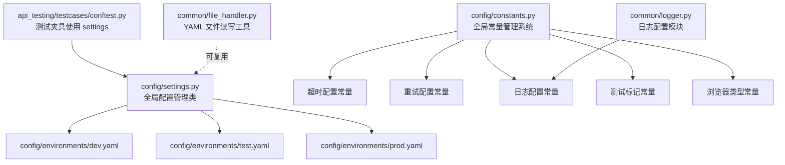
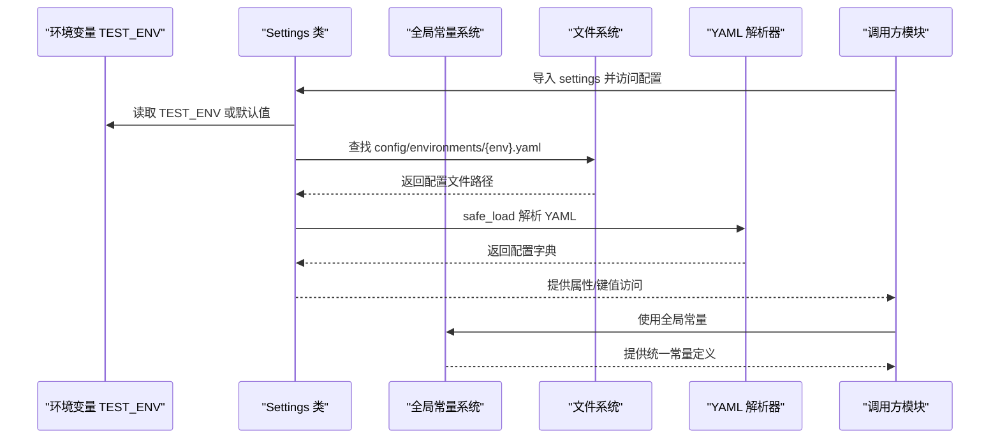
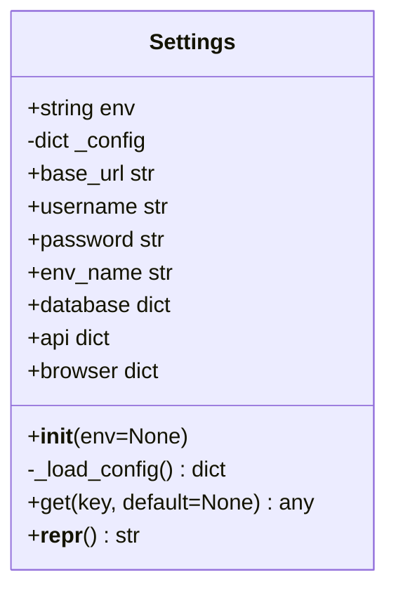
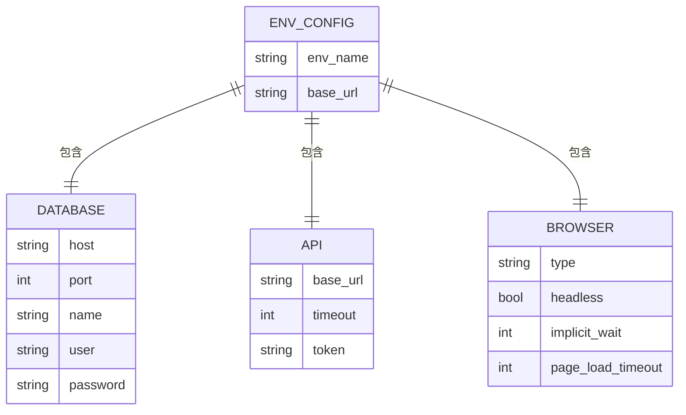
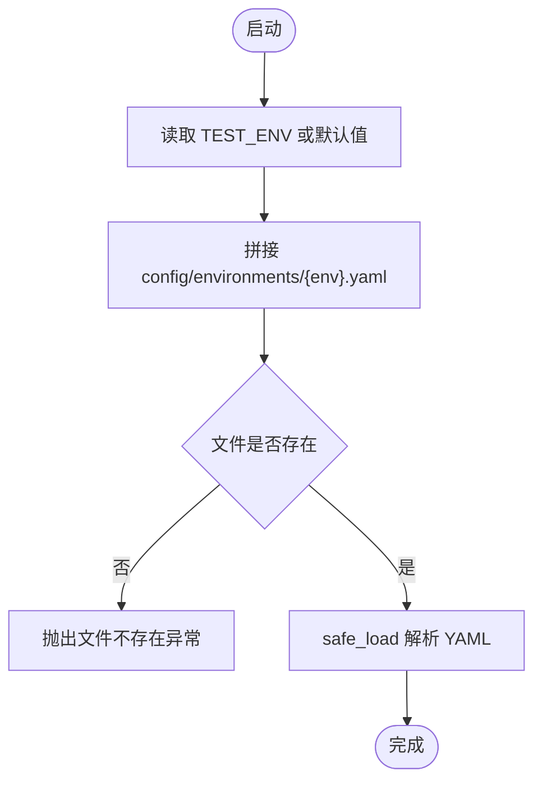
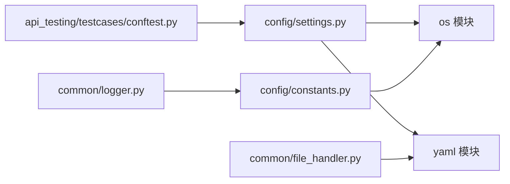

# 配置管理

<cite>
**本文引用的文件**
- [config/settings.py](file://config/settings.py)
- [config/constants.py](file://config/constants.py)
- [config/environments/dev.yaml](file://config/environments/dev.yaml)
- [config/environments/test.yaml](file://config/environments/test.yaml)
- [config/environments/prod.yaml](file://config/environments/prod.yaml)
- [common/file_handler.py](file://common/file_handler.py)
- [common/logger.py](file://common/logger.py)
- [api_testing/testcases/conftest.py](file://api_testing/testcases/conftest.py)
- [api_testing/testdata/example_api_data.yaml](file://api_testing/testdata/example_api_data.yaml)
- [ui_automation/testdata/login_data.yaml](file://ui_automation/testdata/login_data.yaml)
- [ui_automation/conftest.py](file://ui_automation/conftest.py)
- [conftest.py](file://conftest.py)
- [README.md](file://README.md)
- [pytest.ini](file://pytest.ini)
- [requirements.txt](file://requirements.txt)
</cite>

## 更新摘要
**所做更改**
- 新增全局常量管理系统章节，详细介绍超时配置、重试配置、日志配置、测试标记常量、浏览器类型常量等集中化配置管理
- 更新架构总览图，增加常量管理系统的可视化展示
- 新增常量使用最佳实践和集成指南
- 扩展故障排除指南，包含常量相关问题的诊断方法

## 目录
1. [引言](#引言)
2. [项目结构](#项目结构)
3. [核心组件](#核心组件)
4. [架构总览](#架构总览)
5. [详细组件分析](#详细组件分析)
6. [全局常量管理系统](#全局常量管理系统)
7. [依赖分析](#依赖分析)
8. [性能考虑](#性能考虑)
9. [故障排除指南](#故障排除指南)
10. [结论](#结论)
11. [附录](#附录)

## 引言
本文件面向配置管理系统，系统性阐述 Settings 类的设计架构、多环境配置加载机制与配置验证流程，并深入解析 dev/test/prod 环境配置文件的结构与用途（基础 URL、超时设置、认证信息等）。同时，文档化环境切换的实现原理、配置优先级与覆盖机制，提供配置扩展指南、最佳实践与故障排除方法，并补充配置文件格式规范、环境变量注入以及配置热更新等高级主题。

**更新** 新增全局常量管理系统，包括超时配置、重试配置、日志配置、测试标记常量、浏览器类型常量等集中化配置管理，为项目提供统一的常量定义和使用规范。

## 项目结构
配置管理位于 config/ 目录，核心由 Settings 类与多环境 YAML 配置组成。新增的全局常量管理系统提供统一的常量定义。其他模块通过全局 settings 实例按需读取配置，例如接口测试模块在 conftest 中直接使用 settings 获取 API 基础地址与认证 token。



**图表来源**
- [config/settings.py:1-104](file://config/settings.py#L1-L104)
- [config/constants.py:1-60](file://config/constants.py#L1-L60)
- [config/environments/dev.yaml:1-31](file://config/environments/dev.yaml#L1-L31)
- [config/environments/test.yaml:1-31](file://config/environments/test.yaml#L1-L31)
- [config/environments/prod.yaml:1-31](file://config/environments/prod.yaml#L1-L31)
- [api_testing/testcases/conftest.py:1-80](file://api_testing/testcases/conftest.py#L1-L80)
- [common/file_handler.py:1-217](file://common/file_handler.py#L1-L217)
- [common/logger.py:1-77](file://common/logger.py#L1-L77)

**章节来源**
- [README.md:16-43](file://README.md#L16-L43)
- [config/settings.py:1-104](file://config/settings.py#L1-L104)
- [config/constants.py:1-60](file://config/constants.py#L1-L60)
- [config/environments/dev.yaml:1-31](file://config/environments/dev.yaml#L1-L31)
- [config/environments/test.yaml:1-31](file://config/environments/test.yaml#L1-L31)
- [config/environments/prod.yaml:1-31](file://config/environments/prod.yaml#L1-L31)
- [api_testing/testcases/conftest.py:1-80](file://api_testing/testcases/conftest.py#L1-L80)
- [common/file_handler.py:1-217](file://common/file_handler.py#L1-L217)
- [common/logger.py:1-77](file://common/logger.py#L1-L77)

## 核心组件
- Settings 类：负责根据环境变量 TEST_ENV 加载对应 YAML 配置文件，提供属性访问与通用 get 方法，暴露基础 URL、账号信息、数据库、API、浏览器等配置段。
- 全局常量管理系统：提供超时配置、重试配置、日志配置、测试标记常量、浏览器类型常量等统一定义，确保项目中常量的一致性和可维护性。
- 环境配置文件：dev/test/prod 三套 YAML 文件，分别定义基础 URL、账号信息、数据库、API、浏览器等配置。
- 测试夹具：接口测试模块通过 conftest 注入 api_client、auth_client、base_url 等夹具，直接使用 settings 获取配置。
- 文件工具：common/file_handler 提供 YAML 读写能力，可用于配置文件的生成与维护。

**章节来源**
- [config/settings.py:13-104](file://config/settings.py#L13-L104)
- [config/constants.py:6-60](file://config/constants.py#L6-L60)
- [config/environments/dev.yaml:1-31](file://config/environments/dev.yaml#L1-L31)
- [config/environments/test.yaml:1-31](file://config/environments/test.yaml#L1-L31)
- [config/environments/prod.yaml:1-31](file://config/environments/prod.yaml#L1-L31)
- [api_testing/testcases/conftest.py:16-80](file://api_testing/testcases/conftest.py#L16-L80)
- [common/file_handler.py:13-78](file://common/file_handler.py#L13-L78)

## 架构总览
Settings 类通过环境变量 TEST_ENV 动态定位并加载对应 YAML 配置文件，形成"环境名 -> 配置字典"的映射。全局常量管理系统提供统一的常量定义，其他模块通过全局 settings 实例访问配置，实现解耦与集中管理。



**图表来源**
- [config/settings.py:26-48](file://config/settings.py#L26-L48)
- [config/settings.py:85-96](file://config/settings.py#L85-L96)
- [config/constants.py:6-60](file://config/constants.py#L6-L60)

## 详细组件分析

### Settings 类设计与实现
- 初始化与环境切换
  - 通过 TEST_ENV 或显式传参确定环境名，默认 test。
  - 加载对应 YAML 文件，若文件不存在则抛出异常。
- 配置访问接口
  - 属性访问：base_url、username、password、env_name、database、api、browser。
  - 通用 get 方法：支持键名与默认值，便于安全访问嵌套配置。
- 设计要点
  - 单例式全局实例 settings，避免重复 IO。
  - 仅在初始化阶段加载一次配置，后续通过属性/字典访问，性能开销低。
  - 对未找到的键返回空字符串或空字典，便于上层容错。



**图表来源**
- [config/settings.py:13-104](file://config/settings.py#L13-L104)

**章节来源**
- [config/settings.py:26-48](file://config/settings.py#L26-L48)
- [config/settings.py:50-96](file://config/settings.py#L50-L96)
- [config/settings.py:98-104](file://config/settings.py#L98-L104)

### 多环境配置文件结构与用途
- 环境标识
  - env_name：用于展示当前环境名称。
- 基础 URL
  - base_url：统一的基础服务地址，供各模块使用。
- 账号信息
  - username/password：测试账户凭据，用于登录或认证场景。
- 数据库配置
  - database：host、port、name、user、password，用于数据库连接。
- API 配置
  - api：包含 base_url、timeout、token 等，用于接口客户端。
- 浏览器配置（UI 自动化）
  - browser：type、headless、implicit_wait、page_load_timeout 等，用于驱动初始化。



**图表来源**
- [config/environments/dev.yaml:1-31](file://config/environments/dev.yaml#L1-L31)
- [config/environments/test.yaml:1-31](file://config/environments/test.yaml#L1-L31)
- [config/environments/prod.yaml:1-31](file://config/environments/prod.yaml#L1-L31)

**章节来源**
- [config/environments/dev.yaml:1-31](file://config/environments/dev.yaml#L1-L31)
- [config/environments/test.yaml:1-31](file://config/environments/test.yaml#L1-L31)
- [config/environments/prod.yaml:1-31](file://config/environments/prod.yaml#L1-L31)

### 环境切换实现原理与优先级
- 切换原理
  - Settings 初始化时读取 TEST_ENV，若未设置则默认 test。
  - 依据环境名拼接 config/environments/{env}.yaml 路径并加载。
- 优先级与覆盖
  - 当前实现为"环境文件级覆盖"：不同环境文件独立存在，不互相覆盖。
  - 若需在同一进程中覆盖某配置项，可在调用方使用 settings.get(key, default) 的默认值策略进行二次覆盖。
- 注意事项
  - 环境文件缺失会触发异常，确保部署一致性。
  - 不同环境的敏感信息（如账号、token）应严格隔离。



**图表来源**
- [config/settings.py:26-48](file://config/settings.py#L26-L48)

**章节来源**
- [config/settings.py:26-48](file://config/settings.py#L26-L48)

### 配置验证流程
- 文件存在性验证
  - 加载前检查配置文件是否存在，不存在则抛出异常，避免静默失败。
- YAML 解析验证
  - 使用安全解析器 safe_load，避免执行不可信代码；解析失败时返回空字典，保证健壮性。
- 建议增强
  - 在加载后对关键字段（如 base_url、timeout、token）进行格式与范围校验。
  - 对敏感字段（如密码）建议通过环境变量注入而非明文存储。

**章节来源**
- [config/settings.py:42-48](file://config/settings.py#L42-L48)
- [common/file_handler.py:23-36](file://common/file_handler.py#L23-L36)

### 在测试中的应用
- 接口测试夹具
  - api_client：基础客户端，无需认证。
  - auth_client：带 Token 认证的客户端，优先从 settings.api.token 读取，否则可扩展为登录获取。
  - base_url：直接从 settings.api.base_url 获取，便于测试用例使用。
- 测试数据文件
  - 示例接口测试数据与 UI 登录数据文件，用于参数化与断言，与配置解耦。

**章节来源**
- [api_testing/testcases/conftest.py:16-80](file://api_testing/testcases/conftest.py#L16-L80)
- [api_testing/testdata/example_api_data.yaml:1-116](file://api_testing/testdata/example_api_data.yaml#L1-L116)
- [ui_automation/testdata/login_data.yaml:1-19](file://ui_automation/testdata/login_data.yaml#L1-L19)

## 全局常量管理系统

### 系统概述
全局常量管理系统集中管理项目中使用的各种常量值，提供统一的配置定义和使用规范。该系统采用模块化设计，将不同类型的常量分类管理，确保项目的可维护性和一致性。

### 超时配置常量
提供标准化的超时设置，确保测试执行的一致性和可靠性：

- DEFAULT_TIMEOUT：默认等待超时时间（10秒）
- SHORT_TIMEOUT：短等待超时时间（5秒）
- LONG_TIMEOUT：长等待超时时间（30秒）
- PAGE_LOAD_TIMEOUT：页面加载超时时间（30秒）
- AJAX_TIMEOUT：AJAX等待超时时间（15秒）

### 重试配置常量
定义测试重试机制的标准参数：

- MAX_RETRY_ATTEMPTS：最大重试次数（3次）
- RETRY_DELAY：重试初始延迟（1秒）
- RETRY_BACKOFF：重试退避倍数（2倍）

### 日志配置常量
标准化日志系统的配置参数：

- LOG_LEVEL：日志级别（"INFO"）
- LOG_RETENTION：日志保留时间（"7 days"）
- LOG_ROTATION：日志轮转周期（"1 day"）

### 测试标记常量
提供统一的测试用例标记标准，支持pytest的标记系统：

- SMOKE：冒烟测试标记
- FUNCTIONAL：功能测试标记
- REGRESSION：回归测试标记
- SANITY：基本健全性测试标记
- UI：UI自动化测试标记
- API：接口测试标记

### 浏览器类型常量
标准化浏览器配置选项：

- CHROME：Chrome浏览器类型
- FIREFOX：Firefox浏览器类型
- EDGE：Edge浏览器类型

### 路径常量系统
提供项目中常用路径的统一定义：

- PROJECT_ROOT：项目根目录
- UI_AUTOMATION_DIR：UI自动化目录
- EVIDENCE_DIR：证据收集目录
- SCREENSHOTS_DIR：截图目录
- PAGE_SOURCES_DIR：页面源码目录
- TESTDATA_DIR：测试数据目录
- LOGS_DIR：日志目录
- REPORTS_DIR：报告目录

### 测试用例状态常量
标准化测试结果状态的定义：

- PASS：测试通过状态
- FAIL：测试失败状态
- SKIP：测试跳过状态
- BLOCK：测试阻塞状态
- NOT_RUN：测试未执行状态

### 常量使用最佳实践
- 统一导入：所有模块通过 `from config.constants import *` 或具体导入方式使用常量
- 避免魔法数字：使用常量替代硬编码的数值和字符串
- 分类管理：按照功能分类使用相应的常量组
- 文档化：为重要的常量添加注释说明其用途和取值范围

### 集成示例
常量系统与现有配置系统的集成方式：

```python
# 使用超时常量
from config.constants import DEFAULT_TIMEOUT, LONG_TIMEOUT

# 使用测试标记常量
from config.constants import Markers

# 使用浏览器类型常量
from config.constants import BrowserType
```

**章节来源**
- [config/constants.py:6-60](file://config/constants.py#L6-L60)

## 依赖分析
- 内部依赖
  - Settings 依赖 os、yaml；全局 settings 实例被各模块导入使用。
  - 全局常量系统依赖 os 模块进行路径计算。
  - 测试夹具依赖 Settings 以获取配置。
  - 日志模块依赖全局常量系统进行日志配置。
- 外部依赖
  - PyYAML 用于安全解析 YAML。
  - openpyxl 用于 Excel 文件处理（与配置管理非强相关，但属于通用工具）。
  - loguru 用于日志记录（依赖全局日志常量配置）。



**图表来源**
- [config/settings.py:9-10](file://config/settings.py#L9-L10)
- [config/constants.py:41](file://config/constants.py#L41)
- [api_testing/testcases/conftest.py:13](file://api_testing/testcases/conftest.py#L13)
- [common/file_handler.py:5-7](file://common/file_handler.py#L5-L7)
- [common/logger.py:12](file://common/logger.py#L12)

**章节来源**
- [requirements.txt:12-14](file://requirements.txt#L12-L14)
- [requirements.txt:13-14](file://requirements.txt#L13-L14)

## 性能考虑
- 配置加载时机
  - Settings 在首次导入时完成加载，后续访问为内存字典读取，开销极低。
  - 全局常量系统在模块导入时一次性加载，避免重复计算。
- I/O 优化
  - 建议在进程启动时尽早导入 settings 和 constants，避免重复初始化。
- 大型配置
  - 若配置体量增大，可考虑缓存解析结果或延迟加载子段。
  - 常量系统采用编译时常量，访问性能最优。

## 故障排除指南
- 配置文件不存在
  - 现象：初始化时报错，提示配置文件不存在。
  - 处理：确认 TEST_ENV 设置是否正确，或显式传入环境名；检查 config/environments 下是否存在对应文件。
- YAML 解析失败
  - 现象：safe_load 返回空字典或解析异常。
  - 处理：检查 YAML 语法与缩进；必要时使用 common/file_handler 的读取方法辅助诊断。
- 认证 token 缺失
  - 现象：auth_client 无法设置 token。
  - 处理：在 settings.api.token 中配置，或在夹具中实现登录获取逻辑。
- 浏览器配置差异
  - 现象：headless/headless=false 导致 UI 行为差异。
  - 处理：根据环境调整 browser.headless；生产环境建议 headless=true。
- 常量使用问题
  - 现象：导入常量时报错或常量值不正确。
  - 处理：确认常量模块导入路径正确；检查常量定义是否符合预期；验证常量值的数据类型。
- 日志配置异常
  - 现象：日志输出不符合预期或日志文件未生成。
  - 处理：检查 LOG_LEVEL、LOG_RETENTION、LOG_ROTATION 常量设置；确认日志目录权限；验证日志轮转配置。

**章节来源**
- [config/settings.py:42-48](file://config/settings.py#L42-L48)
- [common/file_handler.py:23-36](file://common/file_handler.py#L23-L36)
- [api_testing/testcases/conftest.py:47-67](file://api_testing/testcases/conftest.py#L47-L67)
- [config/environments/prod.yaml:28](file://config/environments/prod.yaml#L28)
- [config/constants.py:18-22](file://config/constants.py#L18-L22)
- [common/logger.py:48-56](file://common/logger.py#L48-L56)

## 结论
本配置管理系统以 Settings 类为核心，结合多环境 YAML 文件和全局常量管理系统，实现了简洁、可维护且易于扩展的配置管理方案。通过环境变量 TEST_ENV 实现灵活的环境切换，配合测试夹具与通用工具，满足接口测试与 UI 自动化的配置需求。

**更新** 新增的全局常量管理系统提供了统一的常量定义和使用规范，包括超时配置、重试配置、日志配置、测试标记常量、浏览器类型常量等，进一步提升了项目的可维护性和一致性。建议在现有基础上增强配置校验与敏感信息注入能力，进一步提升安全性与稳定性。

## 附录

### 配置文件格式规范
- 文件命名：config/environments/{env}.yaml，其中 env 为 dev/test/prod。
- 键名建议：使用小写与下划线组合，避免特殊字符。
- 嵌套结构：database、api、browser 等建议按模块拆分，便于访问与维护。
- 默认值：调用方可通过 settings.get(key, default) 提供默认值，避免 KeyError。

**章节来源**
- [config/settings.py:85-96](file://config/settings.py#L85-L96)

### 环境变量注入
- 当前实现：通过 TEST_ENV 控制环境文件加载。
- 扩展建议：对敏感字段（如密码、token）支持从环境变量注入，避免在 YAML 中明文存储。

**章节来源**
- [config/settings.py:34](file://config/settings.py#L34)

### 配置热更新（高级主题）
- 现状：Settings 在初始化时一次性加载配置，后续不自动刷新。
- 实现思路：
  - 定期轮询配置文件变更（mtime），检测到变化后重新加载。
  - 提供 reload 方法，由调用方在特定时机触发。
  - 对于高并发场景，注意线程安全与原子替换。
- 风险控制：
  - 增加校验步骤，失败时回滚旧配置。
  - 记录热更新日志，便于审计与排障。

**章节来源**
- [config/settings.py:37-48](file://config/settings.py#L37-L48)

### 常量使用最佳实践
- 统一导入：使用 `from config.constants import *` 或具体导入方式
- 避免魔法数字：使用常量替代硬编码值
- 分类管理：按功能分类使用相应的常量组
- 文档化：为重要常量添加注释说明
- 版本控制：常量变更需要版本控制和影响评估

**章节来源**
- [config/constants.py:6-60](file://config/constants.py#L6-L60)

### 常量系统集成指南
- 导入方式：`from config.constants import DEFAULT_TIMEOUT, Markers`
- 路径常量使用：`os.path.join(constants.PROJECT_ROOT, "config")`
- 日志配置：`logger.add(constants.LOGS_DIR, rotation=constants.LOG_ROTATION)`
- 测试标记：`pytest.mark.ui` 使用 Markers.UI 常量

**章节来源**
- [config/constants.py:24-39](file://config/constants.py#L24-L39)
- [config/constants.py:43-50](file://config/constants.py#L43-L50)
- [common/logger.py:48-56](file://common/logger.py#L48-L56)

### 最佳实践
- 将敏感信息放入环境变量，YAML 中仅保留非敏感配置。
- 为每个环境维护独立文件，避免跨环境混用。
- 在 CI/CD 中通过 TEST_ENV 注入环境，确保一致的部署行为。
- 使用 settings.get 的默认值策略，提高健壮性。
- 对关键配置（如 base_url、timeout）在业务层做二次校验与容错。
- 统一使用全局常量系统，避免重复定义相同常量。

**章节来源**
- [config/settings.py:85-96](file://config/settings.py#L85-L96)
- [api_testing/testcases/conftest.py:47-67](file://api_testing/testcases/conftest.py#L47-L67)
- [config/constants.py:6-60](file://config/constants.py#L6-L60)