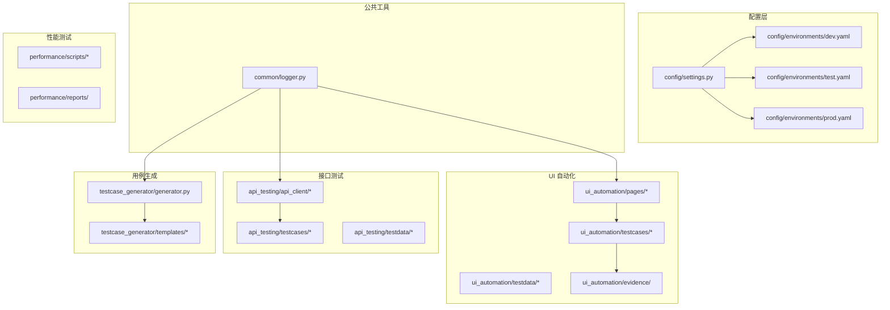
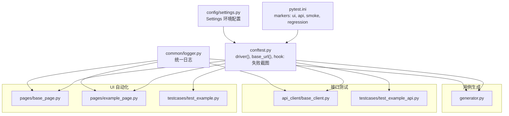
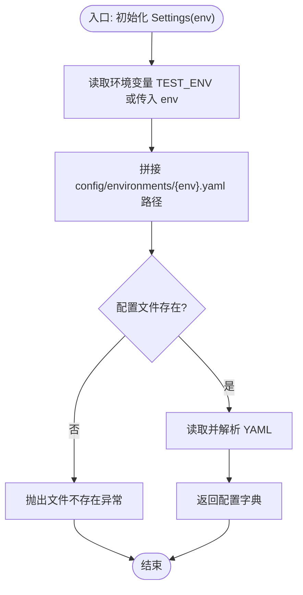
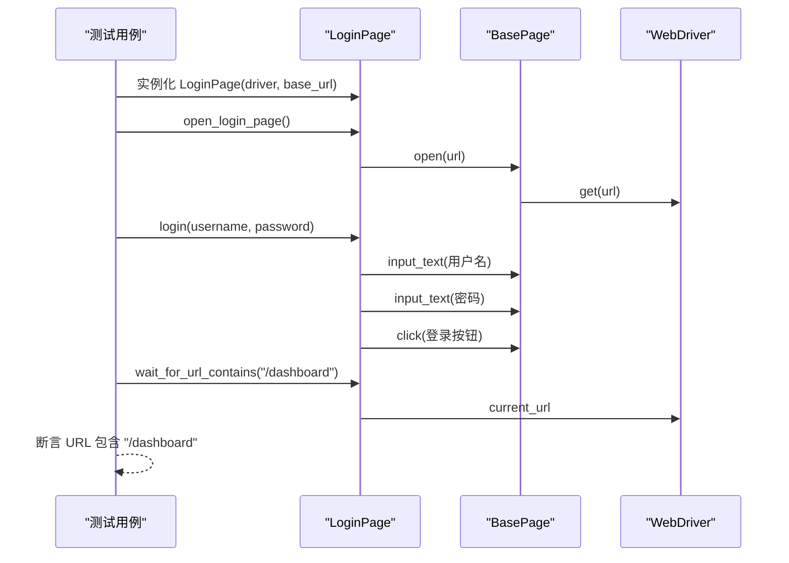
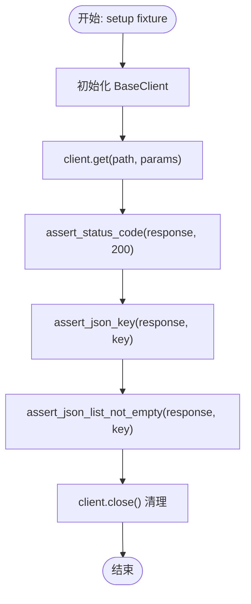
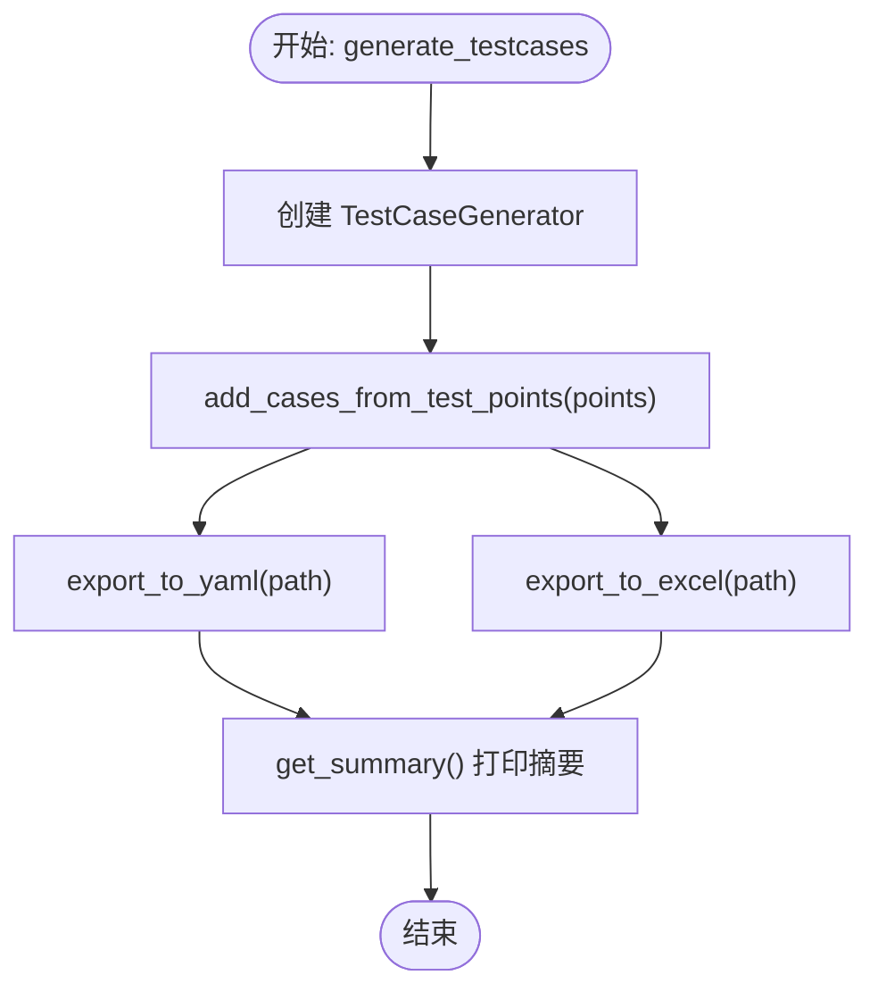
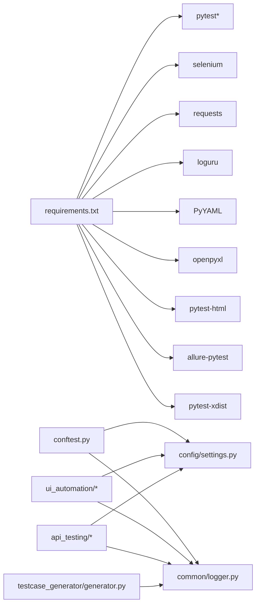

# 项目概述

<cite>
**本文引用的文件**
- [README.md](file://README.md)
- [docs/getting_started.md](file://docs/getting_started.md)
- [requirements.txt](file://requirements.txt)
- [pytest.ini](file://pytest.ini)
- [conftest.py](file://conftest.py)
- [config/settings.py](file://config/settings.py)
- [config/environments/dev.yaml](file://config/environments/dev.yaml)
- [config/environments/test.yaml](file://config/environments/test.yaml)
- [config/environments/prod.yaml](file://config/environments/prod.yaml)
- [common/logger.py](file://common/logger.py)
- [ui_automation/pages/base_page.py](file://ui_automation/pages/base_page.py)
- [ui_automation/pages/example_page.py](file://ui_automation/pages/example_page.py)
- [ui_automation/testcases/test_example.py](file://ui_automation/testcases/test_example.py)
- [api_testing/testcases/test_example_api.py](file://api_testing/testcases/test_example_api.py)
- [testcase_generator/generator.py](file://testcase_generator/generator.py)
</cite>

## 目录
1. [简介](#简介)
2. [项目结构](#项目结构)
3. [核心组件](#核心组件)
4. [架构总览](#架构总览)
5. [详细组件分析](#详细组件分析)
6. [依赖关系分析](#依赖关系分析)
7. [性能考虑](#性能考虑)
8. [故障排查指南](#故障排查指南)
9. [结论](#结论)
10. [附录](#附录)

## 简介
本项目是一个综合性的测试自动化工作区，面向多模块测试框架的落地实践，覆盖 Web UI 自动化、接口测试、性能测试与测试用例生成四大领域，同时提供多环境配置管理与模块化设计，支撑团队在不同场景下的测试需求与协作开发。

- 项目目标
  - 提供统一的测试基础设施与最佳实践，降低测试维护成本
  - 支持多环境配置与跨环境一致性，保障测试稳定性
  - 通过模块化设计与清晰的目录结构，提升可扩展性与可维护性
  - 为初学者提供快速上手指南，为资深工程师提供架构参考与扩展方向

- 核心价值
  - 一体化测试能力：UI、接口、性能、用例生成四线并进，满足端到端质量保障
  - 多环境适配：通过环境配置文件与环境变量实现灵活切换
  - 可复用与可扩展：Page Object、公共日志、配置中心、用例生成器等模块化组件
  - 协作友好：标准化的运行与报告机制，配合 Git 工作流实现多地协同

- 适用人群
  - 初学者：通过快速上手指南与示例用例快速入门
  - 资深开发者：基于模块化架构进行二次开发与扩展

**章节来源**
- [README.md:1-123](file://README.md#L1-L123)

## 项目结构
项目采用“按功能域划分”的模块化组织方式，核心目录如下：
- config：全局配置与多环境配置
- common：公共工具（日志、文件处理、报告工具）
- ui_automation：Web UI 自动化（Page Object、测试用例、测试数据、证据）
- api_testing：接口测试（客户端封装、测试用例、测试数据）
- performance：性能测试脚本与报告
- testcase_generator：测试用例生成器（YAML/Excel 导出）
- docs：文档与快速上手指南
- 根目录：pytest 配置、全局 fixture、依赖声明与说明文档

**图表来源**
- [config/settings.py:1-104](file://config/settings.py#L1-L104)
- [config/environments/dev.yaml:1-31](file://config/environments/dev.yaml#L1-L31)
- [config/environments/test.yaml:1-31](file://config/environments/test.yaml#L1-L31)
- [config/environments/prod.yaml:1-31](file://config/environments/prod.yaml#L1-L31)
- [common/logger.py:1-77](file://common/logger.py#L1-L77)
- [ui_automation/pages/base_page.py:1-499](file://ui_automation/pages/base_page.py#L1-L499)
- [ui_automation/testcases/test_example.py:1-161](file://ui_automation/testcases/test_example.py#L1-L161)
- [api_testing/testcases/test_example_api.py:1-167](file://api_testing/testcases/test_example_api.py#L1-L167)
- [testcase_generator/generator.py:1-263](file://testcase_generator/generator.py#L1-L263)

**章节来源**
- [README.md:7-43](file://README.md#L7-L43)
- [docs/getting_started.md:1-91](file://docs/getting_started.md#L1-L91)

## 核心组件
- 配置管理（config/settings.py）
  - 通过环境变量 TEST_ENV 选择 dev/test/prod，动态加载对应 YAML 配置
  - 提供 base_url、browser、api、database 等统一访问入口
  - 为 UI 自动化与接口测试提供一致的环境参数

- 全局日志（common/logger.py）
  - 使用 loguru 实现统一日志输出：控制台 INFO+ 与文件 DEBUG+（按天轮转、保留 7 天）
  - 通过 get_logger(name) 为各模块绑定模块名，便于问题定位

- UI 自动化（ui_automation）
  - Page Object 模式：BasePage 封装常用元素操作、等待、截图与高级交互
  - 示例页面 LoginPage 展示如何继承 BasePage 并组织页面元素与操作
  - 测试用例 test_example.py 展示如何结合 driver fixture 与 Page Object 编写用例

- 接口测试（api_testing）
  - BaseClient 封装 HTTP 请求与断言辅助方法，支持 GET/POST 等常用场景
  - 示例测试用例 test_example_api.py 展示典型接口测试流程与断言范式

- 用例生成（testcase_generator）
  - TestCaseGenerator 支持从测试点批量生成结构化用例，导出为 YAML/Excel
  - 提供便捷函数一键生成并输出，适合需求评审后的用例沉淀

- 多环境配置（config/environments/*.yaml）
  - dev/test/prod 分别定义 base_url、账号、数据库、API、浏览器等配置
  - 通过环境变量切换，确保测试在不同环境的一致性

**章节来源**
- [config/settings.py:13-104](file://config/settings.py#L13-L104)
- [common/logger.py:59-77](file://common/logger.py#L59-L77)
- [ui_automation/pages/base_page.py:24-499](file://ui_automation/pages/base_page.py#L24-L499)
- [ui_automation/pages/example_page.py:12-161](file://ui_automation/pages/example_page.py#L12-L161)
- [ui_automation/testcases/test_example.py:31-161](file://ui_automation/testcases/test_example.py#L31-L161)
- [api_testing/testcases/test_example_api.py:18-167](file://api_testing/testcases/test_example_api.py#L18-L167)
- [testcase_generator/generator.py:17-263](file://testcase_generator/generator.py#L17-L263)
- [config/environments/dev.yaml:1-31](file://config/environments/dev.yaml#L1-L31)
- [config/environments/test.yaml:1-31](file://config/environments/test.yaml#L1-L31)
- [config/environments/prod.yaml:1-31](file://config/environments/prod.yaml#L1-L31)

## 架构总览
整体架构围绕“配置中心 + 公共工具 + 模块化测试域”展开，通过 pytest 驱动测试执行，conftest 提供 WebDriver 初始化、失败截图与 marker 注册，实现统一的测试生命周期管理。

**图表来源**
- [pytest.ini:1-12](file://pytest.ini#L1-L12)
- [conftest.py:25-122](file://conftest.py#L25-L122)
- [config/settings.py:13-104](file://config/settings.py#L13-L104)
- [common/logger.py:59-77](file://common/logger.py#L59-L77)
- [ui_automation/pages/base_page.py:24-499](file://ui_automation/pages/base_page.py#L24-L499)
- [ui_automation/pages/example_page.py:12-161](file://ui_automation/pages/example_page.py#L12-L161)
- [ui_automation/testcases/test_example.py:31-161](file://ui_automation/testcases/test_example.py#L31-L161)
- [api_testing/testcases/test_example_api.py:18-167](file://api_testing/testcases/test_example_api.py#L18-L167)
- [testcase_generator/generator.py:17-263](file://testcase_generator/generator.py#L17-L263)

## 详细组件分析

### 配置管理（Settings 与多环境）
- 设计要点
  - 通过环境变量 TEST_ENV 选择环境，读取对应 YAML 文件
  - 提供属性访问与 get 方法，兼容不同模块的配置需求
  - 为 UI 自动化提供浏览器配置，为接口测试提供 API 基础地址

- 关键流程（加载配置）

**图表来源**
- [config/settings.py:26-48](file://config/settings.py#L26-L48)

**章节来源**
- [config/settings.py:13-104](file://config/settings.py#L13-L104)
- [config/environments/dev.yaml:1-31](file://config/environments/dev.yaml#L1-L31)
- [config/environments/test.yaml:1-31](file://config/environments/test.yaml#L1-L31)
- [config/environments/prod.yaml:1-31](file://config/environments/prod.yaml#L1-L31)

### UI 自动化（Page Object 与测试用例）
- 设计要点
  - BasePage 封装元素查找、等待、截图、页面操作与高级交互
  - LoginPage 继承 BasePage，聚焦登录页面的元素与操作
  - 测试用例通过 driver 与 base_url fixture 获取浏览器实例与环境地址

- 关键流程（登录用例）

**图表来源**
- [ui_automation/pages/base_page.py:280-317](file://ui_automation/pages/base_page.py#L280-L317)
- [ui_automation/pages/example_page.py:52-110](file://ui_automation/pages/example_page.py#L52-L110)
- [ui_automation/testcases/test_example.py:54-66](file://ui_automation/testcases/test_example.py#L54-L66)

**章节来源**
- [ui_automation/pages/base_page.py:24-499](file://ui_automation/pages/base_page.py#L24-L499)
- [ui_automation/pages/example_page.py:12-161](file://ui_automation/pages/example_page.py#L12-L161)
- [ui_automation/testcases/test_example.py:31-161](file://ui_automation/testcases/test_example.py#L31-L161)

### 接口测试（BaseClient 与示例）
- 设计要点
  - BaseClient 封装 HTTP 请求与断言辅助方法，支持 autouse fixture 管理会话生命周期
  - 示例测试用例展示 GET/POST/认证/自定义 Header 等典型场景

- 关键流程（GET 请求断言）

**图表来源**
- [api_testing/testcases/test_example_api.py:21-32](file://api_testing/testcases/test_example_api.py#L21-L32)
- [api_testing/testcases/test_example_api.py:34-97](file://api_testing/testcases/test_example_api.py#L34-L97)

**章节来源**
- [api_testing/testcases/test_example_api.py:18-167](file://api_testing/testcases/test_example_api.py#L18-L167)

### 用例生成（TestCaseGenerator）
- 设计要点
  - 支持从测试点批量生成用例，自动编号与模块缩写
  - 导出为 YAML/Excel，便于评审与归档
  - 提供便捷函数一键生成并输出

- 关键流程（生成并导出）

**图表来源**
- [testcase_generator/generator.py:225-263](file://testcase_generator/generator.py#L225-L263)
- [testcase_generator/generator.py:100-125](file://testcase_generator/generator.py#L100-L125)
- [testcase_generator/generator.py:127-173](file://testcase_generator/generator.py#L127-L173)

**章节来源**
- [testcase_generator/generator.py:17-263](file://testcase_generator/generator.py#L17-L263)

### 日志系统（统一日志）
- 设计要点
  - 控制台输出 INFO 及以上级别，文件输出 DEBUG 及以上级别（按天轮转、保留 7 天）
  - 通过 get_logger(name) 为模块绑定模块名，便于问题定位与审计

**章节来源**
- [common/logger.py:1-77](file://common/logger.py#L1-L77)

## 依赖关系分析
- 测试框架与工具
  - pytest：测试执行与标记体系
  - pytest-html / allure-pytest：报告生成
  - pytest-xdist：并行执行
  - selenium：UI 自动化
  - requests：接口测试
  - loguru：日志
  - PyYAML/openpyxl：数据处理

- 模块间耦合
  - conftest 依赖 config/settings 与 common/logger
  - UI 与接口测试均依赖 config/settings 与 common/logger
  - 用例生成器依赖 common/file_handler（通过 YAMLHandler/ExcelHandler）

**图表来源**
- [requirements.txt:1-21](file://requirements.txt#L1-L21)
- [conftest.py:19-22](file://conftest.py#L19-L22)
- [config/settings.py:103-104](file://config/settings.py#L103-L104)
- [common/logger.py:12-12](file://common/logger.py#L12-L12)
- [testcase_generator/generator.py:10-12](file://testcase_generator/generator.py#L10-L12)

**章节来源**
- [requirements.txt:1-21](file://requirements.txt#L1-L21)
- [pytest.ini:1-12](file://pytest.ini#L1-L12)
- [conftest.py:19-122](file://conftest.py#L19-L122)

## 性能考虑
- UI 自动化
  - 使用显式等待与截图失败定位，避免硬编码 sleep
  - 无头模式与窗口尺寸配置可按需调整，兼顾速度与稳定性
- 接口测试
  - 使用 autouse fixture 管理会话生命周期，减少连接开销
  - 断言响应时间，有助于发现性能瓶颈
- 用例生成
  - 批量生成与导出，减少手工整理成本，间接提升效率
- 并行执行
  - 通过 pytest-xdist 支持并行，缩短回归周期；建议结合稳定的数据隔离策略

[本节为通用指导，无需具体文件分析]

## 故障排查指南
- 环境配置问题
  - 确认 TEST_ENV 与 config/environments 下的文件名一致
  - 检查 YAML 语法与字段完整性
- UI 自动化失败
  - 查看 ui_automation/evidence/ 截图与页面源码
  - 检查元素定位器是否随页面变化而更新
- 日志定位
  - 查阅 logs/ 下按日期分割的日志文件，结合模块名定位问题
- 测试执行
  - 使用 pytest -m 指定标记运行特定模块
  - 通过 --html 生成报告，Allure 报告可选

**章节来源**
- [conftest.py:80-110](file://conftest.py#L80-L110)
- [common/logger.py:30-56](file://common/logger.py#L30-L56)
- [pytest.ini:6-12](file://pytest.ini#L6-L12)

## 结论
本项目以模块化与多环境配置为核心，构建了覆盖 UI、接口、性能与用例生成的测试自动化工作区。通过统一的配置中心、日志系统与测试执行框架，既降低了学习门槛，也为复杂场景提供了扩展空间。建议在实际项目中：
- 明确环境变量与配置文件的职责边界
- 在 UI 与接口测试中持续完善断言与失败证据
- 借助用例生成器沉淀测试资产，提升评审与执行效率
- 结合并行执行与报告工具，优化回归效率与质量可视化

[本节为总结，无需具体文件分析]

## 附录

### 快速开始（概览）
- 克隆仓库、创建虚拟环境、安装依赖
- 配置环境变量 TEST_ENV 切换 dev/test/prod
- 运行 pytest 指定标记（ui/api/smoke/regression）
- 生成 HTML 报告与 Allure 报告（可选）

**章节来源**
- [README.md:45-81](file://README.md#L45-L81)
- [docs/getting_started.md:23-51](file://docs/getting_started.md#L23-L51)

### 技术栈概览
- 测试框架：pytest
- UI 自动化：Selenium WebDriver
- 接口测试：Requests
- 数据处理：PyYAML、openpyxl
- 日志：Loguru
- 报告：pytest-html、Allure

**章节来源**
- [README.md:115-123](file://README.md#L115-L123)
- [requirements.txt:1-21](file://requirements.txt#L1-L21)