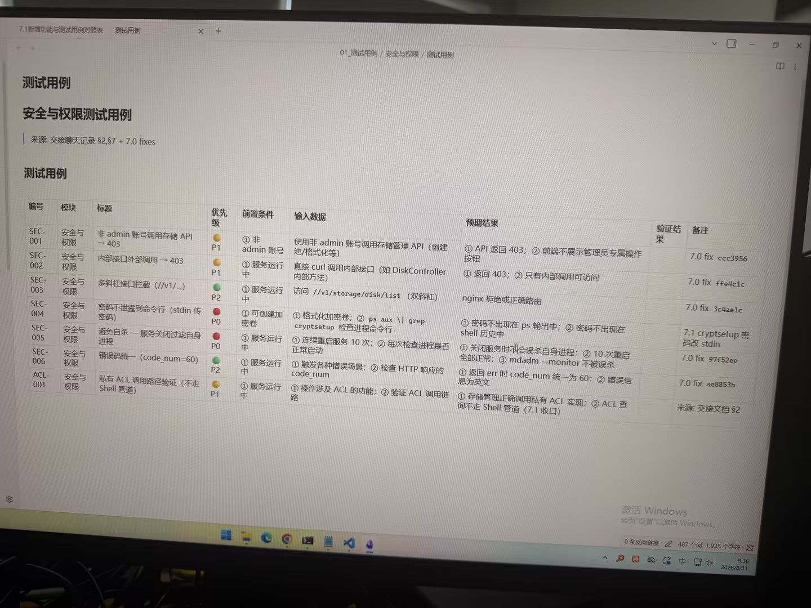

# Image 01: 81a9ad8e-8e61-4213-9dc8-8881bcc6190b.jpg

Original: ../81a9ad8e-8e61-4213-9dc8-8881bcc6190b.jpg

## Summary

This image is a photo of a computer monitor displaying a software document table of security and permission test cases (安全与权限测试用例). The table contains detailed test specifications including case ID, module, title, priority, prerequisites, test inputs, expected results, and comments.

## OCR in reading order

7.1新增功能与测试用例对照表  测试用例
01_测试用例 / 安全与权限 / 测试用例
测试用例
安全与权限测试用例
\| 来源: 交接聊天记录 §2,§7 + 7.0 fixes
测试用例
编号 模块 标题 优先级 前置条件 输入数据 预期结果 验证结果 备注
SEC-001 安全与权限 非 admin 账号调用存储 API → 403 P1 ① 非 admin 账号 使用非 admin 账号调用存储管理 API (创建池/格式化等) ① API 返回 403；② 前端不展示管理员专属操作按钮 7.0 fix ccc3956
SEC-002 安全与权限 内部接口外部调用 → 403 P1 ① 服务运行中 直接 curl 调用内部接口 (如 DiskController 内部方法) ① 返回 403；② 只有内部调用可访问 7.0 fix ffe4c1c
SEC-003 安全与权限 多斜杠接口拦截 (//v1/...) P2 ① 服务运行中 访问 //v1/storage/disk/list (双斜杠) nginx 拒绝或正确路由 7.0 fix 3c4ae1c
SEC-004 安全与权限 密码不泄露到命令行 (stdin 传密码) P0 ① 可创建加密卷 ① 格式化加密卷；② ps aux \| grep cryptsetup 检查进程命令行 ① 密码不出现在 ps 输出中；② 密码不出现在 shell 历史中 7.1 cryptsetup 密码改 stdin
SEC-005 安全与权限 避免自杀 — 服务关闭过滤自身进程 P0 ① 服务运行中 ① 连续重启服务 10 次；② 每次检查进程是否正常启动 ① 关闭服务时不会误杀自身进程；② 10 次重启全部正常；③ mdadm --monitor 不被误杀 7.0 fix 97f52ee
SEC-006 安全与权限 错误码统一 (code_num=60) P2 ① 服务运行中 ① 触发各种错误场景；② 检查 HTTP 响应的 code_num ① 返回 err 时 code_num 统一为 60；② 错误信息为英文 7.0 fix ae8853b
ACL-001 安全与权限 私有 ACL 调用路径验证 (不走 Shell 管道) P1 ① 服务运行中 ① 操作涉及 ACL 的功能；② 验证 ACL 调用链路 ① 存储管理正确调用私有 ACL 实现；② ACL 查询不走 Shell 管道 (7.1 收口) 来源: 交接文档 §2
激活 Windows
转到“设置”以激活 Windows。
0 条反向链接 487 个词 1,935 个字符 9:16 2026/8/11

## Layout

### other 1
7.1新增功能与测试用例对照表  测试用例

### other 2
01_测试用例 / 安全与权限 / 测试用例

### title 3
测试用例

### subtitle 4
安全与权限测试用例

### paragraph 5
\| 来源: 交接聊天记录 §2,§7 + 7.0 fixes

### subtitle 6
测试用例

### table 7
> 编号 模块 标题 优先级 前置条件 输入数据 预期结果 验证结果 备注
> SEC-001 安全与权限 非 admin 账号调用存储 API → 403 P1 ① 非 admin 账号 使用非 admin 账号调用存储管理 API (创建池/格式化等) ① API 返回 403；② 前端不展示管理员专属操作按钮 7.0 fix ccc3956
> SEC-002 安全与权限 内部接口外部调用 → 403 P1 ① 服务运行中 直接 curl 调用内部接口 (如 DiskController 内部方法) ① 返回 403；② 只有内部调用可访问 7.0 fix ffe4c1c
> SEC-003 安全与权限 多斜杠接口拦截 (//v1/...) P2 ① 服务运行中 访问 //v1/storage/disk/list (双斜杠) nginx 拒绝或正确路由 7.0 fix 3c4ae1c
| SEC-004 安全与权限 密码不泄露到命令行 (stdin 传密码) P0 ① 可创建加密卷 ① 格式化加密卷；② ps aux | grep cryptsetup 检查进程命令行 ① 密码不出现在 ps 输出中；② 密码不出现在 shell 历史中 7.1 cryptsetup 密码改 stdin |
> SEC-005 安全与权限 避免自杀 — 服务关闭过滤自身进程 P0 ① 服务运行中 ① 连续重启服务 10 次；② 每次检查进程是否正常启动 ① 关闭服务时不会误杀自身进程；② 10 次重启全部正常；③ mdadm --monitor 不被误杀 7.0 fix 97f52ee
> SEC-006 安全与权限 错误码统一 (code_num=60) P2 ① 服务运行中 ① 触发各种错误场景；② 检查 HTTP 响应的 code_num ① 返回 err 时 code_num 统一为 60；② 错误信息为英文 7.0 fix ae8853b
> ACL-001 安全与权限 私有 ACL 调用路径验证 (不走 Shell 管道) P1 ① 服务运行中 ① 操作涉及 ACL 的功能；② 验证 ACL 调用链路 ① 存储管理正确调用私有 ACL 实现；② ACL 查询不走 Shell 管道 (7.1 收口) 来源: 交接文档 §2

### other 8
激活 Windows
转到“设置”以激活 Windows。

### other 9
0 条反向链接 487 个词 1,935 个字符 9:16 2026/8/11

## Semantics

- Scene: document_editor_or_workspace
- Intent: documenting_software_test_cases

## Uncertainty and verification

- No uncertainty reported.

- Verification: GPT native image review; original image kept local.\r\n- JSON: D:/test_dev_projects/storagemanager/7.1/新增功能与用例/照片/提取md/json/81a9ad8e-8e61-4213-9dc8-8881bcc6190b.json
## Local image verification

- Original JPG reviewed locally; the Markdown image link resolves to the corresponding file.
- Text or table regions outside the photographed screen are not inferred.
