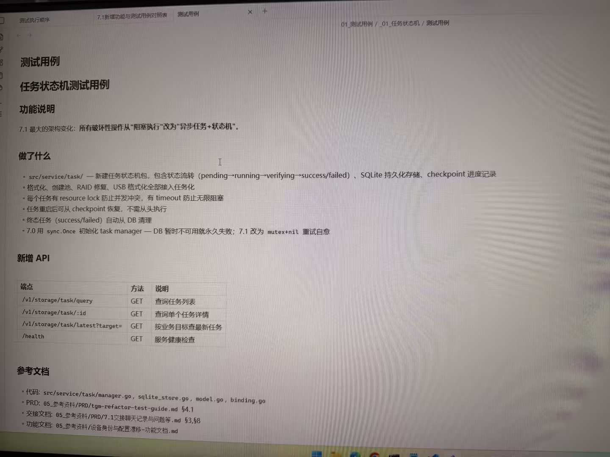

# 图片原文提取：6443467a-6d47-4de4-a59f-02131a0b6718

# 图片原文提取：任务状态机测试用例
## 功能说明
7.1 最大架构变化：破坏性操作由阻塞执行改为异步任务+状态机。
## 做了什么
- src/service/task/ 新建状态机：pending -> running -> verifying -> success/failed。
- SQLite 持久化、checkpoint 恢复、resource lock、timeout；格式化/建池/RAID/USB 均接入。
- 7.0 sync.Once DB 初始化永久失败改为 mutex+nil 重试自愈。
## 新增 API
| 端点 | 方法 | 说明 |
| --- | --- | --- |
| /v1/storage/task/query | GET | 查询任务列表 |
| /v1/storage/task/:id | GET | 查询单个任务详情 |
| /v1/storage/task/latest?target= | GET | 按目标查最新任务 |
| /health | GET | 服务健康检查 |
> 图片下方测试用例表未拍到。
## Local image verification

- Original JPG reviewed locally; the Markdown image link resolves to the corresponding file.
- Text or table regions outside the photographed screen are not inferred.
