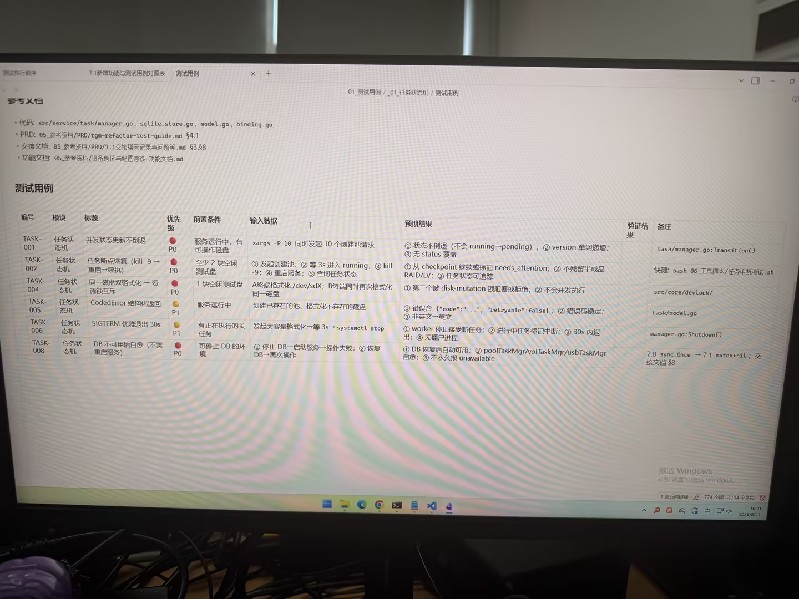

# 图片原文提取：dd358ff1-98d1-47f3-8abf-72eb78d85ffd

# 图片原文提取：任务状态机测试用例表
| 编号 | 模块 | 标题 | 优先级 | 预期结果 |
| --- | --- | --- | --- | --- |
| TASK-001 | 任务状态机 | 并发状态更新不倒退 | P0 | 状态不倒退，version 单调递增 |
| TASK-002 | 任务状态机 | 任务断点恢复（kill-9 -> 重启） | P0 | checkpoint 续执，不残留半成品 RAID/LV |
| TASK-004 | 任务状态机 | 格式化双校验/资源锁互斥 | P0 | 第二请求被拒绝 |
| TASK-005 | 任务状态机 | CodedError 结构化返回 | P1 | code、retryable:false，错误码稳定 |
| TASK-006 | 任务状态机 | SIGTERM 优雅退出 30s | P1 | worker 停止接新任务，30s 内退出 |
| TASK-008 | 任务状态机 | DB 不可用后自愈 | P0 | DB 恢复后任务管理器自动可用 |
## Local image verification

- Original JPG reviewed locally; the Markdown image link resolves to the corresponding file.
- Text or table regions outside the photographed screen are not inferred.
