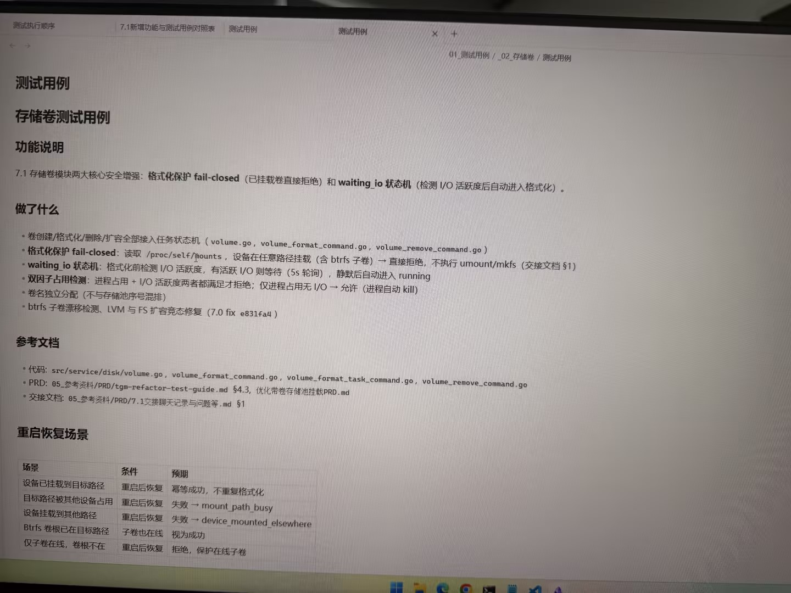

# 图片原文提取：b9ae027c-ca75-4089-b9bc-7f73f114e6e6

# 图片原文提取：存储卷测试用例
## 功能说明
格式化保护 fail-closed；waiting_io 状态机检测 I/O 活跃后再格式化。
## 做了什么
- 卷创建/格式化/删除/扩容任务化。
- 任意挂载（含 btrfs 子卷）直接拒绝，不执行 umount/mkfs。
- 活跃 I/O 每 5s 轮询，静默后 running；双因子占用检测；btrfs 漂移检测。
## 重启恢复场景
| 场景 | 预期 |
| --- | --- |
| 设备在目标路径 | 恢复成功，不重复格式化 |
| 目标路径被其他设备占用 | 失败 -> mount_path_busy |
| 设备在其他路径 | 失败 -> device_mounted_elsewhere |
| Btrfs 根和子卷在线 | 视为成功 |
| 仅子卷在线 | 拒绝，保护在线子卷 |
## Local image verification

- Original JPG reviewed locally; the Markdown image link resolves to the corresponding file.
- Text or table regions outside the photographed screen are not inferred.
