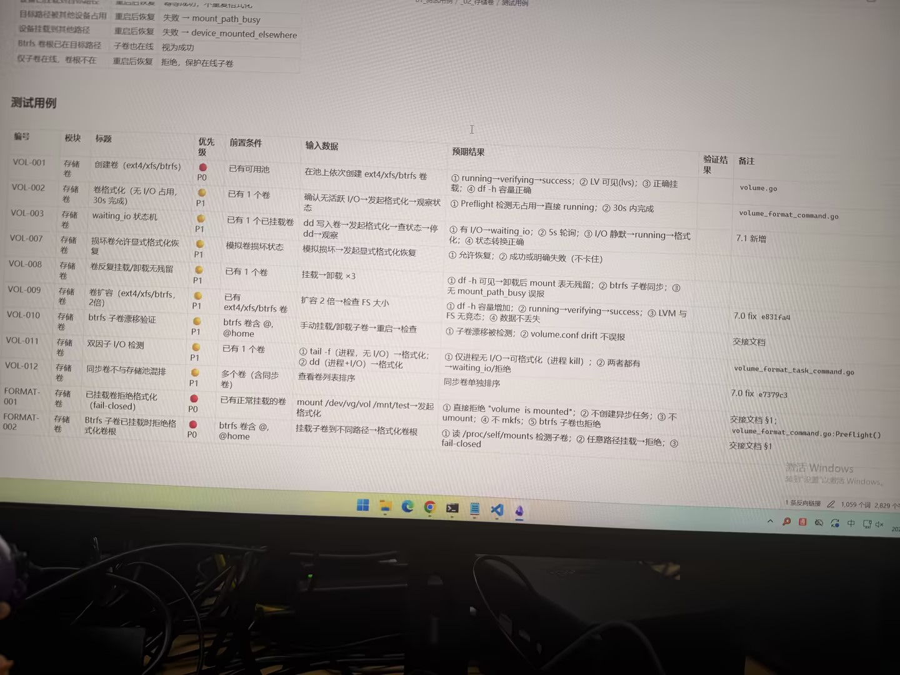

# Image 05: a4579389-9e42-47d1-bf34-9ec58cac3351.jpg

Original: ../a4579389-9e42-47d1-bf34-9ec58cac3351.jpg

## Summary

A photograph of a computer monitor displaying a software testing document written in Chinese. The main table lists various test cases (VOL-001 through FORMAT-002) for a storage volume module ('存储卷'), specifying titles, priority levels (P0, P1), preconditions, input actions, expected results, and code/documentation references.

## OCR in reading order

目标路径被其他设备占用 重启后恢复 失败 -> mount_path_busy
设备挂载到其他路径 重启后恢复 失败 -> device_mounted_elsewhere
Btrfs 卷根已在目标路径 子卷也在线 视为成功
仅子卷在线，卷根不在 重启后恢复 拒绝，保护在线子卷
测试用例
编号 模块 标题 优先级 前置条件 输入数据 预期结果 验证结果 备注
VOL-001 存储卷 创建卷 (ext4/xfs/btrfs) P0 已有可用池 在池上依次创建 ext4/xfs/btrfs 卷 ① running→verifying→success; ② LV 可见(lvs); ③ 正确挂载; ④ df -h 容量正确
VOL-002 存储卷 卷格式化 (无 I/O 占用, 30s 完成) P1 已有 1 个卷 确认无活跃 I/O→发起格式化→观察状态 ① Preflight 检测无占用→直接 running; ② 30s 内完成 volume.go
VOL-003 存储卷 waiting_io 状态机 P1 已有 1 个已挂载卷 dd 写入卷→发起格式化→一查状态→停 dd→观察 ① 有 I/O→waiting_io; ② 5s 轮询; ③ I/O 静默→running→格式化; ④ 状态转换正确 volume_format_command.go
VOL-007 存储卷 损坏卷允许显式格式化恢复 P1 模拟卷损坏状态 模拟损坏→发起显式格式化恢复 ① 允许恢复; ② 成功或明确失败 (不卡住) 7.1 新增
VOL-008 存储卷 卷反复挂载/卸载无残留 P1 已有 1 个卷 挂载→卸载 ×3 ① df -h 可见→卸载后 mount 表无残留; ② btrfs 子卷同步; ③ 无 mount_path_busy 误报
VOL-009 存储卷 卷扩容 (ext4/xfs/btrfs, 2倍) P1 已有 ext4/xfs/btrfs 卷 扩容 2 倍→检查 FS 大小 ① df -h 容量增加; ② running→verifying→success; ③ LVM 与 FS 无竞态; ④ 数据不丢失 7.0 fix e831fa4
VOL-010 存储卷 btrfs 子卷漂移验证 P1 btrfs 卷含 @, @home 手动挂载/卸载子卷→重启→检查 ① 子卷漂移被检测; ② volume.conf drift 不误报 交接文档
VOL-011 存储卷 双因子 I/O 检测 P1 已有 1 个卷 ① tail -f (进程, 无 I/O) →格式化; ② dd (进程+I/O) →格式化 ① 仅进程无 I/O→可格式化 (进程 kill) ; ② 两者都有→waiting_io/拒绝 volume_format_task_command.go
VOL-012 存储卷 同步卷不与存储池混排 P1 多个卷 (含同步卷) 查看卷列表排序 同步卷单独排序 7.0 fix e7379c3
FORMAT-001 存储卷 已挂载卷拒绝格式化 (fail-closed) P0 已有正常挂载的卷 mount /dev/vg/vol /mnt/test→发起格式化 ① 直接拒绝 "volume is mounted"; ② 不创建异步任务; ③ 不 umount; ④ 不 mkfs; ⑤ btrfs 子卷也拒绝 交接文档 §1;
FORMAT-002 存储卷 Btrfs 子卷已挂载时拒绝格式化卷根 P0 btrfs 卷含 @, @home 挂载子卷到不同路径→格式化卷根 ① 读 /proc/self/mounts 检测子卷; ② 任意路径挂载→拒绝; ③ fail-closed 交接文档 §1 volume_format_command.go:Preflight()
激活 Windows
转到“设置”以激活 Windows。
1 条反向链接 1,059 个词 2,829 个字符

## Layout

### paragraph 1
目标路径被其他设备占用 重启后恢复 失败 -> mount_path_busy
设备挂载到其他路径 重启后恢复 失败 -> device_mounted_elsewhere
Btrfs 卷根已在目标路径 子卷也在线 视为成功
仅子卷在线，卷根不在 重启后恢复 拒绝，保护在线子卷

### title 2
测试用例

### table 3
> 编号 模块 标题 优先级 前置条件 输入数据 预期结果 验证结果 备注
> VOL-001 存储卷 创建卷 (ext4/xfs/btrfs) P0 ...
> VOL-002 存储卷 卷格式化 (无 I/O 占用, 30s 完成) P1 ...
> VOL-003 存储卷 waiting_io 状态机 P1 ...
> VOL-007 存储卷 损坏卷允许显式格式化恢复 P1 ...
> VOL-008 存储卷 卷反复挂载/卸载无残留 P1 ...
> VOL-009 存储卷 卷扩容 (ext4/xfs/btrfs, 2倍) P1 ...
> VOL-010 存储卷 btrfs 子卷漂移验证 P1 ...
> VOL-011 存储卷 双因子 I/O 检测 P1 ...
> VOL-012 存储卷 同步卷不与存储池混排 P1 ...
> FORMAT-001 存储卷 已挂载卷拒绝格式化 (fail-closed) P0 ...
> FORMAT-002 存储卷 Btrfs 子卷已挂载时拒绝格式化卷根 P0 ...

### other 4
激活 Windows
转到“设置”以激活 Windows。

### other 5
1 条反向链接 1,059 个词 2,829 个字符

## Semantics

- Scene: document_on_screen
- Intent: Document storage volume test plans and criteria

## Uncertainty and verification

- No uncertainty reported.

- Verification: GPT native image review; original image kept local.\r\n- JSON: D:/test_dev_projects/storagemanager/7.1/新增功能与用例/照片/提取md/json/a4579389-9e42-47d1-bf34-9ec58cac3351.json
## Local image verification

- Original JPG reviewed locally; the Markdown image link resolves to the corresponding file.
- Text or table regions outside the photographed screen are not inferred.
