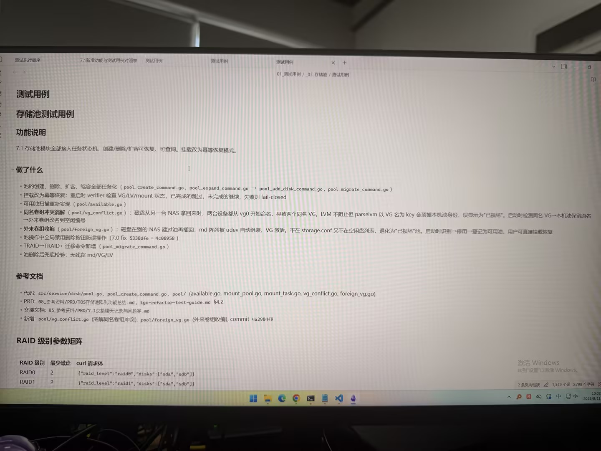

# 图片原文提取：d7981fff-5d6b-4c5d-935f-299af65123e2

# 图片原文提取：存储池测试用例
## 功能说明
存储池创建/删除/扩容/缩容任务化，可恢复可查询；挂载采用幂等恢复。
## 做了什么
- verifier 检查 VG/LV/mount，已完成跳过，未完成继续，失败 fail-closed。
- 可用池扫描、同名卷组冲突消解、外来卷组收编；删除按钮全局禁用。
- TRAID -> TRAID+ 迁移；删除后无残留 md/VG/LV。
## RAID 级别参数矩阵
| RAID | 最少磁盘 |
| --- | --- |
| RAID0 | 2 |
| RAID1 | 2 |
| RAID5 | 3 |
| RAID6 | 4 |
| RAID10 | 4 |
| TRAID | 3+ |
## Local image verification

- Original JPG reviewed locally; the Markdown image link resolves to the corresponding file.
- Text or table regions outside the photographed screen are not inferred.
