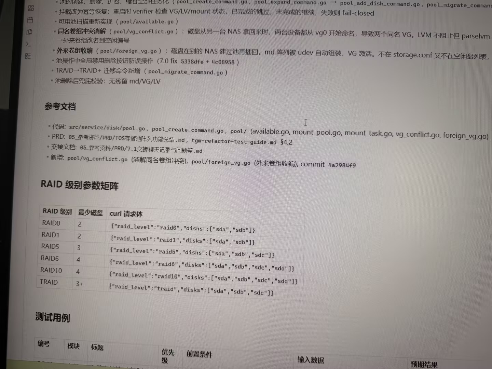

# Image 07: ed675dce-0979-409a-bac3-4d40172333d5.jpg

Original: ../ed675dce-0979-409a-bac3-4d40172333d5.jpg

## Summary

This is a photo of a computer screen displaying technical documentation about TOS storage pool array refactoring, including implementation notes, reference documents, a RAID level parameter matrix table, and a test cases section.

## OCR in reading order

• 池的创建、删除、扩容、缩容全部任务化 ( pool_create_command.go , pool_expand_command.go → pool_add_disk_command.go , pool_migrate_command
• 挂载改为幂等恢复：重启时 verifier 检查 VG/LV/mount 状态，已完成的跳过，未完成的继续，失败则 fail-closed
• 可用池扫描重新实现 ( pool/available.go )
• 同名卷组冲突消解 ( pool/vg_conflict.go ) ：磁盘从另一台 NAS 拿回来时，两台设备都从 vg0 开始命名，导致两个同名 VG。LVM 不阻止但 parselvm →外来卷组改名到空闲编号
• 外来卷组收编 ( pool/foreign_vg.go ) ：磁盘在别的 NAS 建过池再插回，md 阵列被 udev 自动组装、VG 激活。不在 storage.conf 又不在空闲盘列表，
• 池操作中全局禁用删除按钮防误操作 ( 7.0 fix 5338dfe + 4c08958 )
• TRAID→TRAID+ 迁移命令新增 ( pool_migrate_command.go )
• 池删除后兜底校验：无残留 md/VG/LV
参考文档
• 代码: src/service/disk/pool.go , pool_create_command.go , pool/ (available.go, mount_pool.go, mount_task.go, vg_conflict.go, foreign_vg.go)
• PRD: 05_参考资料/PRD/TOS存储池阵列功能总结.md , tgm-refactor-test-guide.md §4.2
• 交接文档: 05_参考资料/PRD/7.1交接聊天记录与问题等.md
• 新增: pool/vg_conflict.go (消解同名卷组冲突), pool/foreign_vg.go (外来卷组收编), commit 4a2984f9
RAID 级别参数矩阵
RAID 级别 最少磁盘 curl 请求体
RAID0 2 {"raid_level":"raid0","disks":["sda","sdb"]}
RAID1 2 {"raid_level":"raid1","disks":["sda","sdb"]}
RAID5 3 {"raid_level":"raid5","disks":["sda","sdb","sdc"]}
RAID6 4 {"raid_level":"raid6","disks":["sda","sdb","sdc","sdd"]}
RAID10 4 {"raid_level":"raid10","disks":["sda","sdb","sdc","sdd"]}
TRAID 3+ {"raid_level":"traid","disks":["sda","sdb","sdc"]}
测试用例
编号 模块 标题 优先级 前置条件 输入数据 预期结果

## Layout

### list 1
• 池的创建、删除、扩容、缩容全部任务化 ( pool_create_command.go , pool_expand_command.go → pool_add_disk_command.go , pool_migrate_command
• 挂载改为幂等恢复：重启时 verifier 检查 VG/LV/mount 状态，已完成的跳过，未完成的继续，失败则 fail-closed
• 可用池扫描重新实现 ( pool/available.go )
• 同名卷组冲突消解 ( pool/vg_conflict.go ) ：磁盘从另一台 NAS 拿回来时，两台设备都从 vg0 开始命名，导致两个同名 VG。LVM 不阻止但 parselvm →外来卷组改名到空闲编号
• 外来卷组收编 ( pool/foreign_vg.go ) ：磁盘在别的 NAS 建过池再插回，md 阵列被 udev 自动组装、VG 激活。不在 storage.conf 又不在空闲盘列表，
• 池操作中全局禁用删除按钮防误操作 ( 7.0 fix 5338dfe + 4c08958 )
• TRAID→TRAID+ 迁移命令新增 ( pool_migrate_command.go )
• 池删除后兜底校验：无残留 md/VG/LV

### subtitle 2
参考文档

### list 3
• 代码: src/service/disk/pool.go , pool_create_command.go , pool/ (available.go, mount_pool.go, mount_task.go, vg_conflict.go, foreign_vg.go)
• PRD: 05_参考资料/PRD/TOS存储池阵列功能总结.md , tgm-refactor-test-guide.md §4.2
• 交接文档: 05_参考资料/PRD/7.1交接聊天记录与问题等.md
• 新增: pool/vg_conflict.go (消解同名卷组冲突), pool/foreign_vg.go (外来卷组收编), commit 4a2984f9

### subtitle 4
RAID 级别参数矩阵

### table 5
| RAID 级别 | 最少磁盘 | curl 请求体 |
| --- | --- | --- |
| RAID0 | 2 | {"raid_level":"raid0","disks":["sda","sdb"]} |
| RAID1 | 2 | {"raid_level":"raid1","disks":["sda","sdb"]} |
| RAID5 | 3 | {"raid_level":"raid5","disks":["sda","sdb","sdc"]} |
| RAID6 | 4 | {"raid_level":"raid6","disks":["sda","sdb","sdc","sdd"]} |
| RAID10 | 4 | {"raid_level":"raid10","disks":["sda","sdb","sdc","sdd"]} |
| TRAID | 3+ | {"raid_level":"traid","disks":["sda","sdb","sdc"]} |

### subtitle 6
测试用例

### table 7
| 编号 | 模块 | 标题 | 优先级 | 前置条件 | 输入数据 | 预期结果 |

## Semantics

- Scene: screen_capture
- Intent: Technical documentation for software development and testing concerning NAS storage pool management and RAID configuration.

## Uncertainty and verification

- The first bullet point text is truncated on the far right after 'pool_migrate_command'.
- The fifth bullet point text ends abruptly after '不在 storage.conf 又不在空闲盘列表，'.
- The test case table below the header row is cut off by the bottom edge of the image.

- Verification: GPT native image review; original image kept local.\r\n- JSON: D:/test_dev_projects/storagemanager/7.1/新增功能与用例/照片/提取md/json/ed675dce-0979-409a-bac3-4d40172333d5.json
## Local image verification

- Original JPG reviewed locally; the Markdown image link resolves to the corresponding file.
- Text or table regions outside the photographed screen are not inferred.
