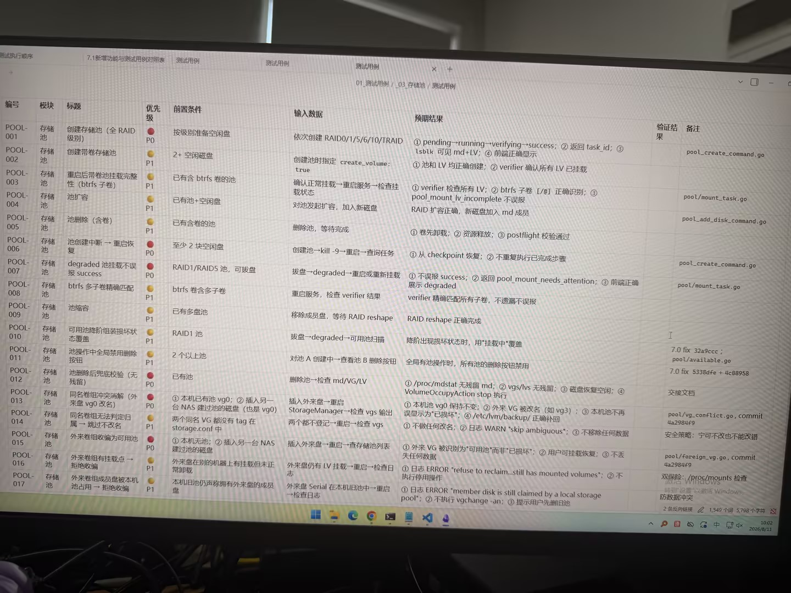

# Image 08: 26e65aa5-4276-4857-9946-0e85b5bd3df8.jpg

Original: ../26e65aa5-4276-4857-9946-0e85b5bd3df8.jpg

## Summary

A photograph showing a software test case documentation table titled with storage pool test cases (POOL-001 through POOL-017), outlining modules, titles, priority levels, prerequisites, input steps, expected results, and verification remarks.

## OCR in reading order

7.1新增功能与测试用例对照表
测试用例
测试用例
01_测试用例 / _03_存储池 / 测试用例
编号 模块 标题 优先级 前置条件 输入数据 预期结果 验证结果 备注
POOL-001 存储池 创建存储池（全 RAID 级别） P0 按级别准备空闲盘 依次创建 RAID0/1/5/6/10/TRAID ① pending→running→verifying→success; ② 返回 task_id; ③ lsblk 可见 md+LV; ④ 前端正确显示 pool_create_command.go
POOL-002 存储池 创建带卷存储池 P1 2+ 空闲磁盘 创建池时指定 create_volume: true ① 池和 LV 均正确创建; ② verifier 确认所有 LV 已挂载
POOL-003 存储池 重启后带卷池挂载完整性（btrfs 子卷） P1 已有含 btrfs 卷的池 确认正常挂载→重启服务→检查挂载状态 ① verifier 检查所有 LV; ② btrfs 子卷 [/@] 正确识别; ③ pool_mount_lv_incomplete 不误报 pool_mount_task.go
POOL-004 存储池 池扩容 P1 已有池+空闲盘 对池发起扩容，加入新磁盘 RAID 扩容正确，新磁盘加入 md 成员 pool_add_disk_command.go
POOL-005 存储池 池删除（含卷） P1 已有含卷的池 删除池，等待完成 ① 卷先卸载; ② 资源释放; ③ postflight 校验通过
POOL-006 存储池 池创建中断 → 重启恢复 P0 至少 2 块空闲盘 创建池→kill -9→重启→查询任务 ① 从 checkpoint 恢复; ② 不重复执行已完成步骤 pool_create_command.go
POOL-007 存储池 degraded 池挂载不误报 success P0 RAID1/RAID5 池，可拔盘 拔盘→degraded→重启或重新挂载 ① 不误报 success; ② 返回 pool_mount_needs_attention; ③ 前端正确展示 degraded pool_mount_task.go
POOL-008 存储池 btrfs 多子卷精确匹配 P1 btrfs 卷含多子卷 重启服务，检查 verifier 结果 verifier 精确匹配所有子卷，不遗漏不误报
POOL-009 存储池 池缩容 P1 已有多盘池 移除成员盘，等待 RAID reshape RAID reshape 正确完成
POOL-010 存储池 可用池降阶组装损坏状态覆盖 P1 RAID1 池 拔盘→degraded→可用池扫描 降阶出现损坏状态时，用"挂载中"覆盖 7.0 fix 32a9ccc ; pool/available.go
POOL-011 存储池 池操作中全局禁用删除按钮 P1 2 个以上池 对池 A 创建中→查看池 B 删除按钮 全局有池操作时，所有池的删除按钮禁用 7.0 fix 5338dfe + 4c08958
POOL-012 存储池 池删除后彻底校验（无残留） P0 已有池 删除池→检查 md/VG/LV ① /proc/mdstat 无残留 md; ② vgs/lvs 无残留; ③ 磁盘恢复空闲; ④ VolumeOccupyAction stop 执行 交接文档
POOL-013 存储池 同名卷组冲突消解（外来盘 vg0 改名） P0 ① 本机已有池 vg0; ② 插入另一台 NAS 建立过的磁盘（也是 vg0）两个同名 VG 都没有 tag 在 storage.conf 中 插入外来盘→重启 StorageManager→检查 vgs 输出两个都不登记→重启→检查 vgs ① 本机 vg0 保持不变; ② 外来 VG 被改名（如 vg3）; ③ 本机池不再误显示为"已损坏"; ④ /etc/lvm/backup/正确补回 pool/vg_conflict.go, commit 4a2984f9
POOL-014 存储池 同名卷组无法判定归属 → 跳过不改名 P1 ① 不做任何改名; ② 日志 WARN "skip ambiguous"; ③ 不移除任何数据 安全策略：宁可不改也不能改错
POOL-015 存储池 外来卷组收编为可用池 P0 ① 本机无池; ② 插入另一台 NAS 建立的磁盘 插入外来盘→重启→查看存储池列表 ① 外来 VG 被识别为"可用"而非"已损坏"; ② 用户可挂载恢复; ③ 不丢失任何数据 pool/foreign_vg.go, commit 4a2984f9
POOL-016 存储池 外来卷组有挂载点 → 拒绝收编 P1 外来盘在别的机器上有挂载但未正常卸载 外来盘仍有 LV 挂载→重启→检查日志 ① 日志 ERROR "refuse to reclaim...still has mounted volumes"; ② 不执行停用操作 双保险：/proc/mounts 检查
POOL-017 存储池 外来卷组成员盘被本机池占用 → 拒绝收编 P1 本机旧池仍声明拥有外来盘的成员盘 外来盘 Serial 在本机旧池中→重启→检查日志 ① 日志 ERROR "member disk is still claimed by a local storage pool"; ② 不执行 vgchange -an; ③ 提示用户先删旧池 防止数据冲突

## Layout

### title 1
7.1新增功能与测试用例对照表 / 01_测试用例 / _03_存储池 / 测试用例

### table 2
> 测试用例表格（包含 编号、模块、标题、优先级、前置条件、输入数据、预期结果、验证结果、备注 等列）

## Semantics

- Scene: computer_screen
- Intent: software_testing_documentation

## Uncertainty and verification

- No uncertainty reported.

- Verification: GPT native image review; original image kept local.\r\n- JSON: D:/test_dev_projects/storagemanager/7.1/新增功能与用例/照片/提取md/json/26e65aa5-4276-4857-9946-0e85b5bd3df8.json
## Local image verification

- Original JPG reviewed locally; the Markdown image link resolves to the corresponding file.
- Text or table regions outside the photographed screen are not inferred.
