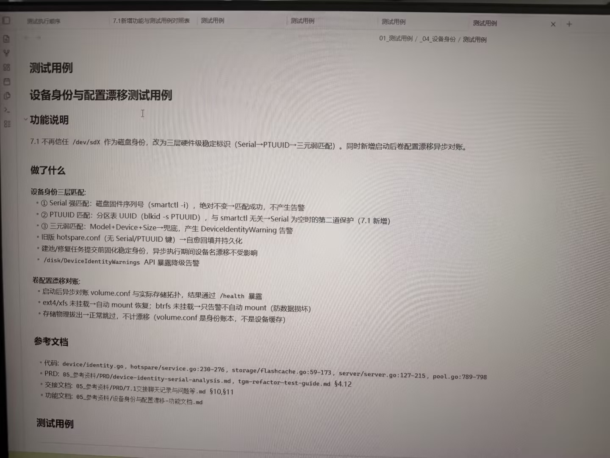

# 图片原文提取：61037bdd-d93a-4a97-b54e-9d30b8be2331

# 图片原文提取：设备身份与配置漂移
## 功能说明
磁盘身份由 Serial -> PTUUID -> Model+Device+Size 三层匹配；启动后对账 volume.conf。
## 做了什么
- Serial 强匹配无告警；PTUUID 是 Serial 为空时的第二道保护。
- 三元弱匹配产生 DeviceIdentityWarning；旧 hotspare.conf 自动回填。
- /disk/DeviceIdentityWarnings 暴露告警；ext4/xfs 自动恢复，btrfs 只告警。
- 物理拔盘正常跳过，不计漂移。
> 测试用例表从图片底部开始，未拍到。
## Local image verification

- Original JPG reviewed locally; the Markdown image link resolves to the corresponding file.
- Text or table regions outside the photographed screen are not inferred.
