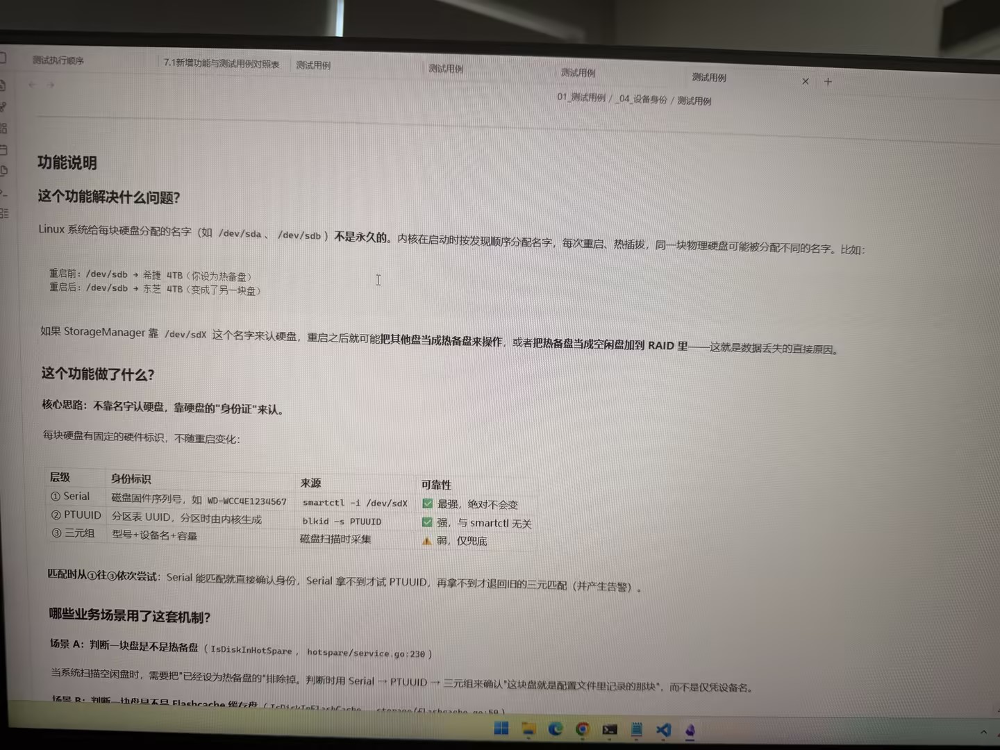

# Image 10: 78967a92-02ff-48b7-a1b6-c0a2636f2012.jpg

Original: ../78967a92-02ff-48b7-a1b6-c0a2636f2012.jpg

## Summary

This is a computer screen displaying a technical documentation document titled '功能说明' (Feature Description). It explains the problem of volatile device names (/dev/sdX) in Linux and describes a unique identification strategy using Serial, PTUUID, and triplet attributes to accurately identify disks across reboots.

## OCR in reading order

测试执行顺序
7.1新增功能与测试用例对照表
测试用例
测试用例
测试用例
测试用例
01_测试用例 / _04_设备身份 / 测试用例
功能说明
这个功能解决什么问题？
Linux 系统给每块硬盘分配的名字（如 /dev/sda 、 /dev/sdb）不是永久的。内核在启动时按发现顺序分配名字，每次重启、热插拔，同一块物理硬盘可能被分配不同的名字。比如：
重启前：/dev/sdb → 希捷 4TB（假设为热备盘）
重启后：/dev/sdb → 东芝 4TB（变成了另一块盘）
如果 StorageManager 靠 /dev/sdX 这个名字来认硬盘，重启之后就可能把其他盘当成热备盘来操作，或者把热备盘当成空闲盘加到 RAID 里——这就是数据丢失的直接原因。
这个功能做了什么？
核心思路：不靠名字认硬盘，靠硬盘的“身份证”来认。
每块硬盘有固定的硬件标识，不随重启变化：
层级 身份标识 来源 可靠性
① Serial 磁盘固件序列号，如 WD-WCC4E1234567 smartctl -i /dev/sdX ✅ 最强，绝对不会变
② PTUUID 分区表 UUID，分区时由内核生成 blkid -s PTUUID ✅ 强，与 smartctl 无关
③ 三元组 型号+设备名+容量 磁盘扫描时采集 ⚠️ 弱，仅兜底
匹配时从①往③依次尝试：Serial 能匹配就直接确认身份，Serial 拿不到才试 PTUUID，再拿不到才退回旧的三元组匹配（并产生告警）。
哪些业务场景用了这套机制？
场景 A：判断一块盘是不是热备盘（ IsDiskInHotSpare ， hotspare/service.go:230 ）
当系统扫描空闲盘时，需要把“已经设为热备盘的”排除掉。判断时用 Serial → PTUUID → 三元组来确认“这块盘就是配置文件里记录的那块”，而不是仅凭设备名。
场景 B：判断一块盘是不是 Flashcache 缓存盘（ IsDiskInFlashcache ， storage/flashcache.go:50 ）

## Layout

### other 1
测试执行顺序 7.1新增功能与测试用例对照表 测试用例 测试用例 测试用例 测试用例 01_测试用例 / _04_设备身份 / 测试用例

### title 2
功能说明

### subtitle 3
这个功能解决什么问题？

### paragraph 4
Linux 系统给每块硬盘分配的名字（如 /dev/sda 、 /dev/sdb）不是永久的。内核在启动时按发现顺序分配名字，每次重启、热插拔，同一块物理硬盘可能被分配不同的名字。比如：
重启前：/dev/sdb → 希捷 4TB（假设为热备盘）
重启后：/dev/sdb → 东芝 4TB（变成了另一块盘）
如果 StorageManager 靠 /dev/sdX 这个名字来认硬盘，重启之后就可能把其他盘当成热备盘来操作，或者把热备盘当成空闲盘加到 RAID 里——这就是数据丢失的直接原因。

### subtitle 5
这个功能做了什么？

### paragraph 6
核心思路：不靠名字认硬盘，靠硬盘的“身份证”来认。
每块硬盘有固定的硬件标识，不随重启变化：

### table 7
| 层级 | 身份标识 | 来源 | 可靠性 |
| --- | --- | --- | --- |
| ① Serial | 磁盘固件序列号，如 WD-WCC4E1234567 | smartctl -i /dev/sdX | ✅ 最强，绝对不会变 |
| ② PTUUID | 分区表 UUID，分区时由内核生成 | blkid -s PTUUID | ✅ 强，与 smartctl 无关 |
| ③ 三元组 | 型号+设备名+容量 | 磁盘扫描时采集 | ⚠️ 弱，仅兜底 |

### paragraph 8
匹配时从①往③依次尝试：Serial 能匹配就直接确认身份，Serial 拿不到才试 PTUUID，再拿不到才退回旧的三元组匹配（并产生告警）。

### subtitle 9
哪些业务场景用了这套机制？

### paragraph 10
场景 A：判断一块盘是不是热备盘（ IsDiskInHotSpare ， hotspare/service.go:230 ）
当系统扫描空闲盘时，需要把“已经设为热备盘的”排除掉。判断时用 Serial → PTUUID → 三元组来确认“这块盘就是配置文件里记录的那块”，而不是仅凭设备名。
场景 B：判断一块盘是不是 Flashcache 缓存盘（ IsDiskInFlashcache ， storage/flashcache.go:50 ）

## Semantics

- Scene: screen_photo
- Intent: Technical documentation explaining Linux disk device identification design and code usage.

## Uncertainty and verification

- Bottom line '场景 B' is partially cut off at the bottom edge of the image frame.

- Verification: GPT native image review; original image kept local.\r\n- JSON: D:/test_dev_projects/storagemanager/7.1/新增功能与用例/照片/提取md/json/78967a92-02ff-48b7-a1b6-c0a2636f2012.json
## Local image verification

- Original JPG reviewed locally; the Markdown image link resolves to the corresponding file.
- Text or table regions outside the photographed screen are not inferred.
