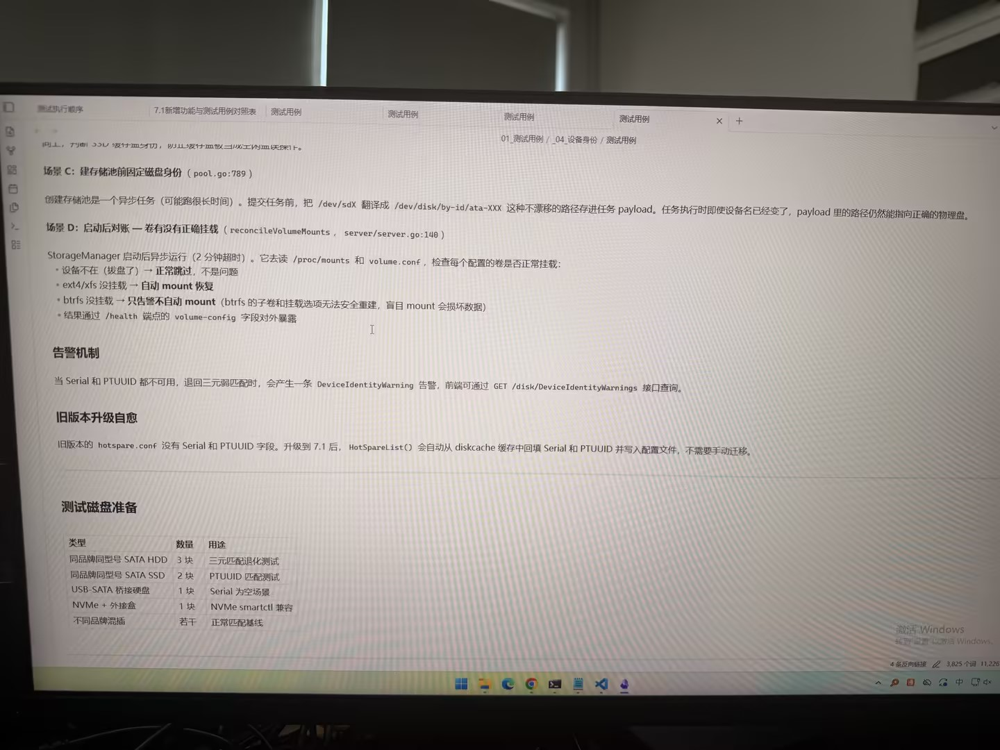

# 图片原文提取：8b0abca5-ed73-4888-8e1c-fc42b2710709

# 图片原文提取：设备身份与卷对账补充
## 场景 C：建池固定磁盘身份
任务 payload 保存 /dev/disk/by-id/ata-XXX，设备名变化仍指向正确物理盘。
## 场景 D：启动后卷对账
读取 /proc/mounts 和 volume.conf；设备缺失跳过；ext4/xfs 自动 mount；btrfs 只告警；结果在 /health.volume-config。
## 告警与升级自愈
Serial/PTUUID 不可用时产生 DeviceIdentityWarning；旧 hotspare.conf 升级后从 diskcache 回填。
## 测试磁盘准备
| 类型 | 数量 | 用途 |
| --- | --- | --- |
| 同型号 SATA HDD | 3 | 三元匹配 |
| 同型号 SSD | 2 | PTUUID 匹配 |
| USB-SATA 桥接盘 | 1 | Serial 为空 |
| NVMe+外接盒 | 1 | smartctl 兼容 |
## Local image verification

- Original JPG reviewed locally; the Markdown image link resolves to the corresponding file.
- Text or table regions outside the photographed screen are not inferred.
