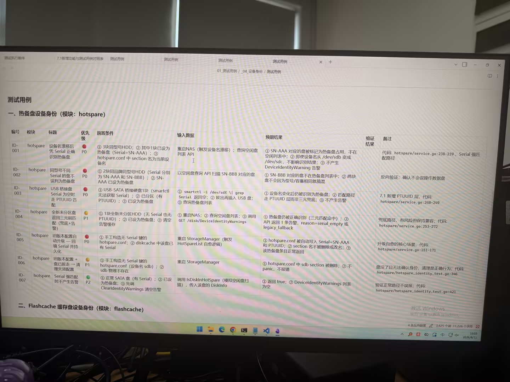

# 图片原文提取：5f9aeda0-b5b3-40fa-bd3f-3ab6f46c9e56

# 图片原文提取：热备盘设备身份
| 编号 | 标题 | 优先级 | 预期结果 |
| --- | --- | --- | --- |
| ID-001 | 设备名漂移后凭 Serial 识别 | P0 | 热备盘不进空闲列表，无告警 |
| ID-002 | 同型号不同 Serial 不误判 | P0 | 不因型号/容量混淆 |
| ID-003 | USB 桥接盘走 PTUUID | P0 | 设备名变化仍识别，无告警 |
| ID-004 | 全新盘三元弱匹配 | P1 | 识别但产生告警 |
| ID-005 | 旧配置回填 Serial/PTUUID | P0 | 自动写回配置 |
| ID-006 | 旧配置盘拔走 | P1 | 清理失效 section，不 panic |
| ID-007 | Serial 强匹配 | P2 | 告警列表为空 |
## 二、Flashcache 缓存盘设备身份
> 图片在此标题处结束。
## Local image verification

- Original JPG reviewed locally; the Markdown image link resolves to the corresponding file.
- Text or table regions outside the photographed screen are not inferred.
