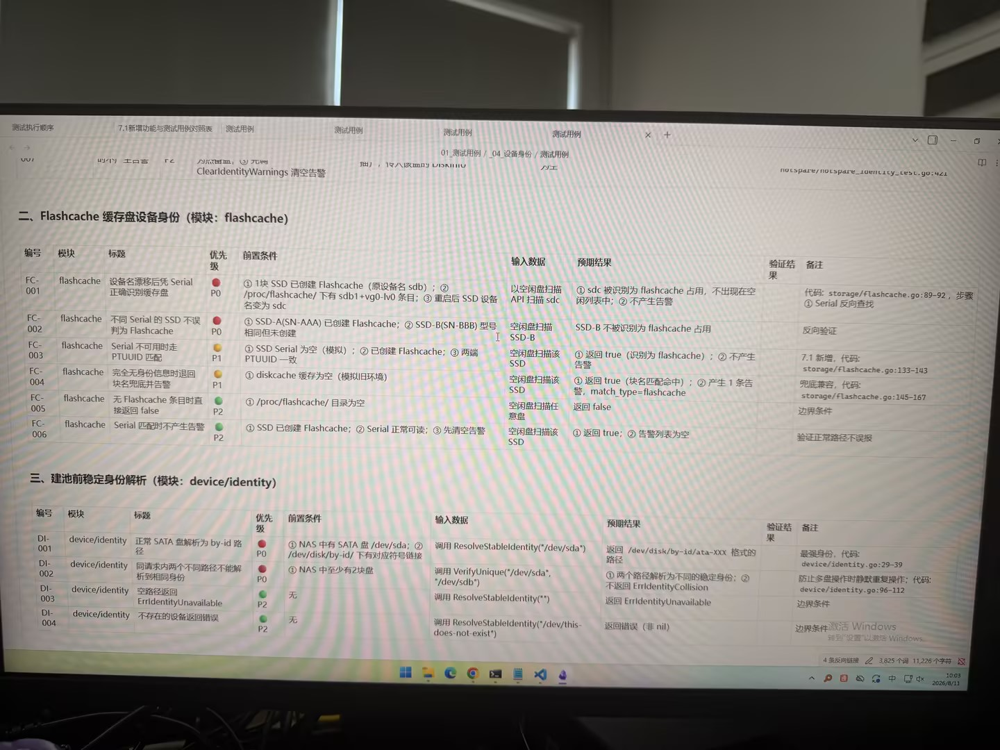

# Image 13: 3c9a87aa-1501-46fc-ac4d-b49a89a0457c.jpg

Original: ../3c9a87aa-1501-46fc-ac4d-b49a89a0457c.jpg

## Summary

The image shows a computer monitor displaying a document or test specification page containing test case tables for software storage modules 'flashcache' and 'device/identity'.

## OCR in reading order

ClearIdentityWarnings 清空告警
二、Flashcache 缓存盘设备身份 (模块: flashcache)
编号 模块 标题 优先级 前置条件 输入数据 预期结果 验证结果 备注
FC-001 flashcache 设备名漂移后凭 Serial 正确识别缓存盘 P0 ① 1块 SSD 已创建 Flashcache (原设备名 sdb)； ② /proc/flashcache/ 下有 sdb1+vg0-lv0 条目； ③ 重启后 SSD 设备名变为 sdc 以空闲盘扫描 API 扫描 sdc ① sdc 被识别为 flashcache 占用，不出现在空闲列表中； ② 不产生告警 代码: storage/flashcache.go:89-92, 步骤 ① Serial 反向查找
FC-002 flashcache 不同 Serial 的 SSD 不误判为 Flashcache P0 ① SSD-A(SN-AAA) 已创建 Flashcache; ② SSD-B(SN-BBB) 型号相同但未创建 空闲盘扫描 SSD-B SSD-B 不被识别为 flashcache 占用 反向验证
FC-003 flashcache SSD 不可用时走 PTUUID 匹配 P1 ① SSD Serial 为空 (模拟)； ② 已创建 Flashcache; ③ 两端 PTUUID 一致 空闲盘扫描该 SSD ① 返回 true (识别为 flashcache)； ② 不产生告警 7.1 新增, 代码: storage/flashcache.go:133-143
FC-004 flashcache 完全无身份信息时退回块名兜底并告警 P1 ① diskcache 缓存为空 (模拟旧环境) 空闲盘扫描该 SSD ① 返回 true (块名匹配命中)； ② 产生 1 条告警, match_type=flashcache 兜底兼容, 代码: storage/flashcache.go:145-167
FC-005 flashcache 无 Flashcache 条目时直接返回 false P2 ① /proc/flashcache/ 目录为空 空闲盘扫描任意盘 返回 false 边界条件
FC-006 flashcache Serial 匹配时不产生告警 P2 ① SSD 已创建 Flashcache; ② Serial 正常可读; ③ 先清空告警 空闲盘扫描该 SSD ① 返回 true; ② 告警列表为空 验证正常路径不误报
三、建池前稳定身份解析 (模块: device/identity)
编号 模块 标题 优先级 前置条件 输入数据 预期结果 验证结果 备注
DI-001 device/identity 正常 SATA 盘解析为 by-id 路径 P0 ① NAS 中有 SATA 盘 /dev/sda; ② /dev/disk/by-id/ 下有对应符号链接 调用 ResolveStableIdentity("/dev/sda") 返回 /dev/disk/by-id/ata-XXX 格式的路径 最强身份, 代码: device/identity.go:29-39
DI-002 device/identity 同请求内两个不同路径不能解析到相同身份 P0 ① NAS 中至少有2块盘 调用 VerifyUnique("/dev/sda", "/dev/sdb") ① 两个路径解析为不同的稳定身份; ② 不返回 ErrIdentityCollision 防止多盘操作时静默重复操作; 代码: device/identity.go:96-112
DI-003 device/identity 空路径返回 ErrIdentityUnavailable P2 无 调用 ResolveStableIdentity("") 返回 ErrIdentityUnavailable 边界条件
DI-004 device/identity 不存在的设备返回错误 P2 无 调用 ResolveStableIdentity("/dev/this-does-not-exist") 返回错误 (非 nil) 边界条件

## Layout

### title 1
二、Flashcache 缓存盘设备身份 (模块: flashcache)

### table 2
| 编号 | 模块 | 标题 | 优先级 | 前置条件 | 输入数据 | 预期结果 | 验证结果 | 备注 |
| --- | --- | --- | --- | --- | --- | --- | --- | --- |
> FC-001 至 FC-006 测试用例详细表格内容

### title 3
三、建池前稳定身份解析 (模块: device/identity)

### table 4
| 编号 | 模块 | 标题 | 优先级 | 前置条件 | 输入数据 | 预期结果 | 验证结果 | 备注 |
| --- | --- | --- | --- | --- | --- | --- | --- | --- |
> DI-001 至 DI-004 测试用例详细表格内容

## Semantics

- Scene: document_editor
- Intent: display test plan specification and test case matrix

## Uncertainty and verification

- No uncertainty reported.

- Verification: GPT native image review; original image kept local.\r\n- JSON: D:/test_dev_projects/storagemanager/7.1/新增功能与用例/照片/提取md/json/3c9a87aa-1501-46fc-ac4d-b49a89a0457c.json
## Local image verification

- Original JPG reviewed locally; the Markdown image link resolves to the corresponding file.
- Text or table regions outside the photographed screen are not inferred.
