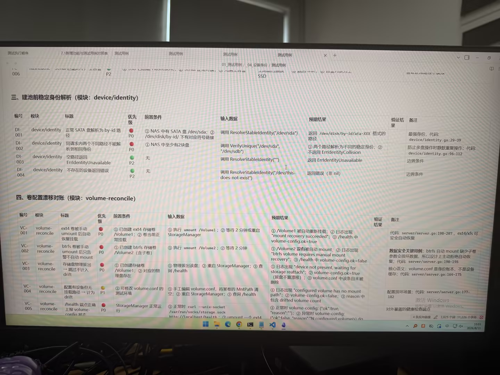

# Image 14: 1516fa47-c454-4b42-96ab-e8ab4459f6cc.jpg

Original: ../1516fa47-c454-4b42-96ab-e8ab4459f6cc.jpg

## Summary

This is a photo of a monitor screen displaying a document with test cases for device/identity and volume-reconcile modules.

## OCR in reading order

测试执行顺序
7.1 新增功能与测试用例对照表
测试用例
01_测试用例 / 04_设备身份 / 测试用例
SSD
三、电池前稳定身份解析 (模块: device/identity)
编号 模块 标题 优先级 前置条件 输入数据 预期结果 验证结果 备注
DI-001 device/identity 正常 SATA 盘解析为 by-id 路径 P0 ① NAS 中有 SATA 盘 /dev/sda; ② /dev/disk/by-id/ 下有对应符号链接 调用 ResolveStableIdentity("/dev/sda") 返回 /dev/disk/by-id/ata-XXX 格式的路径 最强身份，代码: device/identity.go:29-39
DI-002 device/identity 同请求内两个不同路径不能解析到相同身份 P0 ① NAS 中至少有2块盘 调用 VerifyUnique("/dev/sda", "/dev/sdb") ① 两个路径解析为不同的稳定身份; ② 不返回 ErrIdentityCollision 防止多盘操作时静默重复操作; 代码: device/identity.go:96-112
DI-003 device/identity 空路径返回 ErrIdentityUnavailable P2 无 调用 ResolveStableIdentity("") 返回 ErrIdentityUnavailable 边界条件
DI-004 device/identity 不存在的设备返回错误 P2 无 调用 ResolveStableIdentity("/dev/this-does-not-exist") 返回错误 (非 nil) 边界条件
四、卷配置漂移对账 (模块: volume-reconcile)
编号 模块 标题 优先级 前置条件 输入数据 预期结果 验证结果 备注
VC-001 volume-reconcile ext4 卷手动 umount 后自动恢复挂载 P0 ① 已创建 ext4 存储卷 /Volume1; ② 卷当前正常挂载 ① 执行 umount /Volume1; ② 等待 2 分钟或重启 StorageManager ① /Volume1 被自动重新挂载; ② 日志出现 "mount recovery succeeded"; ③ /health 中 volume-config.ok=true 代码: server/server.go:198-207, ext4/xfs 可安全自动恢复
VC-002 volume-reconcile btrfs 卷手动 umount 后只告警不自动 mount P0 ① 已创建 btrfs 存储卷 /Volume2 (含子卷) ① 执行 umount /Volume2; ② 等待 2 分钟 ① /Volume2 没有被自动 mount; ② 日志出现 "btrfs volume requires manual mount recovery"; ③ /health 中 volume-config.ok=false 数据安全关键用例: btrfs 自动 mount 缺少子卷参数会损坏数据，所以设计上主动拒绝自动恢复; 代码: server/server.go:190-195
VC-003 volume-reconcile 存储盘物理拔出 -> 跳过不计入 drift P0 ① 已创建存储卷 /Volume1; ② 对应的物理盘存在 ① 物理拔出该盘; ② 重启 StorageManager; ③ 查询 /health ① 日志出现 "device not present, waiting for storage reattach"; ② volume-config.ok=true (拔盘不算漂移); ③ volume-config 中该条目未被删除 核心语义: volume.conf 是身份账本，不是设备缓存; 代码: server/server.go:164-175
VC-004 volume-reconcile 配置有设备但无挂载路径 -> 计为 drift P1 ① 可修改 volume.conf 的测试环境 ① 手工编辑 volume.conf，将某卷的 MntPath 清空; ② 重启 StorageManager; ③ 查询 /health ① 日志出现 "configured volume has no mount path"; ② volume-config.ok=false; ③ reason 中包含 drifted volume count 配置损坏场景; 代码: server/server.go:177-182
VC-005 volume-reconcile /health 端点正确上报 volume-config 状态 P0 StorageManager 正常运行 ① 正常时 curl --unix-socket /var/run/socks/storage.sock http://localhost/health; ② umount 一个 ext4 ... ① 正常时 volume-config: {"ok":true, "reason":""}; ② 异常时 volume-config: {"ok":false, "reason":"N configured volume(s) do..." 对外暴露的健康检查端点
激活 Windows
转到“设置”以激活 Windows。

## Layout

### other 1
测试执行顺序 7.1 新增功能与测试用例对照表 测试用例 01_测试用例 / 04_设备身份 / 测试用例 SSD

### title 2
三、电池前稳定身份解析 (模块: device/identity)

### table 3
> DI-001 ~ DI-004 测试用例表格

### title 4
四、卷配置漂移对账 (模块: volume-reconcile)

### table 5
> VC-001 ~ VC-005 测试用例表格

### other 6
激活 Windows 转到“设置”以激活 Windows。

## Semantics

- Scene: screen_photo
- Intent: document_review

## Uncertainty and verification

- No uncertainty reported.

- Verification: GPT native image review; original image kept local.\r\n- JSON: D:/test_dev_projects/storagemanager/7.1/新增功能与用例/照片/提取md/json/1516fa47-c454-4b42-96ab-e8ab4459f6cc.json
## Local image verification

- Original JPG reviewed locally; the Markdown image link resolves to the corresponding file.
- Text or table regions outside the photographed screen are not inferred.
