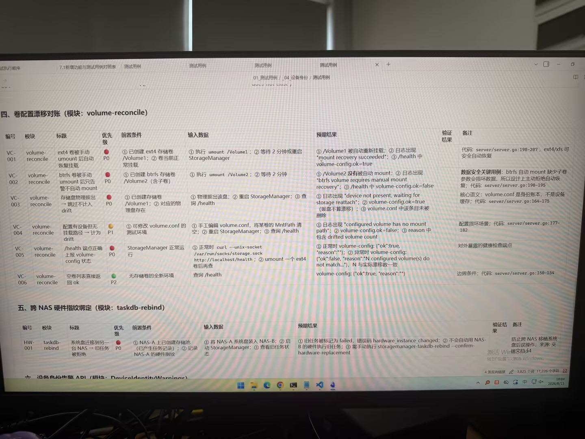

# Image 15: 13dd8922-0e6d-4afd-bc70-466c678b1f7b.jpg

Original: ../13dd8922-0e6d-4afd-bc70-466c678b1f7b.jpg

## Summary

This is a photo of a computer monitor displaying a software testing specification document in Chinese. The document details test cases for storage volume drift reconciliation (volume-reconcile) and cross-NAS hardware fingerprint binding (taskdb-rebind), presented in structured tables with columns such as test case ID, module, title, priority, prerequisites, input data, expected results, verification results, and remarks.

## OCR in reading order

01_测试用例 / 04_设备身份 / 测试用例
四、卷配置漂移对账 (模块: volume-reconcile)
编号 模块 标题 优先级 前置条件 输入数据 预期结果 验证结果 备注
VC-001 volume-reconcile ext4 卷被手动 umount 后自动恢复挂载 P0 ① 已创建 ext4 存储卷 /Volume1; ② 卷当前正常挂载 ① 执行 umount /Volume1; ② 等待 2 分钟或重启 StorageManager ① /Volume1 被自动重新挂载; ② 日志出现 "mount recovery succeeded"; ③ /health 中 volume-config.ok=true 代码: server/server.go:198-207, ext4/xfs 可安全自动恢复
VC-002 volume-reconcile btrfs 卷被手动 umount 后只告警不自动 mount P0 ① 已创建 btrfs 存储卷 /Volume2 (含子卷) ① 执行 umount /Volume2; ② 等待 2 分钟 ① /Volume2 没有被自动 mount; ② 日志出现 "btrfs volume requires manual mount recovery"; ③ /health 中 volume-config.ok=false 数据安全关键用例: btrfs 自动 mount 缺少子卷参数会损坏数据，所以设计上主动拒绝自动恢复; 代码: server/server.go:190-195
VC-003 volume-reconcile 存储盘物理拔出 → 跳过不计入 drift P0 ① 已创建存储卷 /Volume1; ② 对应的物理盘存在 ① 物理拔出该盘; ② 重启 StorageManager; ③ 查询 /health ① 日志出现 "device not present, waiting for storage reattach"; ② volume-config.ok=true (拔盘不算漂移); ③ volume.conf 中该条目未被删除 核心语义: volume.conf 是身份账本，不是设备缓存; 代码: server/server.go:164-175
VC-004 volume-reconcile 配置有设备但无挂载路径 → 计为 drift P1 ① 可修改 volume.conf 的测试环境 ① 手工编辑 volume.conf, 将某卷的 MntPath 清空; ② 重启 StorageManager; ③ 查询 /health ① 日志出现 "configured volume has no mount path"; ② volume-config.ok=false; ③ reason 中包含 drifted volume count 配置损坏场景; 代码: server/server.go:177-182
VC-005 volume-reconcile /health 端点正确上报 volume-config 状态 P0 StorageManager 正常运行 ① 正常时 curl --unix-socket /var/run/socks/storage.sock http://localhost/health ; ② umount 一个 ext4 卷后再查 ① 正常时 volume-config: {"ok":true, "reason":""}; ② 异常时 volume-config: {"ok":false, "reason":"N configured volume(s) do not match..."}, N 与实际漂移数一致 对外暴露的健康检查端点
VC-006 volume-reconcile 空卷列表直接返回 ok P2 无存储卷的全新环境 查询 /health volume-config: {"ok":true, "reason":""} 边界条件; 代码: server/server.go:150-154
五、跨 NAS 硬件指纹绑定 (模块: taskdb-rebind)
编号 模块 标题 优先级 前置条件 输入数据 预期结果 验证结果 备注
HW-001 taskdb-rebind 系统盘迁移到另一台 NAS → 旧任务被拒绝 P0 ① NAS-A 上已创建存储池 (已产生任务记录); ② 记录 NAS-A 的硬件指纹 ① 将 NAS-A 系统盘装入 NAS-B; ② 启动 StorageManager; ③ 查看旧任务状态 ① 旧任务被标记为 failed, 错误码 hardware_instance_changed; ② 不会自动用 NAS-B 的硬件执行旧任务; ③ 需手动执行 storagemanager-taskdb-rebind --confirm-hardware-replacement 防止跨 NAS 移植系统盘后误操作; 来源: 交叉文档 S4
六、设备身份告警 API (模块: DeviceIdentityWarnings)

## Layout

### title 1
01_测试用例 / 04_设备身份 / 测试用例

### title 2
四、卷配置漂移对账 (模块: volume-reconcile)

### table 3
| 编号 | 模块 | 标题 | 优先级 | 前置条件 | 输入数据 | 预期结果 | 验证结果 | 备注 |
| --- | --- | --- | --- | --- | --- | --- | --- | --- |
| VC-001 | volume-reconcile | ext4 卷被手动 umount 后自动恢复挂载 | P0 | ① 已创建 ext4 存储卷 /Volume1; ② 卷当前正常挂载 | ① 执行 umount /Volume1; ② 等待 2 分钟或重启 StorageManager | ① /Volume1 被自动重新挂载; ② 日志出现 "mount recovery succeeded"; ③ /health 中 volume-config.ok=true |  | 代码: server/server.go:198-207, ext4/xfs 可安全自动恢复 |
| VC-002 | volume-reconcile | btrfs 卷被手动 umount 后只告警不自动 mount | P0 | ① 已创建 btrfs 存储卷 /Volume2 (含子卷) | ① 执行 umount /Volume2; ② 等待 2 分钟 | ① /Volume2 没有被自动 mount; ② 日志出现 "btrfs volume requires manual mount recovery"; ③ /health 中 volume-config.ok=false |  | 数据安全关键用例: btrfs 自动 mount 缺少子卷参数会损坏数据，所以设计上主动拒绝自动恢复; 代码: server/server.go:190-195 |
| VC-003 | volume-reconcile | 存储盘物理拔出 → 跳过不计入 drift | P0 | ① 已创建存储卷 /Volume1; ② 对应的物理盘存在 | ① 物理拔出该盘; ② 重启 StorageManager; ③ 查询 /health | ① 日志出现 "device not present, waiting for storage reattach"; ② volume-config.ok=true (拔盘不算漂移); ③ volume.conf 中该条目未被删除 |  | 核心语义: volume.conf 是身份账本，不是设备缓存; 代码: server/server.go:164-175 |
| VC-004 | volume-reconcile | 配置有设备但无挂载路径 → 计为 drift | P1 | ① 可修改 volume.conf 的测试环境 | ① 手工编辑 volume.conf, 将某卷的 MntPath 清空; ② 重启 StorageManager; ③ 查询 /health | ① 日志出现 "configured volume has no mount path"; ② volume-config.ok=false; ③ reason 中包含 drifted volume count |  | 配置损坏场景; 代码: server/server.go:177-182 |
| VC-005 | volume-reconcile | /health 端点正确上报 volume-config 状态 | P0 | StorageManager 正常运行 | ① 正常时 curl --unix-socket /var/run/socks/storage.sock http://localhost/health ; ② umount 一个 ext4 卷后再查 | ① 正常时 volume-config: {"ok":true, "reason":""}; ② 异常时 volume-config: {"ok":false, "reason":"N configured volume(s) do not match..."}, N 与实际漂移数一致 |  | 对外暴露的健康检查端点 |
| VC-006 | volume-reconcile | 空卷列表直接返回 ok | P2 | 无存储卷的全新环境 | 查询 /health | volume-config: {"ok":true, "reason":""} |  | 边界条件; 代码: server/server.go:150-154 |

### title 4
五、跨 NAS 硬件指纹绑定 (模块: taskdb-rebind)

### table 5
| 编号 | 模块 | 标题 | 优先级 | 前置条件 | 输入数据 | 预期结果 | 验证结果 | 备注 |
| --- | --- | --- | --- | --- | --- | --- | --- | --- |
| HW-001 | taskdb-rebind | 系统盘迁移到另一台 NAS → 旧任务被拒绝 | P0 | ① NAS-A 上已创建存储池 (已产生任务记录); ② 记录 NAS-A 的硬件指纹 | ① 将 NAS-A 系统盘装入 NAS-B; ② 启动 StorageManager; ③ 查看旧任务状态 | ① 旧任务被标记为 failed, 错误码 hardware_instance_changed; ② 不会自动用 NAS-B 的硬件执行旧任务; ③ 需手动执行 storagemanager-taskdb-rebind --confirm-hardware-replacement |  | 防止跨 NAS 移植系统盘后误操作; 来源: 交叉文档 S4 |

### title 6
六、设备身份告警 API (模块: DeviceIdentityWarnings)

## Semantics

- Scene: office_document_screen
- Intent: documenting software test cases for storage volume drift reconciliation and NAS hardware fingerprint binding

## Uncertainty and verification

- No uncertainty reported.

- Verification: GPT native image review; original image kept local.\r\n- JSON: D:/test_dev_projects/storagemanager/7.1/新增功能与用例/照片/提取md/json/13dd8922-0e6d-4afd-bc70-466c678b1f7b.json
## Local image verification

- Original JPG reviewed locally; the Markdown image link resolves to the corresponding file.
- Text or table regions outside the photographed screen are not inferred.
