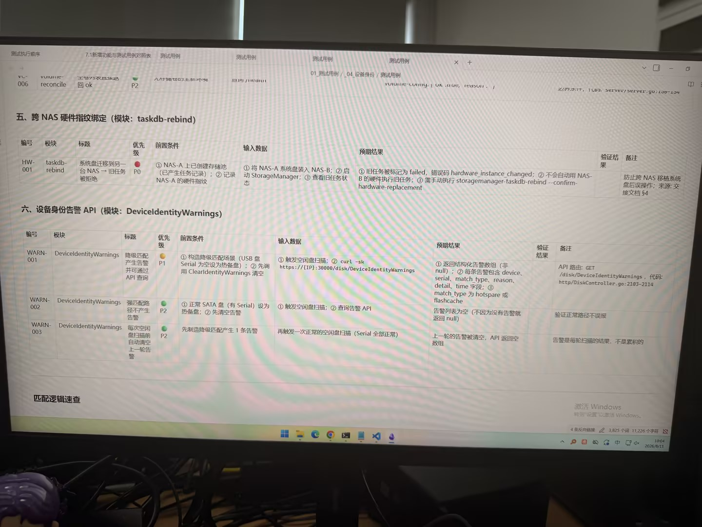

# Image 16: 89f05588-07ea-49f5-8f3d-60af512858ed.jpg

Original: ../89f05588-07ea-49f5-8f3d-60af512858ed.jpg

## Summary

The image shows a computer monitor displaying a technical document containing software test cases formatted in tables. The document includes sections '五、跨 NAS 硬件指纹绑定 (模块: taskdb-rebind)' and '六、设备身份告警 API (模块: DeviceIdentityWarnings)', detailing test IDs (HW-001, WARN-001, WARN-002, WARN-003), test modules, titles, priority levels, prerequisites, inputs, expected results, validation status, and remarks.

## OCR in reading order

五、跨 NAS 硬件指纹绑定 (模块: taskdb-rebind)
编号 模块 标题 优先级 前置条件 输入数据 预期结果 验证结果 备注
HW-001 taskdb-rebind 系统盘迁移到另一台 NAS -> 旧任务被拒绝 P0 ① NAS-A 上已创建存储池 (已产生任务记录)；② 记录 NAS-A 的硬件指纹 ① 将 NAS-A 系统盘装入 NAS-B；② 启动 StorageManager；③ 查看旧任务状态 ① 旧任务被标记为 failed，错误码 hardware_instance_changed；② 不会自动用 NAS-B 的硬件执行旧任务；③ 需手动执行 storagemanager-taskdb-rebind --confirm-hardware-replacement 防止跨 NAS 移植系统盘后误操作；来源：交接文档 §4
六、设备身份告警 API (模块: DeviceIdentityWarnings)
编号 模块 标题 优先级 前置条件 输入数据 预期结果 验证结果 备注
WARN-001 DeviceIdentityWarnings 降级匹配产生告警并可通过 API 查询 P1 ① 构建降级匹配场景 (USB 盘 Serial 为空设为热备盘)；② 先调用 ClearIdentityWarnings 清空 ① 触发空闲盘扫描；② curl -sk https://{IP}:30000/disk/DeviceIdentityWarnings ① 返回结构化告警数组 (非 null)；② 每条告警包含 device、serial、match_type、reason、detail、time 字段；③ match_type 为 hotspare 或 flashcache API 路由: GET /disk/DeviceIdentityWarnings, 代码: http/DiskController.go:2103-2114
WARN-002 DeviceIdentityWarnings 强匹配路径不产生告警 P2 ① 正常 SATA 盘 (有 Serial) 设为热备盘；② 先清空告警 ① 触发空闲盘扫描；② 查询告警 API 告警列表为空 (不因为没有告警就返回 null) 验证正常路径不误报
WARN-003 DeviceIdentityWarnings 每次空闲盘扫描前自动清空上一轮告警 P2 先制造降级匹配产生 1 条告警 再触发一次正常的空闲盘扫描 (Serial 全部正常) 上一轮的告警被清空，API 返回空数组 告警是每轮扫描的结果，不是累积的
匹配逻辑速查
激活 Windows
转到“设置”以激活 Windows。

## Layout

### title 1
五、跨 NAS 硬件指纹绑定 (模块: taskdb-rebind)

### table 2
> 编号 模块 标题 优先级 前置条件 输入数据 预期结果 验证结果 备注
> HW-001 taskdb-rebind 系统盘迁移到另一台 NAS -> 旧任务被拒绝 P0 ① NAS-A 上已创建存储池 (已产生任务记录)；② 记录 NAS-A 的硬件指纹 ① 将 NAS-A 系统盘装入 NAS-B；② 启动 StorageManager；③ 查看旧任务状态 ① 旧任务被标记为 failed，错误码 hardware_instance_changed；② 不会自动用 NAS-B 的硬件执行旧任务；③ 需手动执行 storagemanager-taskdb-rebind --confirm-hardware-replacement 防止跨 NAS 移植系统盘后误操作；来源：交接文档 §4

### title 3
六、设备身份告警 API (模块: DeviceIdentityWarnings)

### table 4
> 编号 模块 标题 优先级 前置条件 输入数据 预期结果 验证结果 备注
> WARN-001 DeviceIdentityWarnings 降级匹配产生告警并可通过 API 查询 P1 ① 构建降级匹配场景 (USB 盘 Serial 为空设为热备盘)；② 先调用 ClearIdentityWarnings 清空 ① 触发空闲盘扫描；② curl -sk https://{IP}:30000/disk/DeviceIdentityWarnings ① 返回结构化告警数组 (非 null)；② 每条告警包含 device、serial、match_type、reason、detail、time 字段；③ match_type 为 hotspare 或 flashcache API 路由: GET /disk/DeviceIdentityWarnings, 代码: http/DiskController.go:2103-2114
> WARN-002 DeviceIdentityWarnings 强匹配路径不产生告警 P2 ① 正常 SATA 盘 (有 Serial) 设为热备盘；② 先清空告警 ① 触发空闲盘扫描；② 查询告警 API 告警列表为空 (不因为没有告警就返回 null) 验证正常路径不误报
> WARN-003 DeviceIdentityWarnings 每次空闲盘扫描前自动清空上一轮告警 P2 先制造降级匹配产生 1 条告警 再触发一次正常的空闲盘扫描 (Serial 全部正常) 上一轮的告警被清空，API 返回空数组 告警是每轮扫描的结果，不是累积的

### subtitle 5
匹配逻辑速查

### other 6
激活 Windows
转到“设置”以激活 Windows。

## Semantics

- Scene: computer screen document view
- Intent: document test cases for system software development

## Uncertainty and verification

- No uncertainty reported.

- Verification: GPT native image review; original image kept local.\r\n- JSON: D:/test_dev_projects/storagemanager/7.1/新增功能与用例/照片/提取md/json/89f05588-07ea-49f5-8f3d-60af512858ed.json
## Local image verification

- Original JPG reviewed locally; the Markdown image link resolves to the corresponding file.
- Text or table regions outside the photographed screen are not inferred.
