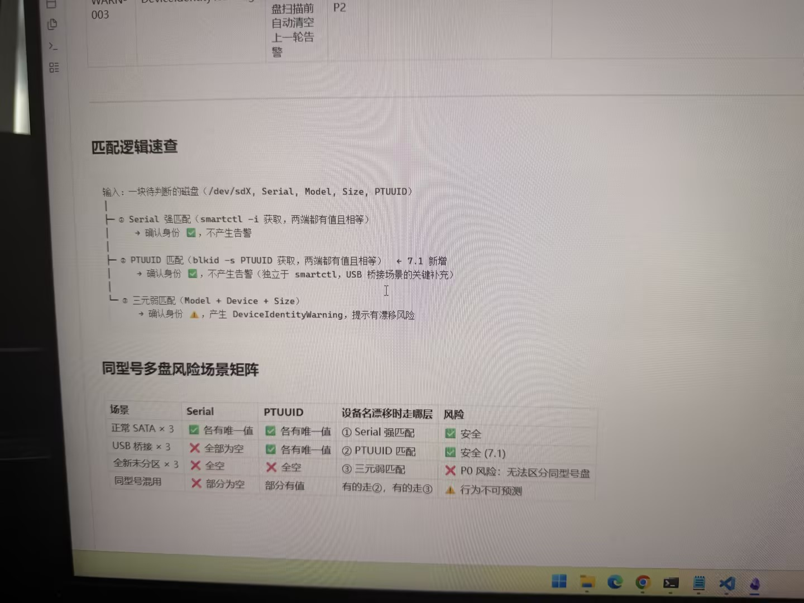

# 图片原文提取：d9dd0814-da2f-47eb-8ddb-9866445b925f

# 图片原文提取：匹配逻辑速查
输入：/dev/sdX、Serial、Model、Size、PTUUID。
1. Serial 强匹配 -> 确认身份，不告警。
2. PTUUID 匹配（7.1 新增） -> 确认身份，不告警。
3. 三元弱匹配 -> 确认身份并产生 DeviceIdentityWarning。
## 同型号多盘风险矩阵
| 场景 | 走哪层 | 风险 |
| --- | --- | --- |
| 正常 SATA x3 | Serial | 安全 |
| USB 桥接 x3 | PTUUID | 安全（7.1） |
| 全新未分区 x3 | 三元弱匹配 | P0，无法区分 |
| 同型号混用 | ②或③ | 行为不可预测 |
## Local image verification

- Original JPG reviewed locally; the Markdown image link resolves to the corresponding file.
- Text or table regions outside the photographed screen are not inferred.
