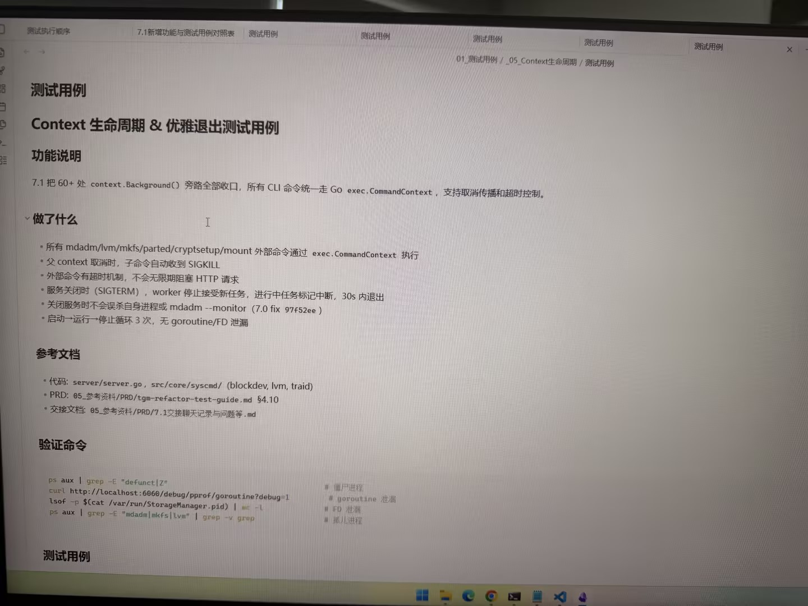

# Image 18: 2df17964-1903-482f-918d-2fa34eae7a03.jpg

Original: ../2df17964-1903-482f-918d-2fa34eae7a03.jpg

## Summary

A photo of a computer screen displaying software technical documentation for Context lifecycle and graceful exit test cases, detailing functional specifications, implemented changes, reference documentation, and verification shell commands.

## OCR in reading order

测试执行顺序
7.1新增功能与测试用例对照表
测试用例
测试用例
测试用例
测试用例
测试用例
01_测试用例 / _05_Context生命周期 / 测试用例
测试用例
Context 生命周期 & 优雅退出测试用例
功能说明
7.1 把 60+ 处 context.Background() 旁路全部收口，所有 CLI 命令统一走 Go exec.CommandContext，支持取消传播和超时控制。
做了什么
• 所有 mdadm/lvm/mkfs/parted/cryptsetup/mount 外部命令通过 exec.CommandContext 执行
• 父 context 取消时，子命令自动收到 SIGKILL
• 外部命令有超时机制，不会无限期阻塞 HTTP 请求
• 服务关闭时 (SIGTERM)，worker 停止接受新任务，进行中任务标记中断，30s 内退出
• 关闭服务时不会误杀自身进程或 mdadm --monitor (7.0 fix 97f52ee )
• 启动→运行→停止循环 3 次，无 goroutine/FD 泄漏
参考文档
• 代码: server/server.go, src/core/syscmd/ (blockdev, lvm, traid)
• PRD: 05_参考资料/PRD/tgm-refactor-test-guide.md §4.10
• 交接文档: 05_参考资料/PRD/7.1交接聊天记录与问题等.md
验证命令
ps aux \| grep -E "defunct\|Z" # 僵尸进程
curl http://localhost:6060/debug/pprof/goroutine?debug=1 # goroutine 泄漏
lsof -p $(cat /var/run/StorageManager.pid) \| wc -l # FD 泄漏
ps aux \| grep -E "mdadm\|mkfs\|lvm" \| grep -v grep # 孤儿进程
测试用例

## Layout

### other 1
测试执行顺序 7.1新增功能与测试用例对照表 测试用例 测试用例 测试用例 测试用例 测试用例 01_测试用例 / _05_Context生命周期 / 测试用例

### title 2
测试用例

### subtitle 3
Context 生命周期 & 优雅退出测试用例

### subtitle 4
功能说明

### paragraph 5
7.1 把 60+ 处 context.Background() 旁路全部收口，所有 CLI 命令统一走 Go exec.CommandContext，支持取消传播和超时控制。

### subtitle 6
做了什么

### list 7
• 所有 mdadm/lvm/mkfs/parted/cryptsetup/mount 外部命令通过 exec.CommandContext 执行
• 父 context 取消时，子命令自动收到 SIGKILL
• 外部命令有超时机制，不会无限期阻塞 HTTP 请求
• 服务关闭时 (SIGTERM)，worker 停止接受新任务，进行中任务标记中断，30s 内退出
• 关闭服务时不会误杀自身进程或 mdadm --monitor (7.0 fix 97f52ee )
• 启动→运行→停止循环 3 次，无 goroutine/FD 泄漏

### subtitle 8
参考文档

### list 9
• 代码: server/server.go, src/core/syscmd/ (blockdev, lvm, traid)
• PRD: 05_参考资料/PRD/tgm-refactor-test-guide.md §4.10
• 交接文档: 05_参考资料/PRD/7.1交接聊天记录与问题等.md

### subtitle 10
验证命令

### code 11
ps aux \| grep -E "defunct\|Z" # 僵尸进程
curl http://localhost:6060/debug/pprof/goroutine?debug=1 # goroutine 泄漏
lsof -p $(cat /var/run/StorageManager.pid) \| wc -l # FD 泄漏
ps aux \| grep -E "mdadm\|mkfs\|lvm" \| grep -v grep # 孤儿进程

### title 12
测试用例

## Semantics

- Scene: screen_photo
- Intent: documenting_software_test_cases

## Uncertainty and verification

- No uncertainty reported.

- Verification: GPT native image review; original image kept local.\r\n- JSON: D:/test_dev_projects/storagemanager/7.1/新增功能与用例/照片/提取md/json/2df17964-1903-482f-918d-2fa34eae7a03.json
## Local image verification

- Original JPG reviewed locally; the Markdown image link resolves to the corresponding file.
- Text or table regions outside the photographed screen are not inferred.
