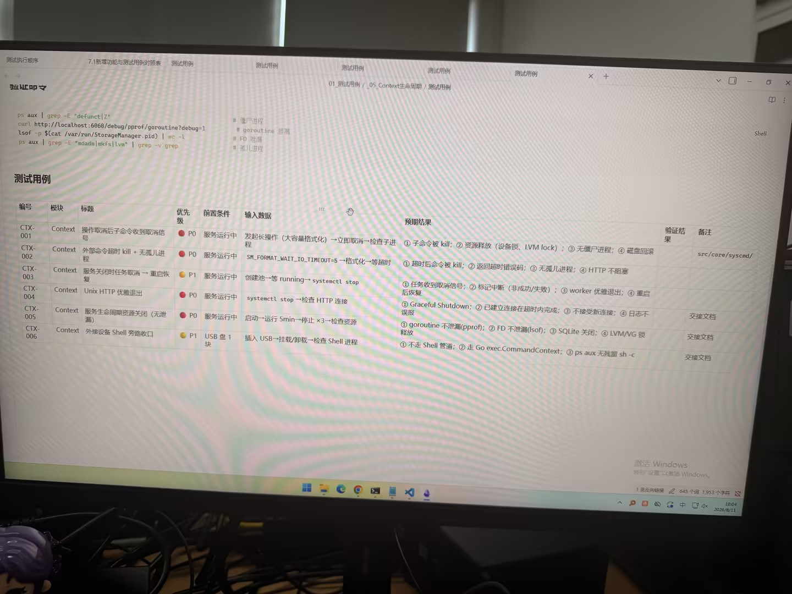

# 图片原文提取：8f63a966-c79c-4103-9e6c-464618f53454

# 图片原文提取：Context 生命周期测试
## 验证命令
ps aux | grep -E defunct|z；curl /debug/pprof/goroutine；lsof StorageManager.pid；ps aux | grep mdadm|mkfs|lvm。
| 编号 | 标题 | 优先级 | 预期结果 |
| --- | --- | --- | --- |
| CTX-001 | 操作取消后子命令收到取消 | P0 | kill 子命令，释放锁，无僵尸 |
| CTX-002 | 外部命令超时 kill | P0 | 无孤儿进程，HTTP 不阻塞 |
| CTX-003 | 关闭时任务取消/重启恢复 | P1 | 标记中断并恢复 |
| CTX-004 | Unix HTTP 优雅退出 | P0 | Graceful Shutdown，不接新连接 |
| CTX-005 | 生命周期资源关闭 | P0 | 无 goroutine/FD/SQLite/LVM 泄漏 |
| CTX-006 | 外接设备 Shell 收口 | P1 | 使用 Go exec.CommandContext |
## Local image verification

- Original JPG reviewed locally; the Markdown image link resolves to the corresponding file.
- Text or table regions outside the photographed screen are not inferred.
