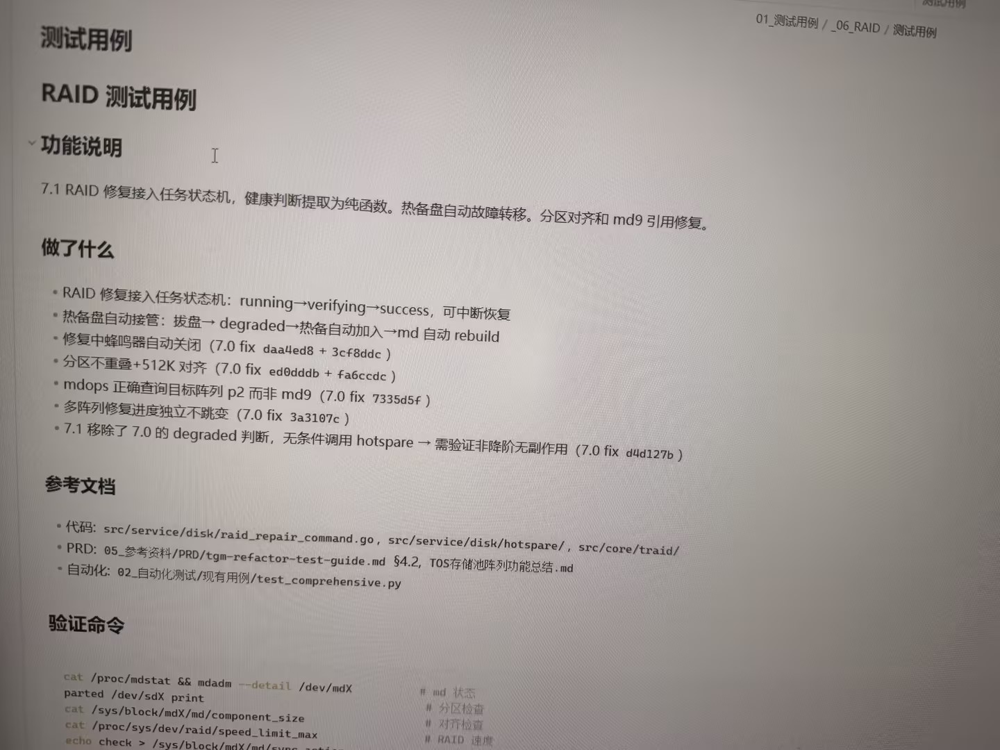

# 图片原文提取：96927e65-857c-4b1b-bf25-94a0852caf9a

# 图片原文提取：RAID 测试用例
## 功能说明
RAID 修复接入任务状态机；健康判断纯函数；热备自动故障转移；分区对齐和 md9 修复。
## 做了什么
- running -> verifying -> success，可中断恢复。
- 拔盘 -> degraded -> 热备盘加入 -> md rebuild。
- 蜂鸣器自动关闭；分区不重叠 + 512K 对齐；mdops 查询目标阵列 p2。
- 多阵列进度独立；移除 degraded 判断。
## 验证命令
cat /proc/mdstat；mdadm --detail /dev/mdX；parted /dev/sdX print；echo check > /sys/block/mdX/md/sync_action。
> 图片底部测试用例表未完整拍到。
## Local image verification

- Original JPG reviewed locally; the Markdown image link resolves to the corresponding file.
- Text or table regions outside the photographed screen are not inferred.
