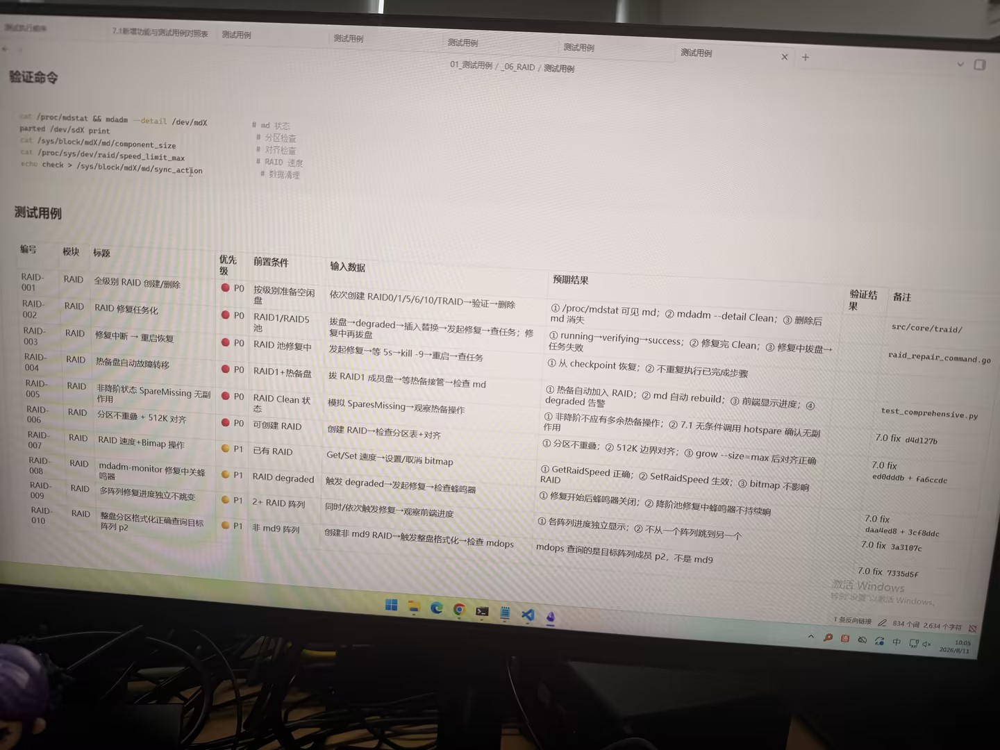

# Image 21: aa984c4d-6417-4a99-9859-840d3d2a9f56.jpg

Original: ../aa984c4d-6417-4a99-9859-840d3d2a9f56.jpg

## Summary

A photo of a computer screen displaying a software test suite and verification commands document for RAID functionality, formatted as a Markdown document with a table of test cases.

## OCR in reading order

7.1新增功能与测试用例对照表 测试用例 测试用例 测试用例
01_测试用例 / _06_RAID / 测试用例
验证命令
cat /proc/mdstat && mdadm --detail /dev/mdX # md 状态
parted /dev/sdX print # 分区检查
cat /sys/block/mdX/md/component_size # 对齐检查
cat /proc/sys/dev/raid/speed_limit_max # RAID 速度
echo check > /sys/block/mdX/md/sync_action # 数据清理
测试用例
编号 模块 标题 优先级 前置条件 输入数据 预期结果 验证结果 备注
RAID-001 RAID 全级别 RAID 创建/删除 P0 按级别准备空闲盘 依次创建 RAID0/1/5/6/10/TRAID→验证→删除 ① /proc/mdstat 可见 md; ② mdadm --detail Clean; ③ 删除后 md 消失 src/core/traid/
RAID-002 RAID RAID 修复任务化 P0 RAID1/RAID5 池 拔盘→degraded→插入替换→发起修复→查任务; 修复中再拔盘 ① running→verifying→success; ② 修复完 Clean; ③ 修复中拔盘→任务失败 raid_repair_command.go
RAID-003 RAID 修复中断 → 重启恢复 P0 RAID 池修复中 发起修复→等 5s→kill -9→重启→查任务 ① 从 checkpoint 恢复; ② 不重复执行已完成步骤
RAID-004 RAID 热备盘自动故障转移 P0 RAID1+热备盘 拔 RAID1 成员盘→等待热备接管→检查 md ① 热备自动加入 RAID; ② md 自动 rebuild; ③ 前端显示进度; ④ degraded 告警 test_comprehensive.py
RAID-005 RAID 非降阶状态 SpareMissing 无副作用 P0 RAID Clean 状态 模拟 SparesMissing→观察热备操作 ① 非降阶不应有多余热备操作; ② 7.1 无条件调用 hotspare 确认无副作用 7.0 fix d4d127b
RAID-006 RAID 分区不重量 + 512K 对齐 P0 可创建 RAID 创建 RAID→检查分区表+对齐 ① 分区不重叠; ② 512K 边界对齐; ③ grow --size=max 后对齐正确 7.0 fix ed0dddb + fa6ccdc
RAID-007 RAID RAID 速度+Bitmap 操作 P1 已有 RAID Get/Set 速度→设置/取消 bitmap ① GetRaidSpeed 正确; ② SetRaidSpeed 生效; ③ bitmap 不影响 RAID
RAID-008 RAID mdadm-monitor 修复中关蜂鸣器 P1 RAID degraded 触发 degraded→发起修复→检查蜂鸣器 ① 修复开始后蜂鸣器关闭; ② 降阶池修复中蜂鸣器不持续响 7.0 fix daa4ed8 + 3cf8ddc
RAID-009 RAID 多阵列修复进度独立不跳变 P1 2+ RAID 阵列 同时/依次触发修复→观察前端进度 ① 各阵列进度独立显示; ② 不从一个阵列跳到另一个 7.0 fix 3a3107c
RAID-010 RAID 整盘分区格式化正确查询目标阵列 p2 P1 非 md9 阵列 创建非 md9 RAID→触发盘格式化→检查 mdops mdops 查询的是目标阵列成员 p2, 不是 md9 7.0 fix 7335d5f
激活 Windows
转到“设置”以激活 Windows。
1 条反向链接 834 个词 2,634 个字符 2026/8/11 10:05

## Layout

### title 1
验证命令

### code 2
cat /proc/mdstat && mdadm --detail /dev/mdX # md 状态
parted /dev/sdX print # 分区检查
cat /sys/block/mdX/md/component_size # 对齐检查
cat /proc/sys/dev/raid/speed_limit_max # RAID 速度
echo check > /sys/block/mdX/md/sync_action # 数据清理

### title 3
测试用例

### table 4
| 编号 | 模块 | 标题 | 优先级 | 前置条件 | 输入数据 | 预期结果 | 验证结果 | 备注 |
| --- | --- | --- | --- | --- | --- | --- | --- | --- |
| RAID-001 | RAID | 全级别 RAID 创建/删除 | P0 | 按级别准备空闲盘 | 依次创建 RAID0/1/5/6/10/TRAID→验证→删除 | ① /proc/mdstat 可见 md; ② mdadm --detail Clean; ③ 删除后 md 消失 |  | src/core/traid/ |
| RAID-002 | RAID | RAID 修复任务化 | P0 | RAID1/RAID5 池 | 拔盘→degraded→插入替换→发起修复→查任务; 修复中再拔盘 | ① running→verifying→success; ② 修复完 Clean; ③ 修复中拔盘→任务失败 |  | raid_repair_command.go |
| RAID-003 | RAID | 修复中断 → 重启恢复 | P0 | RAID 池修复中 | 发起修复→等 5s→kill -9→重启→查任务 | ① 从 checkpoint 恢复; ② 不重复执行已完成步骤 |  |  |
| RAID-004 | RAID | 热备盘自动故障转移 | P0 | RAID1+热备盘 | 拔 RAID1 成员盘→等待热备接管→检查 md | ① 热备自动加入 RAID; ② md 自动 rebuild; ③ 前端显示进度; ④ degraded 告警 |  | test_comprehensive.py |
| RAID-005 | RAID | 非降阶状态 SpareMissing 无副作用 | P0 | RAID Clean 状态 | 模拟 SparesMissing→观察热备操作 | ① 非降阶不应有多余热备操作; ② 7.1 无条件调用 hotspare 确认无副作用 |  | 7.0 fix d4d127b |
| RAID-006 | RAID | 分区不重量 + 512K 对齐 | P0 | 可创建 RAID | 创建 RAID→检查分区表+对齐 | ① 分区不重叠; ② 512K 边界对齐; ③ grow --size=max 后对齐正确 |  | 7.0 fix ed0dddb + fa6ccdc |
| RAID-007 | RAID | RAID 速度+Bitmap 操作 | P1 | 已有 RAID | Get/Set 速度→设置/取消 bitmap | ① GetRaidSpeed 正确; ② SetRaidSpeed 生效; ③ bitmap 不影响 RAID |  |  |
| RAID-008 | RAID | mdadm-monitor 修复中关蜂鸣器 | P1 | RAID degraded | 触发 degraded→发起修复→检查蜂鸣器 | ① 修复开始后蜂鸣器关闭; ② 降阶池修复中蜂鸣器不持续响 |  | 7.0 fix daa4ed8 + 3cf8ddc |
| RAID-009 | RAID | 多阵列修复进度独立不跳变 | P1 | 2+ RAID 阵列 | 同时/依次触发修复→观察前端进度 | ① 各阵列进度独立显示; ② 不从一个阵列跳到另一个 |  | 7.0 fix 3a3107c |
| RAID-010 | RAID | 整盘分区格式化正确查询目标阵列 p2 | P1 | 非 md9 阵列 | 创建非 md9 RAID→触发盘格式化→检查 mdops | mdops 查询的是目标阵列成员 p2, 不是 md9 |  | 7.0 fix 7335d5f |

### other 5
激活 Windows
转到“设置”以激活 Windows。
1 条反向链接 834 个词 2,634 个字符 2026/8/11 10:05

## Semantics

- Scene: computer screen showing a test document in a markdown editor
- Intent: document test cases and verification commands for RAID storage functionality

## Uncertainty and verification

- No uncertainty reported.

- Verification: GPT native image review; original image kept local.\r\n- JSON: D:/test_dev_projects/storagemanager/7.1/新增功能与用例/照片/提取md/json/aa984c4d-6417-4a99-9859-840d3d2a9f56.json
## Local image verification

- Original JPG reviewed locally; the Markdown image link resolves to the corresponding file.
- Text or table regions outside the photographed screen are not inferred.
