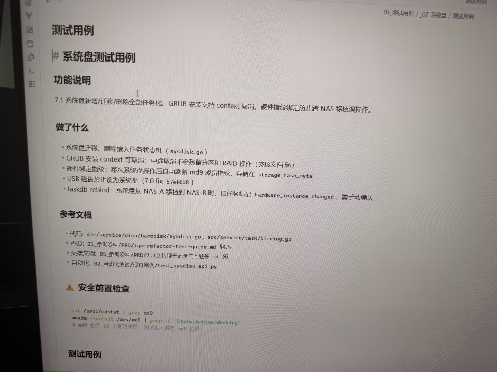

# Image 22: b521b1ea-2206-47cd-ba97-19b1ee77e3ba.jpg

Original: ../b521b1ea-2206-47cd-ba97-19b1ee77e3ba.jpg

## Summary

This is a document or markdown page detailing system disk test cases, feature specifications, changes made, reference documentation, and pre-checks for system disk operations.

## OCR in reading order

01_测试用例 / _07_系统盘 / 测试用例
测试用例
# 系统盘测试用例
功能说明
7.1 系统盘新增/迁移/删除全部任务化。GRUB 安装支持 context 取消。硬件指纹绑定防止跨 NAS 移植误操作。
做了什么
• 系统盘迁移、删除接入任务状态机（sysdisk.go）
• GRUB 安装 context 可取消：中途取消不会残留分区和 RAID 操作 (交接文档 §6)
• 硬件绑定指纹：每次系统盘操作后自动刷新 md9 成员指纹，存储在 storage_task_meta
• USB 磁盘禁止设为系统盘 (7.0 fix 57ef6a8)
• taskdb-rebind: 系统盘从 NAS-A 移植到 NAS-B 时，旧任务标记 hardware_instance_changed，需手动确认
参考文档
• 代码: src/service/disk/harddisk/sysdisk.go, src/service/task/binding.go
• PRD: 05_参考资料/PRD/tgm-refactor-test-guide.md §4.5
• 交接文档: 05_参考资料/PRD/7.1交接聊天记录与问题等.md §6
• 自动化: 02_自动化测试/现有用例/test_sysdisk_api.py
⚠️ 安全前置检查
cat /proc/mdstat \| grep md9
mdadm --detail /dev/md9 \| grep -E "State\|Active\|Working"
# md9 必须 ≥2 个有效成员！测试盘不得是 md9 成员！
测试用例

## Layout

### other 1
01_测试用例 / _07_系统盘 / 测试用例

### title 2
测试用例

### title 3
# 系统盘测试用例

### subtitle 4
功能说明

### paragraph 5
7.1 系统盘新增/迁移/删除全部任务化。GRUB 安装支持 context 取消。硬件指纹绑定防止跨 NAS 移植误操作。

### subtitle 6
做了什么

### list 7
• 系统盘迁移、删除接入任务状态机（sysdisk.go）
• GRUB 安装 context 可取消：中途取消不会残留分区和 RAID 操作 (交接文档 §6)
• 硬件绑定指纹：每次系统盘操作后自动刷新 md9 成员指纹，存储在 storage_task_meta
• USB 磁盘禁止设为系统盘 (7.0 fix 57ef6a8)
• taskdb-rebind: 系统盘从 NAS-A 移植到 NAS-B 时，旧任务标记 hardware_instance_changed，需手动确认

### subtitle 8
参考文档

### list 9
• 代码: src/service/disk/harddisk/sysdisk.go, src/service/task/binding.go
• PRD: 05_参考资料/PRD/tgm-refactor-test-guide.md §4.5
• 交接文档: 05_参考资料/PRD/7.1交接聊天记录与问题等.md §6
• 自动化: 02_自动化测试/现有用例/test_sysdisk_api.py

### subtitle 10
⚠️ 安全前置检查

### code 11
cat /proc/mdstat \| grep md9
mdadm --detail /dev/md9 \| grep -E "State\|Active\|Working"
# md9 必须 ≥2 个有效成员！测试盘不得是 md9 成员！

### subtitle 12
测试用例

## Semantics

- Scene: A photo of a computer monitor displaying technical documentation in Markdown or a knowledge base format.
- Intent: To document system disk test cases, requirements, code paths, and safety pre-checks for software development/testing.

## Uncertainty and verification

- No uncertainty reported.

- Verification: GPT native image review; original image kept local.\r\n- JSON: D:/test_dev_projects/storagemanager/7.1/新增功能与用例/照片/提取md/json/b521b1ea-2206-47cd-ba97-19b1ee77e3ba.json
## Local image verification

- Original JPG reviewed locally; the Markdown image link resolves to the corresponding file.
- Text or table regions outside the photographed screen are not inferred.
