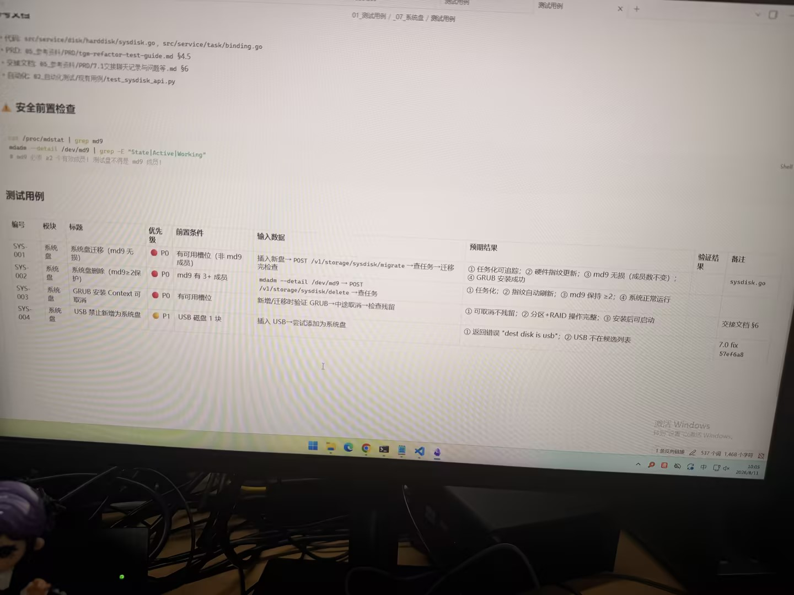

# 图片原文提取：7cfa1ff1-b1d8-4d65-b2d1-87f4bcf945e4

# 图片原文提取：系统盘测试用例
## 安全前置检查
cat /proc/mdstat | grep md9；mdadm --detail /dev/md9 | grep State|Active|Working。md9 至少 2 个有效成员。
| 编号 | 标题 | 优先级 | 预期结果 |
| --- | --- | --- | --- |
| SYS-001 | 系统盘迁移（md9 无损） | P0 | 任务可追踪，指纹更新，md9 无损，GRUB 成功 |
| SYS-002 | 系统盘删除（md9>=2） | P0 | 任务化，指纹刷新，md9>=2 |
| SYS-003 | GRUB 安装可取消 | P0 | 无残留，分区+RAID 完整 |
| SYS-004 | USB 禁止新增系统盘 | P1 | 返回 dest disk is usb |
## Local image verification

- Original JPG reviewed locally; the Markdown image link resolves to the corresponding file.
- Text or table regions outside the photographed screen are not inferred.
