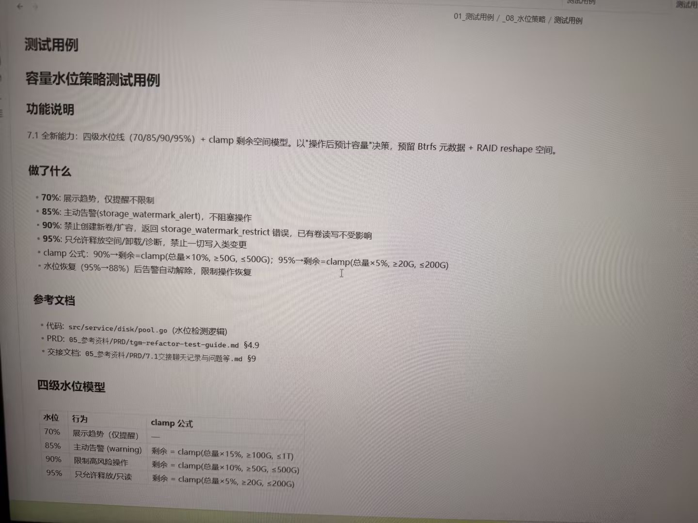

# 图片原文提取：640523e1-4bc9-4cf4-b54b-67ab0d864a8e

# 图片原文提取：容量水位策略
## 功能说明
四级水位线 70/85/90/95% + clamp 剩余空间，预留 Btrfs 元数据和 RAID reshape。
- 70% 展示趋势；85% storage_watermark_alert；90% storage_watermark_restrict；95% 只允许释放/只读。
- 90% clamp(总量×10%，≥50G，≤500G)；95% clamp(总量×5%，≥20G，≤200G)。
## 四级水位模型
| 水位 | 行为 |
| --- | --- |
| 70% | 展示趋势 |
| 85% | 主动告警 |
| 90% | 限制高风险操作 |
| 95% | 只允许释放/只读 |
## Local image verification

- Original JPG reviewed locally; the Markdown image link resolves to the corresponding file.
- Text or table regions outside the photographed screen are not inferred.
