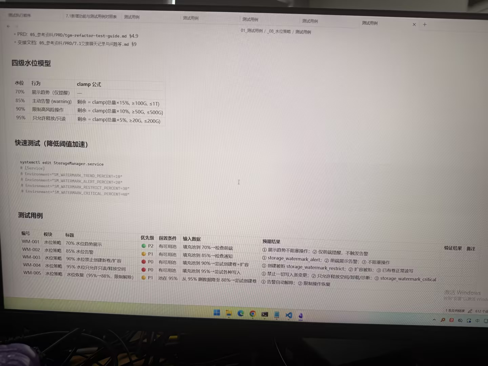

# Image 25: 777475e1-607b-4580-8c27-fc4357976975.jpg

Original: ../777475e1-607b-4580-8c27-fc4357976975.jpg

## Summary

A photograph of a computer monitor displaying a software design and test document written in Chinese, detailing a four-level watermark capacity management policy ('四级水位模型'), quick testing configuration commands, and a structured test case table.

## OCR in reading order

测试执行顺序
7.1新增功能与测试用例对照表
测试用例
01_测试用例 / _08_水位策略 / 测试用例
• PRD: 05_参考资料/PRD/tgm-refactor-test-guide.md §4.9
• 交接文档: 05_参考资料/PRD/7.1交接聊天记录与问题等.md §9
四级水位模型
水位 行为 clamp 公式
70% 展示趋势 (仅提醒) —
85% 主动告警 (warning) 剩余 = clamp(总量×15%, ≥100G, ≤1T)
90% 限制高风险操作 剩余 = clamp(总量×10%, ≥50G, ≤500G)
95% 只允许释放/只读 剩余 = clamp(总量×5%, ≥20G, ≤200G)
快速测试 (降低阈值加速)
systemctl edit StorageManager.service
# [Service]
# Environment="SM_WATERMARK_TREND_PERCENT=10"
# Environment="SM_WATERMARK_ALERT_PERCENT=20"
# Environment="SM_WATERMARK_RESTRICT_PERCENT=30"
# Environment="SM_WATERMARK_CRITICAL_PERCENT=40"
测试用例
WM-001 水位策略 70% 水位趋势展示 P2 有可用池 填充池到 70%→检查前端 ① 展示趋势不阻塞操作；② 仅前端提醒，不触发告警
WM-002 水位策略 85% 水位告警 P1 有可用池 填充池到 85%→检查通知 ① storage_watermark_alert；② 前端展示告警；③ 不阻塞操作
WM-003 水位策略 90% 水位禁止创建新卷/扩容 P0 有可用池 填充池到 90%→尝试创建卷+扩容 ① 创建被拒 storage_watermark_restrict；② 扩容被拒；③ 已有卷正常读写
WM-004 水位策略 95% 水位只允许只读/释放空间 P0 有可用池 填充池到 95%→尝试各种写入 ① 禁止一切写入类变更；② 只允许释放空间/卸载/诊断；③ storage_watermark_critical
WM-005 水位策略 水位恢复 (95%→88%，限制解除) P1 池在 95% 从 95% 删数据降至 88%→尝试创建卷 ① 告警自动解除；② 限制操作恢复

## Layout

### other 1
Tab bar navigation items at the top of the window.

### paragraph 2
PRD and 交接文档 reference links: • PRD: 05_参考资料/PRD/tgm-refactor-test-guide.md §4.9
• 交接文档: 05_参考资料/PRD/7.1交接聊天记录与问题等.md §9

### title 3
四级水位模型

### table 4
> Table defining storage watermark thresholds (70%, 85%, 90%, 95%), behavior, and clamp calculations.

### title 5
快速测试 (降低阈值加速)

### code 6
systemctl edit StorageManager.service
# [Service]
# Environment="SM_WATERMARK_TREND_PERCENT=10"
# Environment="SM_WATERMARK_ALERT_PERCENT=20"
# Environment="SM_WATERMARK_RESTRICT_PERCENT=30"
# Environment="SM_WATERMARK_CRITICAL_PERCENT=40"

### title 7
测试用例

### table 8
> Test cases table (WM-001 to WM-005) covering watermark strategy verification.

## Semantics

- Scene: A photo of a computer screen showing software architecture documentation and test plans.
- Intent: To document storage watermark capacity thresholds, quick configuration overrides, and test validation cases.

## Uncertainty and verification

- No uncertainty reported.

- Verification: GPT native image review; original image kept local.\r\n- JSON: D:/test_dev_projects/storagemanager/7.1/新增功能与用例/照片/提取md/json/777475e1-607b-4580-8c27-fc4357976975.json
## Local image verification

- Original JPG reviewed locally; the Markdown image link resolves to the corresponding file.
- Text or table regions outside the photographed screen are not inferred.
