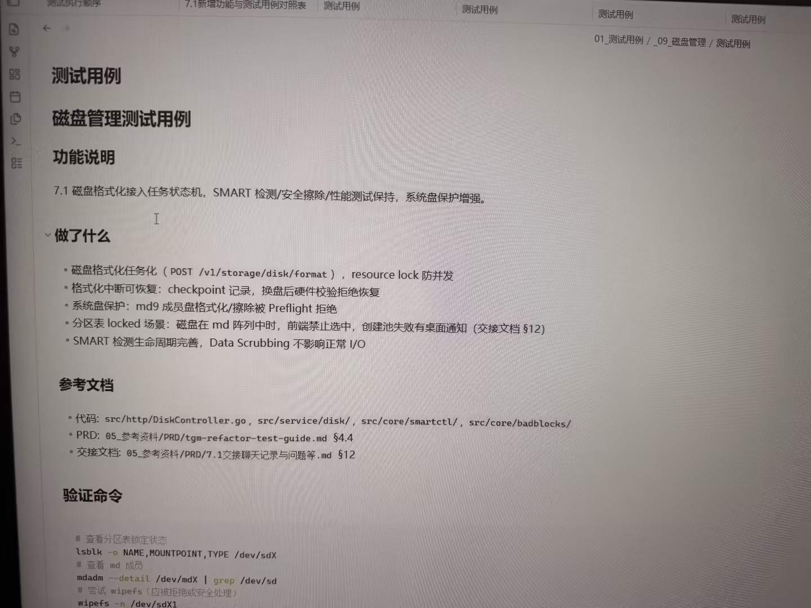

# Image 26: 69ee09fe-5e07-4101-b74b-3bcc82423763.jpg

Original: ../69ee09fe-5e07-4101-b74b-3bcc82423763.jpg

## Summary

A photo of a computer screen displaying a software documentation page for disk management test cases (磁盘管理测试用例). The page covers feature descriptions, changes implemented, reference documents, and verification commands.

## OCR in reading order

01_测试用例 / _09_磁盘管理 / 测试用例
测试用例
磁盘管理测试用例
功能说明
7.1 磁盘格式化接入任务状态机，SMART 检测/安全擦除/性能测试保持，系统盘保护增强。
做了什么
• 磁盘格式化任务化 ( POST /v1/storage/disk/format )，resource lock 防并发
• 格式化中断可恢复: checkpoint 记录，换盘后硬件校验拒绝恢复
• 系统盘保护: md9 成员盘格式化/擦除被 Preflight 拒绝
• 分区表 locked 场景: 磁盘在 md 阵列中时，前端禁止选中，创建池失败有桌面通知 (交接文档 §12)
• SMART 检测生命周期完善，Data Scrubbing 不影响正常 I/O
参考文档
• 代码: src/http/DiskController.go, src/service/disk/, src/core/smartctl/, src/core/badblocks/
• PRD: 05_参考资料/PRD/tgm-refactor-test-guide.md §4.4
• 交接文档: 05_参考资料/PRD/7.1交接聊天记录与问题等.md §12
验证命令
# 查看分区表锁定状态
lsblk -o NAME,MOUNTPOINT,TYPE /dev/sdX
# 查看 md 成员
mdadm --detail /dev/mdX \| grep /dev/sd
# 尝试 wipefs（应被拒绝或安全处理）
wipefs -n /dev/sdX1

## Layout

### other 1
01_测试用例 / _09_磁盘管理 / 测试用例

### title 2
测试用例

### subtitle 3
磁盘管理测试用例

### subtitle 4
功能说明

### paragraph 5
7.1 磁盘格式化接入任务状态机，SMART 检测/安全擦除/性能测试保持，系统盘保护增强。

### subtitle 6
做了什么

### list 7
• 磁盘格式化任务化 ( POST /v1/storage/disk/format )，resource lock 防并发
• 格式化中断可恢复: checkpoint 记录，换盘后硬件校验拒绝恢复
• 系统盘保护: md9 成员盘格式化/擦除被 Preflight 拒绝
• 分区表 locked 场景: 磁盘在 md 阵列中时，前端禁止选中，创建池失败有桌面通知 (交接文档 §12)
• SMART 检测生命周期完善，Data Scrubbing 不影响正常 I/O

### subtitle 8
参考文档

### list 9
• 代码: src/http/DiskController.go, src/service/disk/, src/core/smartctl/, src/core/badblocks/
• PRD: 05_参考资料/PRD/tgm-refactor-test-guide.md §4.4
• 交接文档: 05_参考资料/PRD/7.1交接聊天记录与问题等.md §12

### subtitle 10
验证命令

### code 11
# 查看分区表锁定状态
lsblk -o NAME,MOUNTPOINT,TYPE /dev/sdX
# 查看 md 成员
mdadm --detail /dev/mdX \| grep /dev/sd
# 尝试 wipefs（应被拒绝或安全处理）
wipefs -n /dev/sdX1

## Semantics

- Scene: digital screen display of software development/testing documentation
- Intent: To document disk management features, update details, source files, and test verification CLI commands.

## Uncertainty and verification

- No uncertainty reported.

- Verification: GPT native image review; original image kept local.\r\n- JSON: D:/test_dev_projects/storagemanager/7.1/新增功能与用例/照片/提取md/json/69ee09fe-5e07-4101-b74b-3bcc82423763.json
## Local image verification

- Original JPG reviewed locally; the Markdown image link resolves to the corresponding file.
- Text or table regions outside the photographed screen are not inferred.
