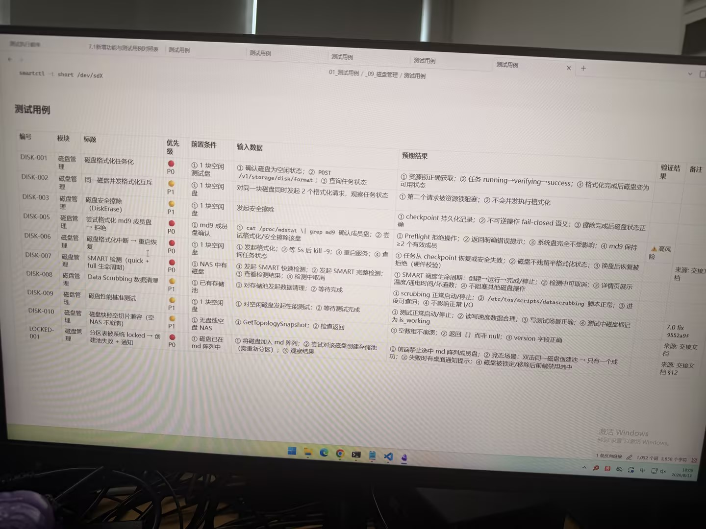

# 图片原文提取：f28e9f43-05dd-4f48-86c9-78da84019465

# 图片原文提取：磁盘管理测试用例
## 验证命令
smartctl -t short /dev/sdX
| 编号 | 标题 | 优先级 | 预期结果 |
| --- | --- | --- | --- |
| DISK-001 | 磁盘格式化任务化 | P0 | running -> verifying -> success |
| DISK-002 | 并发格式化互斥 | P1 | 第二请求被资源锁阻塞 |
| DISK-003 | 安全擦除 DiskErase | P1 | checkpoint 持久化，fail-closed |
| DISK-005 | 格式化 md9 成员盘 | P0 | Preflight 拒绝，md9>=2 |
| DISK-006 | 格式化中断重启恢复 | P0 | checkpoint 恢复或安全失败 |
| DISK-007 | SMART 检测 | P0 | 任务可恢复 |
| DISK-008 | Data Scrubbing | P1 | 进度可查询，不影响 I/O |
| DISK-009 | 性能基准 | P1 | 数据合理，is_working |
| LOCKED-001 | 空 NAS 快照兼容 | P0 | 返回 [] 而非 null |
## Local image verification

- Original JPG reviewed locally; the Markdown image link resolves to the corresponding file.
- Text or table regions outside the photographed screen are not inferred.
