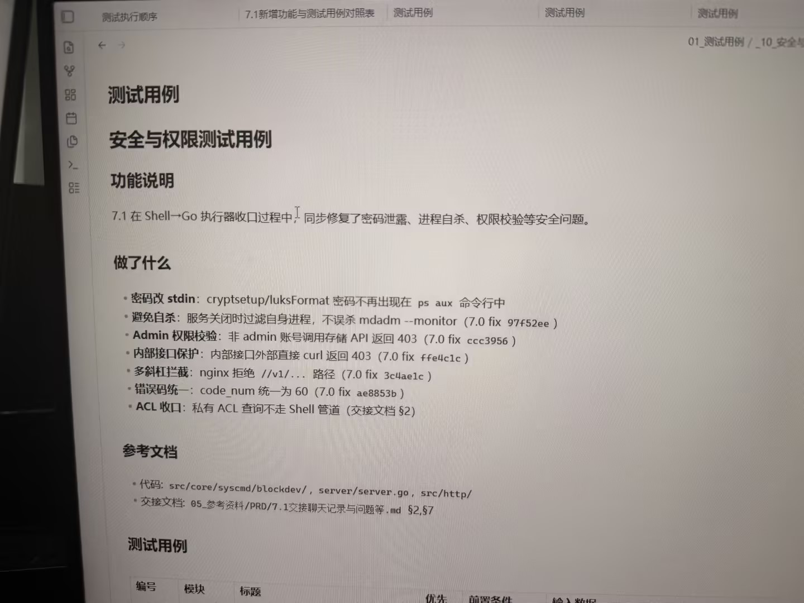

# 图片原文提取：91e968dd-4bc8-4770-82e0-4bbd03ee2599

# 图片原文提取：安全与权限测试用例
## 功能说明
Shell -> Go 执行器收口，修复密码泄露、进程自杀、权限校验。
## 做了什么
- 密码改 stdin；关闭时不误杀 mdadm；非 admin 返回 403；内部接口外部 curl 返回 403。
- nginx 拦截多斜杠；code_num 统一 60；私有 ACL 不走 Shell 管道。
> 测试用例表从照片下方开始，未拍到。
## Local image verification

- Original JPG reviewed locally; the Markdown image link resolves to the corresponding file.
- Text or table regions outside the photographed screen are not inferred.
