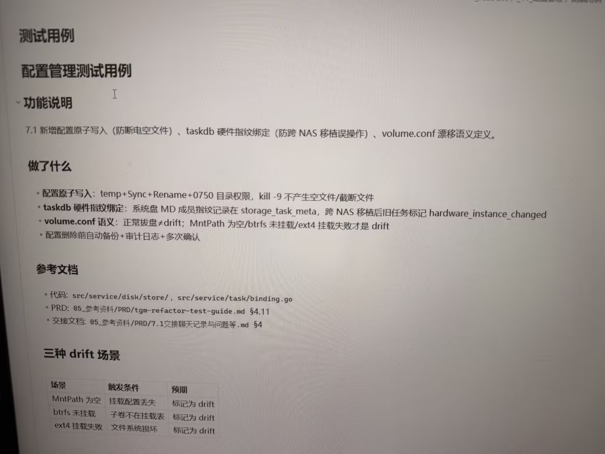

# Image 30: b561e007-e0e7-449f-82f0-4e83961d05d2.jpg

Original: ../b561e007-e0e7-449f-82f0-4e83961d05d2.jpg

## Summary

The image is a photo of a screen displaying a technical document titled "测试用例" (Test Cases) and "配置管理测试用例" (Configuration Management Test Cases). It outlines feature explanations, implemented changes, reference documentation, and a table describing three "drift" scenarios.

## OCR in reading order

测试用例
配置管理测试用例
功能说明
7.1 新增配置原子写入（防断电空文件）、taskdb 硬件指纹绑定（防跨 NAS 移植误操作）、volume.conf 漂移语义定义。
做了什么
• 配置原子写入: temp+Sync+Rename+0750 目录权限，kill -9 不产生空文件/截断文件
• taskdb 硬件指纹绑定: 系统盘 MD 成员指纹记录在 storage_task_meta，跨 NAS 移植后旧任务标记 hardware_instance_changed
• volume.conf 语义: 正常拔盘≠drift; MntPath 为空/btrfs 未挂载/ext4 挂载失败才是 drift
• 配置删除前自动备份+审计日志+多次确认
参考文档
• 代码: src/service/disk/store/, src/service/task/binding.go
• PRD: 05_参考资料/PRD/tgm-refactor-test-guide.md §4.11
• 交接文档: 05_参考资料/PRD/7.1交接聊天记录与问题等.md §4
三种 drift 场景
场景 触发条件 预期
MntPath 为空 挂载配置丢失 标记为 drift
btrfs 未挂载 子卷不在挂载表 标记为 drift
ext4 挂载失败 文件系统损坏 标记为 drift

## Layout

### title 1
测试用例

### subtitle 2
配置管理测试用例

### subtitle 3
功能说明

### paragraph 4
7.1 新增配置原子写入（防断电空文件）、taskdb 硬件指纹绑定（防跨 NAS 移植误操作）、volume.conf 漂移语义定义。

### subtitle 5
做了什么

### list 6
• 配置原子写入: temp+Sync+Rename+0750 目录权限，kill -9 不产生空文件/截断文件
• taskdb 硬件指纹绑定: 系统盘 MD 成员指纹记录在 storage_task_meta，跨 NAS 移植后旧任务标记 hardware_instance_changed
• volume.conf 语义: 正常拔盘≠drift; MntPath 为空/btrfs 未挂载/ext4 挂载失败才是 drift
• 配置删除前自动备份+审计日志+多次确认

### subtitle 7
参考文档

### list 8
• 代码: src/service/disk/store/, src/service/task/binding.go
• PRD: 05_参考资料/PRD/tgm-refactor-test-guide.md §4.11
• 交接文档: 05_参考资料/PRD/7.1交接聊天记录与问题等.md §4

### subtitle 9
三种 drift 场景

### table 10
| 场景 | 触发条件 | 预期 |
| --- | --- | --- |
| MntPath 为空 | 挂载配置丢失 | 标记为 drift |
| btrfs 未挂载 | 子卷不在挂载表 | 标记为 drift |
| ext4 挂载失败 | 文件系统损坏 | 标记为 drift |

## Semantics

- Scene: document_view
- Intent: 

## Uncertainty and verification

- No uncertainty reported.

- Verification: GPT native image review; original image kept local.\r\n- JSON: D:/test_dev_projects/storagemanager/7.1/新增功能与用例/照片/提取md/json/b561e007-e0e7-449f-82f0-4e83961d05d2.json
## Local image verification

- Original JPG reviewed locally; the Markdown image link resolves to the corresponding file.
- Text or table regions outside the photographed screen are not inferred.
