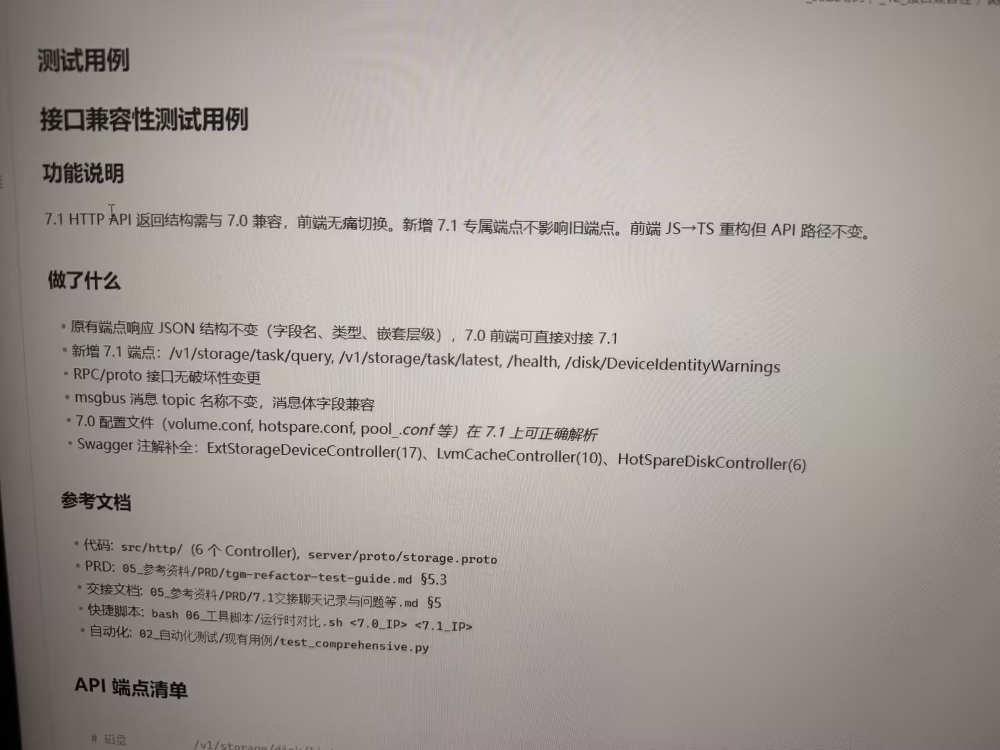

# 图片原文提取：b9986875-2918-4d7d-b885-650f8912cff7

# 图片原文提取：接口兼容性测试用例
## 功能说明
7.1 HTTP API 返回结构与 7.0 兼容，新增端点不影响旧端点，API 路径不变。
## 做了什么
- 原有 JSON 字段/类型/嵌套不变；新增 /v1/storage/task/query、/v1/storage/task/latest、/health、/disk/DeviceIdentityWarnings。
- RPC/proto 无破坏性变更；msgbus 兼容；7.0 volume.conf/hotspare.conf/pool_*.conf 可解析。
- Swagger：ExtStorageDeviceController(17)、LvmCacheController(10)、HotSpareDiskController(6)。
> API 端点清单只拍到标题和首行。
## Local image verification

- Original JPG reviewed locally; the Markdown image link resolves to the corresponding file.
- Text or table regions outside the photographed screen are not inferred.
