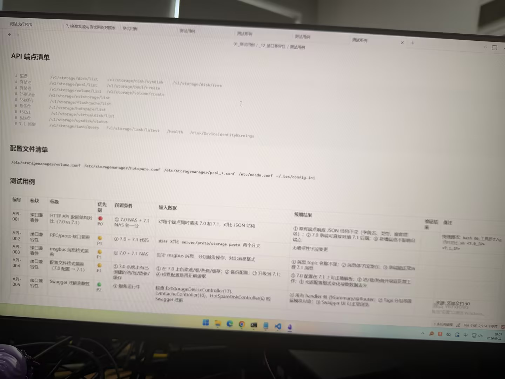

# Image 33: 6824b9cb-1a45-47ab-8869-3ea110daabd1.jpg

Original: ../6824b9cb-1a45-47ab-8869-3ea110daabd1.jpg

## Summary

This is a photo of a computer monitor displaying technical documentation and a test case table related to API compatibility and system upgrade tests (version 7.0 vs 7.1). The document includes an API endpoint list, configuration file list, and a detailed test case table.

## OCR in reading order

测试执行顺序
7.1新增功能与测试用例对照表
测试用例
01_测试用例 / _12_接口兼容性 / 测试用例
API 端点清单
# 磁盘 /v1/storage/disk/list /v1/storage/disk/sysdisk /v1/storage/disk/free
# 存储池 /v1/storage/pool/list /v1/storage/pool/create
# 存储卷 /v1/storage/volume/list /v1/storage/volume/create
# 外接设备 /v1/storage/extstorage/list
# SSD缓存 /v1/storage/flashcache/list
# 热备盘 /v1/storage/hotspare/list
# iSCSI /v1/storage/virtualdisk/list
# 系统盘 /v1/storage/sysdisk/status
# 7.1 新增 /v1/storage/task/query /v1/storage/task/latest /health /disk/DeviceIdentityWarnings
配置文件清单
/etc/storagemanager/volume.conf /etc/storagemanager/hotspare.conf /etc/storagemanager/pool_*.conf /etc/mdadm.conf ~/.tos/config.ini
测试用例
编号 模块 标题 优先级 前置条件 输入数据 预期结果 验证结果 备注
API-001 接口兼容性 HTTP API 返回结构对比 (7.0 vs 7.1) P0 ① 7.0 NAS + 7.1 NAS 各一台 对每个端点同时请求 7.0 和 7.1，对比 JSON 结构 ① 原有端点响应 JSON 结构不变（字段名、类型、嵌套层级）；② 7.0 前端可直接对接 7.1 后端；③ 新增端点不影响旧端点 快速脚本: bash 06_工具脚本/运行框架.sh <7.0_IP> <7.1_IP>
API-002 接口兼容性 RPC/proto 接口兼容 P1 ① 7.0 + 7.1 代码 diff 对比 server/proto/storage.proto 两个分支 无破坏性字段变更
API-003 接口兼容性 msgbus 消息格式兼容 P1 ① 7.0 + 7.1 NAS 监听 msgbus 消息，分别触发操作，对比消息格式 ① 消息 topic 名称不变；② 消息体字段兼容；③ 前端能正常消费 7.1 消息
API-004 接口兼容性 配置文件格式兼容 (7.0 配置 -> 7.1) P1 ① 7.0 系统上有已创建的池/卷/热备/缓存 ① 在 7.0 上创建池/卷/热备/缓存；② 备份配置；③ 升级到 7.1；④ 检查配置是否正确读取 ① 7.0 配置在 7.1 上可正确解析；② 池/卷/热备升级后正常工作；③ 无因配置格式变化导致数据丢失
API-005 接口兼容性 Swagger 注解完整性 P2 ① 服务运行中 检查 ExtStorageDeviceController(17)、LvmCacheController(10)、HotSpareDiskController(6) 的 Swagger 注解 ① 所有 handler 有 @Summary/@Router; ② Tags 分组与前端模块对应; ③ Swagger UI 可正常浏览 来源: 交付文档 $0 激活 Windows

## Layout

### title 1
API 端点清单

### paragraph 2
# 磁盘 /v1/storage/disk/list /v1/storage/disk/sysdisk /v1/storage/disk/free
# 存储池 /v1/storage/pool/list /v1/storage/pool/create
# 存储卷 /v1/storage/volume/list /v1/storage/volume/create
# 外接设备 /v1/storage/extstorage/list
# SSD缓存 /v1/storage/flashcache/list
# 热备盘 /v1/storage/hotspare/list
# iSCSI /v1/storage/virtualdisk/list
# 系统盘 /v1/storage/sysdisk/status
# 7.1 新增 /v1/storage/task/query /v1/storage/task/latest /health /disk/DeviceIdentityWarnings

### title 3
配置文件清单

### paragraph 4
/etc/storagemanager/volume.conf /etc/storagemanager/hotspare.conf /etc/storagemanager/pool_*.conf /etc/mdadm.conf ~/.tos/config.ini

### title 5
测试用例

### table 6
| 编号 | 模块 | 标题 | 优先级 | 前置条件 | 输入数据 | 预期结果 | 验证结果 | 备注 |
| --- | --- | --- | --- | --- | --- | --- | --- | --- |
| API-001 | 接口兼容性 | HTTP API 返回结构对比 (7.0 vs 7.1) | P0 | ① 7.0 NAS + 7.1 NAS 各一台 | 对每个端点同时请求 7.0 和 7.1，对比 JSON 结构 | ① 原有端点响应 JSON 结构不变（字段名、类型、嵌套层级）；② 7.0 前端可直接对接 7.1 后端；③ 新增端点不影响旧端点 |  | 快速脚本: bash 06_工具脚本/运行框架.sh <7.0_IP> <7.1_IP> |
| API-002 | 接口兼容性 | RPC/proto 接口兼容 | P1 | ① 7.0 + 7.1 代码 | diff 对比 server/proto/storage.proto 两个分支 | 无破坏性字段变更 |  |  |
| API-003 | 接口兼容性 | msgbus 消息格式兼容 | P1 | ① 7.0 + 7.1 NAS | 监听 msgbus 消息，分别触发操作，对比消息格式 | ① 消息 topic 名称不变；② 消息体字段兼容；③ 前端能正常消费 7.1 消息 |  |  |
| API-004 | 接口兼容性 | 配置文件格式兼容 (7.0 配置 -> 7.1) | P1 | ① 7.0 系统上有已创建的池/卷/热备/缓存 | ① 在 7.0 上创建池/卷/热备/缓存；② 备份配置；③ 升级到 7.1；④ 检查配置是否正确读取 | ① 7.0 配置在 7.1 上可正确解析；② 池/卷/热备升级后正常工作；③ 无因配置格式变化导致数据丢失 |  |  |
| API-005 | 接口兼容性 | Swagger 注解完整性 | P2 | ① 服务运行中 | 检查 ExtStorageDeviceController(17)、LvmCacheController(10)、HotSpareDiskController(6) 的 Swagger 注解 | ① 所有 handler 有 @Summary/@Router; ② Tags 分组与前端模块对应; ③ Swagger UI 可正常浏览 |  | 来源: 交付文档 $0 |

## Semantics

- Scene: Software development test suite and API specification document rendered in a document editor/browser on a physical monitor screen.
- Intent: Documenting software API compatibility tests, configuration file locations, and test execution details between version 7.0 and version 7.1 of a NAS storage system.

## Uncertainty and verification

- Some text at the bottom right corner (e.g., Windows activation watermark / taskbar status text) is slightly obscured or blurry.

- Verification: GPT native image review; original image kept local.\r\n- JSON: D:/test_dev_projects/storagemanager/7.1/新增功能与用例/照片/提取md/json/6824b9cb-1a45-47ab-8869-3ea110daabd1.json
## Local image verification

- Original JPG reviewed locally; the Markdown image link resolves to the corresponding file.
- Text or table regions outside the photographed screen are not inferred.
