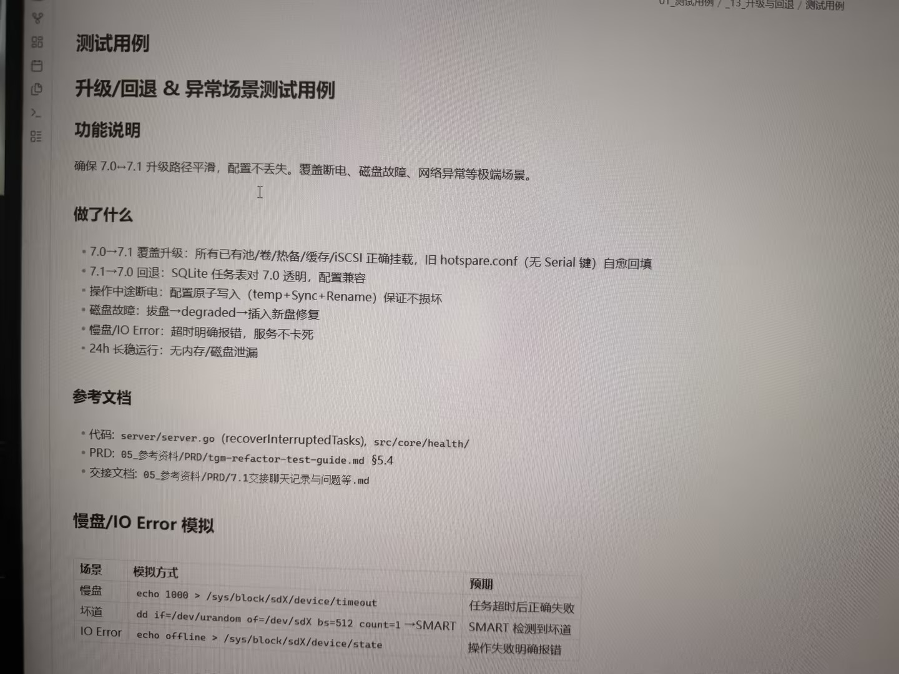

# Image 34: 2195c391-b20f-4cb4-a27e-0a8c66671777.jpg

Original: ../2195c391-b20f-4cb4-a27e-0a8c66671777.jpg

## Summary

This image shows a photo of a computer screen displaying technical documentation and test cases for software version upgrade/rollback (7.0 to 7.1) and exception handling scenarios (power off, disk failure, slow disk, IO error).

## OCR in reading order

01_测试用例 / _13_升级与回退 / 测试用例
测试用例
升级/回退 & 异常场景测试用例
功能说明
确保 7.0→7.1 升级路径平滑，配置不丢失。覆盖断电、磁盘故障、网络异常等极端场景。
做了什么
• 7.0→7.1 覆盖升级：所有已有池/卷/热备/缓存/iSCSI 正确挂载，旧 hotspare.conf (无 Serial 键) 自愈回填
• 7.1→7.0 回退：SQLite 任务表对 7.0 透明，配置兼容
• 操作中途断电：配置原子写入 (temp+Sync+Rename) 保证不损坏
• 磁盘故障：拔盘→degraded→插入新盘修复
• 慢盘/IO Error：超时明确报错，服务不卡死
• 24h 长稳运行：无内存/磁盘泄漏
参考文档
• 代码: server/server.go (recoverInterruptedTasks), src/core/health/
• PRD: 05_参考资料/PRD/tgm-refactor-test-guide.md §5.4
• 交接文档: 05_参考资料/PRD/7.1交接聊天记录与问题等.md
慢盘/IO Error 模拟
场景 模拟方式 预期
慢盘 echo 1000 > /sys/block/sdX/device/timeout 任务超时后正确失败
坏道 dd if=/dev/urandom of=/dev/sdX bs=512 count=1 → SMART SMART 检测到坏道
IO Error echo offline > /sys/block/sdX/device/state 操作失败明确报错

## Layout

### other 1
01_测试用例 / _13_升级与回退 / 测试用例

### title 2
测试用例

### subtitle 3
升级/回退 & 异常场景测试用例

### subtitle 4
功能说明

### paragraph 5
确保 7.0→7.1 升级路径平滑，配置不丢失。覆盖断电、磁盘故障、网络异常等极端场景。

### subtitle 6
做了什么

### list 7
• 7.0→7.1 覆盖升级：所有已有池/卷/热备/缓存/iSCSI 正确挂载，旧 hotspare.conf (无 Serial 键) 自愈回填
• 7.1→7.0 回退：SQLite 任务表对 7.0 透明，配置兼容
• 操作中途断电：配置原子写入 (temp+Sync+Rename) 保证不损坏
• 磁盘故障：拔盘→degraded→插入新盘修复
• 慢盘/IO Error：超时明确报错，服务不卡死
• 24h 长稳运行：无内存/磁盘泄漏

### subtitle 8
参考文档

### list 9
• 代码: server/server.go (recoverInterruptedTasks), src/core/health/
• PRD: 05_参考资料/PRD/tgm-refactor-test-guide.md §5.4
• 交接文档: 05_参考资料/PRD/7.1交接聊天记录与问题等.md

### subtitle 10
慢盘/IO Error 模拟

### table 11
| 场景 | 模拟方式 | 预期 |
| --- | --- | --- |
| 慢盘 | echo 1000 > /sys/block/sdX/device/timeout | 任务超时后正确失败 |
| 坏道 | dd if=/dev/urandom of=/dev/sdX bs=512 count=1 → SMART | SMART 检测到坏道 |
| IO Error | echo offline > /sys/block/sdX/device/state | 操作失败明确报错 |

## Semantics

- Scene: screen_photo
- Intent: documenting_software_testing_specifications

## Uncertainty and verification

- No uncertainty reported.

- Verification: GPT native image review; original image kept local.\r\n- JSON: D:/test_dev_projects/storagemanager/7.1/新增功能与用例/照片/提取md/json/2195c391-b20f-4cb4-a27e-0a8c66671777.json
## Local image verification

- Original JPG reviewed locally; the Markdown image link resolves to the corresponding file.
- Text or table regions outside the photographed screen are not inferred.
