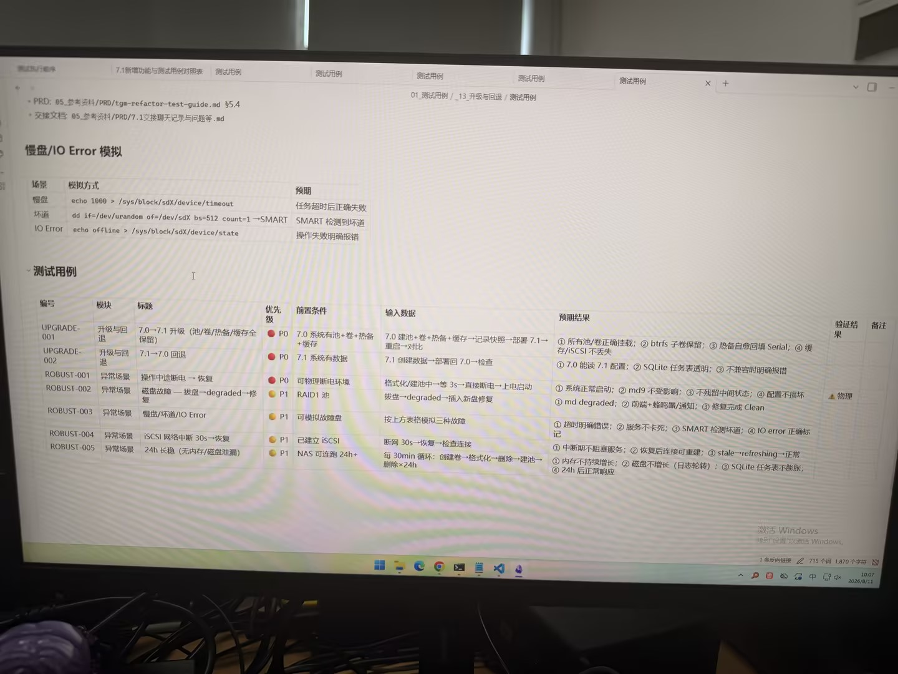

# 图片原文提取：53fe3cd4-05c6-4c93-85d0-419f99073d20

# 图片原文提取：升级与回退异常场景
## 慢盘/IO Error 模拟
| 场景 | 模拟方式 | 预期 |
| --- | --- | --- |
| 慢盘 | echo 1000 > /sys/block/sdX/device/timeout | 任务超时后失败 |
| 坏道 | dd if=/dev/urandom of=/dev/sdX ... -> SMART | 检测到坏道 |
| IO Error | echo offline > /sys/block/sdX/device/state | 明确报错 |
## 测试用例
| UPGRADE-001 | 7.0 -> 7.1 升级 | P0 | 池卷热备缓存保留 |
| UPGRADE-002 | 7.1 -> 7.0 回退 | P0 | 配置可读，SQLite 透明 |
| ROBUST-001 | 断电恢复 | P0 | 正常启动，配置不损坏 |
| ROBUST-002 | 拔盘 degraded 修复 | P0 | md degraded，修复 Clean |
| ROBUST-003 | 慢盘/坏道/IO Error | P1 | 超时明确，服务不卡死 |
| ROBUST-004 | iSCSI 断网30s恢复 | P1 | 连接可恢复 |
| ROBUST-005 | 24h 长稳 | P1 | 无泄漏，SQLite 不膨胀 |
## Local image verification

- Original JPG reviewed locally; the Markdown image link resolves to the corresponding file.
- Text or table regions outside the photographed screen are not inferred.
