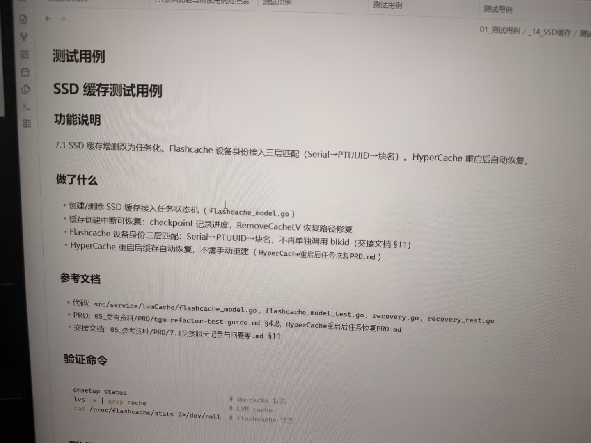

# 图片原文提取：a00eee17-39d1-46c8-94de-dc1fe609154f

# 图片原文提取：SSD 缓存测试用例
## 功能说明
SSD 缓存增删改任务化；Flashcache 身份 Serial -> PTUUID -> 块名；HyperCache 重启自动恢复。
## 做了什么
- 创建/删除任务状态机；checkpoint 恢复；RemoveCacheLV 恢复路径修复。
## 验证命令
dmsetup status；lvs -a | grep cache；cat /proc/flashcache/stats 2>/dev/null。
> 测试用例表从照片下方开始。
## Local image verification

- Original JPG reviewed locally; the Markdown image link resolves to the corresponding file.
- Text or table regions outside the photographed screen are not inferred.
