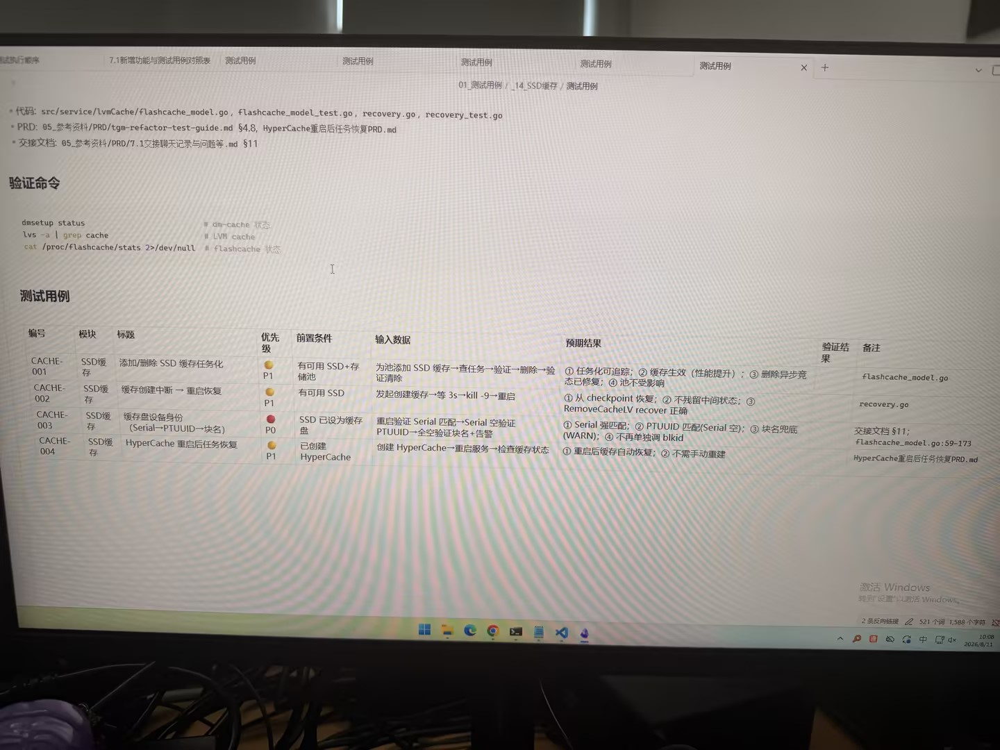

# 图片原文提取：937ede40-ffb1-4028-bea8-0654ecf64f29

# 图片原文提取：SSD 缓存测试用例表
| 编号 | 标题 | 优先级 | 预期结果 |
| --- | --- | --- | --- |
| CACHE-001 | 添加/删除 SSD 缓存任务化 | P1 | 任务可追踪，缓存生效，删除修复 |
| CACHE-002 | 创建中断重启恢复 | P1 | checkpoint 恢复，无中间状态 |
| CACHE-003 | 缓存盘身份三层匹配 | P0 | Serial/PTUUID/块名兜底并告警 |
| CACHE-004 | HyperCache 重启任务恢复 | P1 | 自动恢复，不需重建 |
## Local image verification

- Original JPG reviewed locally; the Markdown image link resolves to the corresponding file.
- Text or table regions outside the photographed screen are not inferred.
