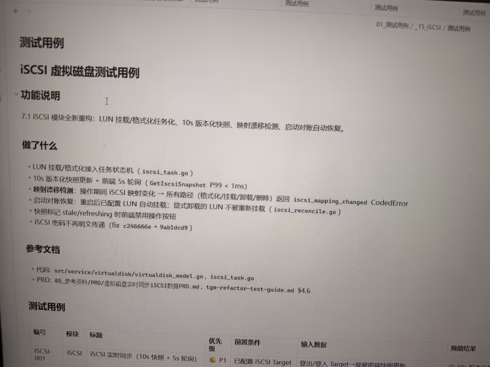

# 图片原文提取：43405f65-0e15-4557-9305-c3f4f147fd07

# 图片原文提取：iSCSI 虚拟磁盘测试用例
## 功能说明
LUN 挂载/格式化任务化、10s 版本化快照、映射漂移检测、启动对账自动恢复。
## 做了什么
- 10s 快照 + 前端 5s 轮询；漂移返回 iscsi_mapping_changed。
- 重启后配置 LUN 自动挂载，显式卸载的不重挂；stale/refreshing 禁用按钮；密码不明文。
> 测试用例表只拍到表头和第一行。
## Local image verification

- Original JPG reviewed locally; the Markdown image link resolves to the corresponding file.
- Text or table regions outside the photographed screen are not inferred.
