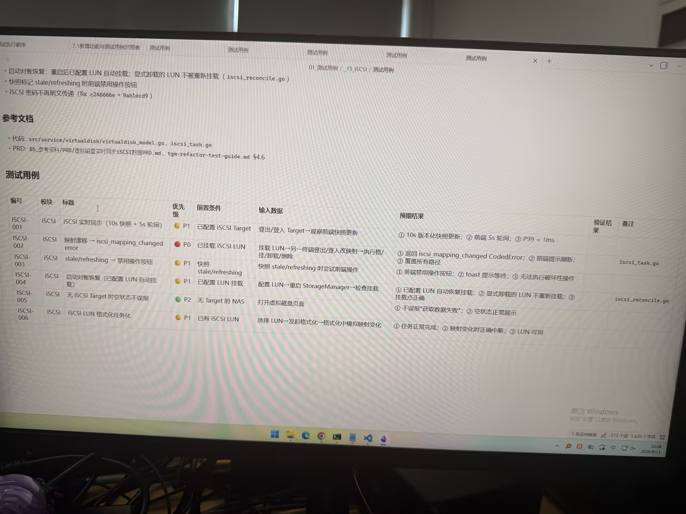

# 图片原文提取：2589d08e-98eb-4a16-a9ee-be749dd965a9

# 图片原文提取：iSCSI 测试用例表
| 编号 | 标题 | 优先级 | 预期结果 |
| --- | --- | --- | --- |
| ISCSI-001 | iSCSI 实时同步（10s快照+5s轮询） | P1 | 快照更新，P99<1ms |
| ISCSI-002 | 映射漂移 -> iscsi_mapping_changed | P0 | 返回错误并提示刷新 |
| ISCSI-003 | stale/refreshing 禁用操作 | P1 | 按钮禁用，toast 等待 |
| ISCSI-004 | 启动对账恢复 | P1 | 配置 LUN 自动挂载，显式卸载不重挂 |
| ISCSI-005 | 无 Target 空状态 | P2 | 不误报，空状态正常 |
| ISCSI-006 | LUN 格式化任务化 | P1 | 变化时中断，LUN 可用 |
## Local image verification

- Original JPG reviewed locally; the Markdown image link resolves to the corresponding file.
- Text or table regions outside the photographed screen are not inferred.
