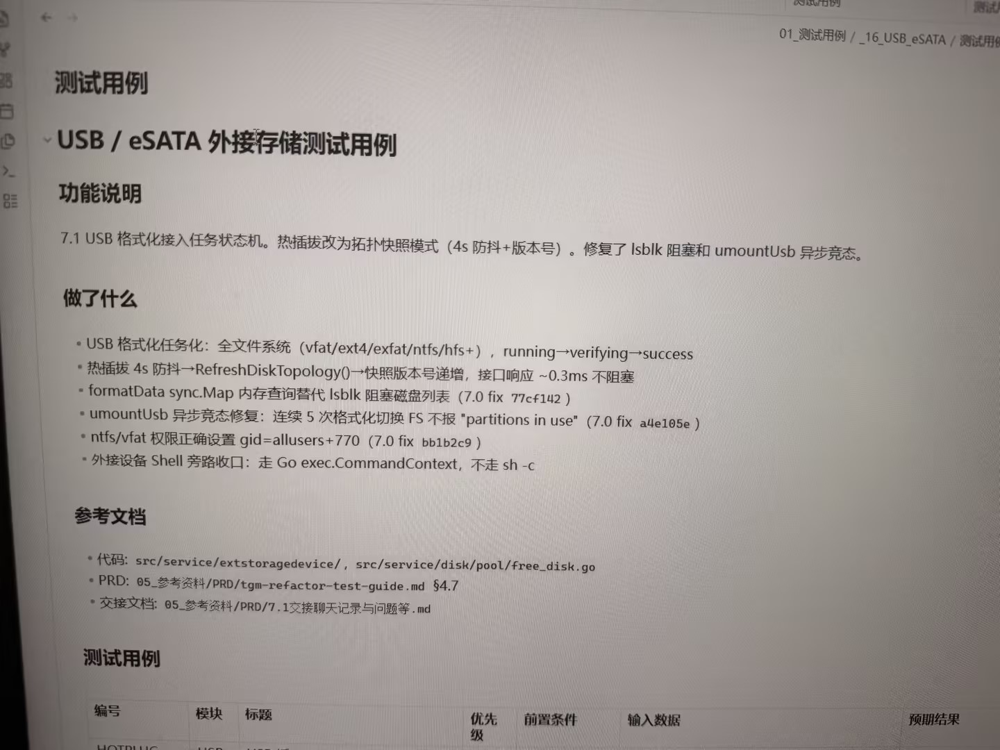

# Image 40: 179794e5-2412-4b9b-b486-ae01f6f11bf9.jpg

Original: ../179794e5-2412-4b9b-b486-ae01f6f11bf9.jpg

## Summary

A screenshot of a software documentation page regarding USB / eSATA external storage test cases, listing functional descriptions, changes made, reference documents, and test case tables.

## OCR in reading order

01_测试用例 / _16_USB_eSATA / 测试用例
测试用例
USB / eSATA 外接存储测试用例
功能说明
7.1 USB 格式化接入任务状态机。热插拔改为拓扑快照模式（4s 防抖+版本号）。修复了 lsblk 阻塞和 umountUsb 异步竞态。
做了什么
• USB 格式化任务化：全文件系统（vfat/ext4/exfat/ntfs/hfs+），running→verifying→success
• 热插拔 4s 防抖→RefreshDiskTopology()→快照版本号递增，接口响应 ~0.3ms 不阻塞
• formatData sync.Map 内存查询替代 lsblk 阻塞磁盘列表（7.0 fix 77cf142）
• umountUsb 异步竞态修复：连续 5 次格式化切换 FS 不报 "partitions in use"（7.0 fix a4e105e）
• ntfs/vfat 权限正确设置 gid=allusers+770（7.0 fix bb1b2c9）
• 外接设备 Shell 旁路窗口：走 Go exec.CommandContext，不走 sh -c
参考文档
• 代码: src/service/extstoragedevice/, src/service/disk/pool/free_disk.go
• PRD: 05_参考资料/PRD/tgm-refactor-test-guide.md §4.7
• 交接文档: 05_参考资料/PRD/7.1交接聊天记录与问题等.md
测试用例
编号 模块 标题 优先级 前置条件 输入数据 预期结果

## Layout

### title 1
测试用例

### subtitle 2
USB / eSATA 外接存储测试用例

### subtitle 3
功能说明

### paragraph 4
7.1 USB 格式化接入任务状态机。热插拔改为拓扑快照模式（4s 防抖+版本号）。修复了 lsblk 阻塞和 umountUsb 异步竞态。

### subtitle 5
做了什么

### list 6
• USB 格式化任务化：全文件系统（vfat/ext4/exfat/ntfs/hfs+），running→verifying→success
• 热插拔 4s 防抖→RefreshDiskTopology()→快照版本号递增，接口响应 ~0.3ms 不阻塞
• formatData sync.Map 内存查询替代 lsblk 阻塞磁盘列表（7.0 fix 77cf142）
• umountUsb 异步竞态修复：连续 5 次格式化切换 FS 不报 "partitions in use"（7.0 fix a4e105e）
• ntfs/vfat 权限正确设置 gid=allusers+770（7.0 fix bb1b2c9）
• 外接设备 Shell 旁路窗口：走 Go exec.CommandContext，不走 sh -c

### subtitle 7
参考文档

### list 8
• 代码: src/service/extstoragedevice/, src/service/disk/pool/free_disk.go
• PRD: 05_参考资料/PRD/tgm-refactor-test-guide.md §4.7
• 交接文档: 05_参考资料/PRD/7.1交接聊天记录与问题等.md

### subtitle 9
测试用例

### table 10
> 编号 模块 标题 优先级 前置条件 输入数据 预期结果

## Semantics

- Scene: computer screen capture
- Intent: documenting test specs and code change logs for storage functionality

## Uncertainty and verification

- No uncertainty reported.

- Verification: GPT native image review; original image kept local.\r\n- JSON: D:/test_dev_projects/storagemanager/7.1/新增功能与用例/照片/提取md/json/179794e5-2412-4b9b-b486-ae01f6f11bf9.json
## Local image verification

- Original JPG reviewed locally; the Markdown image link resolves to the corresponding file.
- Text or table regions outside the photographed screen are not inferred.
