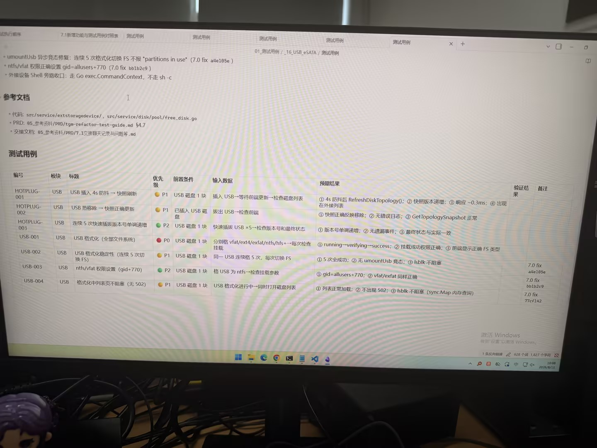

# 图片原文提取：e3fa48d1-e876-4b04-8aaa-3e15282233a9

# 图片原文提取：USB/eSATA 外接存储测试用例
## 图片顶部改动
- umountUsb 异步竞态修复；连续 5 次切换 FS 不报 partitions in use。
- ntfs/vfat 权限 gid=allusers+770。
- 外接设备走 Go exec.CommandContext，不走 sh -c。
| 编号 | 标题 | 优先级 | 预期结果 |
| --- | --- | --- | --- |
| HOTPLUG-001 | USB 插入4s防抖 | P1 | 拓扑刷新，版本递增 |
| HOTPLUG-002 | USB 热移除 | P1 | 快照正确更新 |
| HOTPLUG-003 | 连续5次插拔 | P2 | 版本单调递增 |
| USB-001 | USB 格式化全部文件系统 | P0 | running -> verifying -> success |
| USB-002 | 连续5次切换 FS | P1 | 全成功，无竞态 |
| USB-003 | ntfs/vfat gid+770 | P2 | 挂载参数正确 |
| USB-004 | 格式化中列表 | P1 | 无502，lsblk不阻塞 |
## Local image verification

- Original JPG reviewed locally; the Markdown image link resolves to the corresponding file.
- Text or table regions outside the photographed screen are not inferred.
